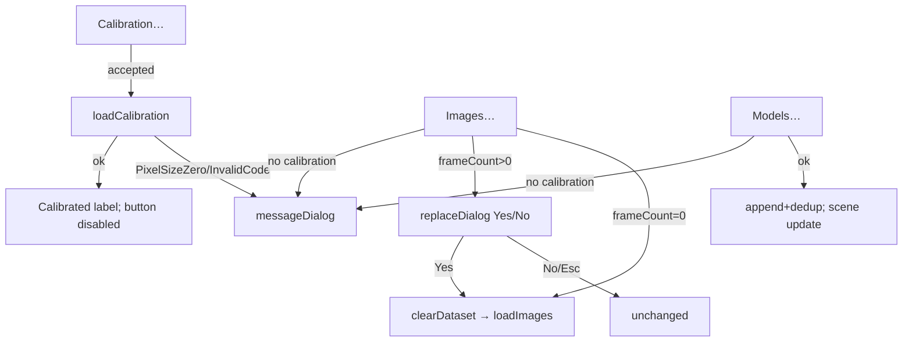
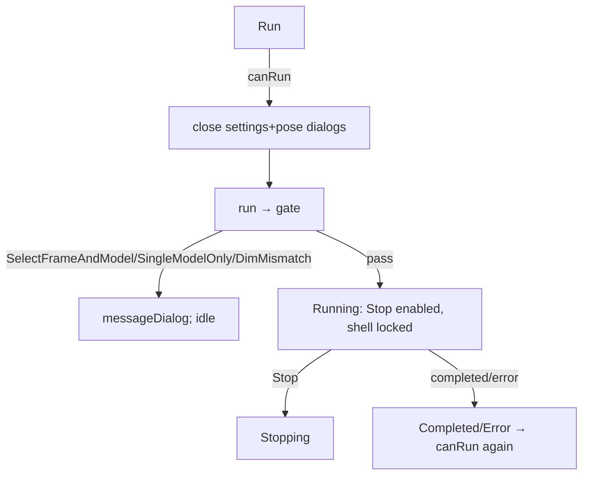

Pre-existing panoptes workspace changes only — nothing in `src/app/experimental/` touched. Analysis complete.

---

# Spec/Flow Analysis: QML Front-End Improvement Pass

**Scope reviewed:** `src/app/experimental/` (main.qml 1,020 lines, PoseCell.qml, SettingsPanel.qml, Theme.qml, 7 bridge headers/impls, main.cpp, qmldir) + bridge unit tests. All line refs verified against the current tree.

## User Flows

**F1 — Study load (calibration-first, one-use, replace-on-second-image-set)**

**F2 — Optimizer run (dialogs close, lock, gate, progress)**

**F3 — Pose editing (immediate per-cell commit, dirty badge, file I/O)**
Open Poses → header/dirty badge → edit cell → editingFinished → `setPoseValue` → reject: inline message + field reverts; accept: SavePose + dirty + scene sync (current frame only) → copy-prev/next → save/load pose/kinematics (false-return → message, dirty kept).

**F4 — ML (per-frame, current-frame scope)**
Pick .pt (femur/tibia/estimate) → Segment (needs dataset + frame + any segment .pt) → segmented view; Estimate (needs dataset + frame + primary model + estimate .pt) → segment-first → SavePose + scene + optimizer seed + estimate label. Degradation: missing models → disabled buttons + hint label + typed message if invoked anyway.

**F5 — Viewer interaction (mode toggle, model drag → applyViewerPose → storage+scene+readout).**

## Gaps

### Critical

**C1 — Pose-table virtualization will corrupt data unless PoseCell's commit contract changes.** Today `Repeater` (main.qml:359) never recycles delegates, so a mid-edit cell always commits to the row it was created for. Under the planned `Repeater → ListView`, scrolling recycles delegates: `frameRow` re-binds to the new row, the focus-loss `editingFinished` fires, and PoseCell.qml:41-48 commits `text` (the *old* row's typing) to `setPoseValue(frameRow /* new row */, ...)`. Additionally, PoseCell.qml:46-48's failed-commit path (`text = storedValue.toFixed(3)`) permanently breaks the text binding, so any later external change to that cell (copy-prev, load-kinematics, dataChanged) never re-displays. The "PoseCell binding-fix" must be specced as: capture `(frameRow, axisIndex, primaryModelIndex)` atomically at edit start and commit against the captured tuple, or commit on focus-out before re-binding, or disable recycling for this list. *Why it matters:* silent cross-row pose writes — the worst possible failure mode for a pose editor.

**C2 — Mid-edit primary-model switch can commit to the wrong model.** PoseCell.qml:46 reads `studyBridge.primaryModelIndex` at commit time, not at edit start. Changing the model selection while a cell is focused destroys the delegate (PoseBridge.cpp `onSelectionChanged` → `setModelRow` → `refresh()` → reset) — the focus-loss `editingFinished` may fire during teardown and commit the old row's text under the *new* primary. Same fix family as C1 (capture the model at edit start). *Why it matters:* silent pose write to a model the user never looked at.

### Important

**I1 — Pose table goes stale after an optimizer run.** The controller persists optimized poses into storage (OptimizerBridge.cpp:322-324) and the Run button closes the pose dialog (main.qml:981), but nothing refreshes `PoseTableModel` on run completion — `refresh()` fires only on bridge mutation, selection change, or dataset change (PoseBridge.cpp:56-63, `onSelectionChanged`/`onDatasetChanged`). Dialog content persists across open/close, so reopening Poses after a run shows pre-run values. *Fix:* PoseBridge should connect `optimizerBridge.runStateChanged` (terminal Completed/Error → refresh) — or OptimizerBridge should emit `poseTableChanged`.

**I2 — Pose table goes stale after a viewer model-drag.** `applyViewerPose` (StudyBridge.cpp) writes `SavePose` and emits `viewerPoseApplied`, but never touches the table model. The Poses dialog is non-modal, so the user can drag the model with the dialog open and watch the cell *not* update. The `viewerPoseApplied` handoff exists for the viewport readout only — it needs a table-refresh leg too.

**I3 — ML estimate seed outlives a post-estimate manual drag on the same frame.** The seed is cleared only on `selectionChanged` (MlBridge.cpp:99-103); the controller's stale-guard (OptimizerBridge.cpp:211-213, `setSeedPose` stores frame+model) only rejects a changed frame/model. A user who estimates, then manually drags the model into a different arrangement on the same frame, then runs — gets the *estimate* pose applied, silently discarding their drag (the run's SaveLastPose mirror loses to the seed by design). Needs a decision: should `applyViewerPose` (or any post-estimate storage write on the same frame/model) drop the pending seed?

**I4 — Run-lock matrix is incomplete in the view.** The stated contract is "everything else on the shell is locked while running" (main.qml:465-466 comment), but the **Black sil. checkbox (main.qml:820) and the Fem/Tib kind buttons (main.qml:836-850) have no `enabled: !optimizerBridge.running` binding** — the view-mode buttons (main.qml:870,880) and everything else do. Also the **viewport itself is not interaction-locked**: a model drag during a run writes storage mid-run (applyViewerPose) — the in-flight run never reads it (storage is copied by value at Initialize) and the next `OptimizedFrame` write clobbers it, leaving the user believing they arranged the pose. Storage access is GUI-thread-only (controller relays), so no memory race — but the state is semantically wrong.

**I5 — Estimate button enablement contradicts the segment requirement.** main.qml:808-813 enables Estimate with `mlBridge.hasEstimateModel` but *not* `hasSegmentModel`; the bridge then rejects the click with "Estimate needs a segmentation model too" (MlBridge.cpp:264-271). The degradation contract (AE4: "buttons disabled with a hint label") should cover this: either add `hasSegmentModel` to the enablement, or accept the message path deliberately. The Segment button (main.qml:799-803) does it right.

**I6 — Keyboard navigation (planned) must wire the bridge, or view/bridge diverge.** Both lists use MouseArea-only selection (main.qml:672, 707); ListView arrow keys already move `currentIndex`/`highlightFollowsCurrentItem` (main.qml:677) with *no* `setCurrentFrame`/`toggleModelSelected` call — enabling key focus without binding `onCurrentIndexChanged` (or Keys handlers) to the bridge creates a highlight that disagrees with `studyBridge.currentFrame`, which then feeds the gate, the pose table, and the ML strip. This is the single most likely silent bug in the keyboard pass.

### Minor

**M1 — `orientationSymTrapUpdated` is relayed (OptimizerBridge.h:56-58) but has no QML handler** — a deliberate v1 cut documented only in the bridge header. Keep it as an explicit no-op comment in the extracted glue so the pass doesn't silently drop it (same for `dilationBackgroundRequested`, main.qml:454-457).

**M2 — Theme/token duplication that extraction will fork.** Dirty-badge hexes `#e5b567/#3a4a3d/#2a2118/#8fbf96` are duplicated in main.qml:221-227 and SettingsPanel.qml (badge block); SettingsPanel hardcodes `#cfd3da`/`#8b929c` where `Theme.fg`/`Theme.fgMuted` exist (SettingsPanel.qml imports **no** "." module — the theme pass must add the import); readout text is `color: "white"` (main.qml:948); `Theme.border` is unused; typography (10/11/14px, bold) is hardcoded in three files with no token set. Consolidate before extraction or the components will fork the palette.

**M3 — `baseName()` splits on `/` only (main.qml:160-163)** — Windows paths render as full paths in the ML strip labels. Cosmetic; cheap to fix with a `\\` split too.

**M4 — Torch calls block the GUI thread** (MlBridge.cpp `runSegmentOnCurrentFrame` — `torch::jit::load` + 1024×1024 segment). The whole shell (including Stop) freezes for the call duration. Acceptable v1, but the qmlprofiler pass should measure and document it; a worker-thread move is out of scope.

**M5 — Models-without-frames then first image load silently merges instead of confirming.** The replace rule keys on `frameCount > 0` (main.qml:48); a study with models but no frames skips the replace-confirm and merges a new image set into the existing model set. Decide whether that's a "second study" (should confirm) or legitimate (models-first workflow).

**M6 — No shell-level unsaved indicator.** The dirty badge lives inside the dialogs; both dialogs close on press-outside (main.qml:202-206, 209-213), and closing the window with dirty pose edits or unsaved settings discards them silently (no close-confirm, no shell badge). Optional, but cheap to add once the dialogs are components.

## Questions (priority order)

1. **C1/C2:** What is the commit contract for PoseCell under ListView recycling — capture `(frameRow, axisIndex, primaryModelIndex)` at edit start, commit-before-rebind, or `reuseItems: false`? *Stakes:* silent cross-row/cross-model pose writes. *Default:* capture-at-edit-start + commit on focus-out, and keep the stored-value binding alive via a `textFromStored` function rather than a one-shot binding.
2. **I1/I2:** Who owns pose-table refresh after run completion and after `viewerPoseApplied` — PoseBridge hooking `runStateChanged` + `viewerPoseApplied`, or new signals from OptimizerBridge/StudyBridge? *Stakes:* stale pose table undermines the whole U8 feature. *Default:* PoseBridge connects both signals and refreshes (single refresh owner).
3. **I3:** Should a manual pose write (viewer drag / pose-table edit) on the seeded frame+model drop the pending ML seed? *Stakes:* optimizer silently overrides the user's final arrangement. *Default:* yes — any user pose write after an estimate invalidates the seed.
4. **I4:** Should the Black sil. checkbox, Fem/Tib buttons, and the viewport interaction be locked during runs to honor the DisableAll contract? *Stakes:* inconsistent lock state + mid-run drags that get clobbered. *Default:* lock the two knobs; leave the viewport interactive only if the clobber is accepted and documented.
5. **I5:** Add `hasSegmentModel` to the Estimate button's enablement (with the hint label explaining why), or keep the message-on-click path? *Stakes:* degradation contract consistency. *Default:* add the flag — matches AE4 and the Segment button's pattern.
6. **I6:** Which keys select frames/models, and is the bridge wired via `onCurrentIndexChanged`? *Stakes:* view/bridge divergence feeding the gate + ML strip + pose table. *Default:* `onCurrentIndexChanged` → `setCurrentFrame` for the frame list; Space/Enter toggles for the model list.
7. **M5:** Is a models-only study followed by first image load a replace or a merge? *Default:* keep merge (frames-only rule), but document it in the flow tests.
8. **M2/M6:** Token consolidation and shell-level dirty indicators — in scope for this pass? *Default:* tokens yes (before extraction), shell dirty indicator no (defer).
9. **Extraction mechanics:** property injection — `required property` with the same names as the context properties (shadowing; loud failure when unwired), distinct names, or QQmlContext injection in tests? *Stakes:* silent fallback to context properties would make tests pass against the real bridges. *Default:* `required property` same-named, wired explicitly in main.qml — load-time failure when missed.
10. **Tests infra:** Qt Quick Test target — does it run under `QT_QPA_PLATFORM=offscreen` in this repo's test conventions, and do view tests avoid instantiating QmlVtkRenderer (GL)? *Stakes:* a test target that can't run headless won't be run.

## Recommended Next Steps

1. **Answer Q1/Q2 before the virtualization and extraction units** — they're the only two with data-integrity consequences; both are one-line fixes in PoseBridge/PoseCell if decided now, and both must be pinned by the first Qt Quick Test.
2. **Spec the table-refresh fix (I1/I2) as its own unit** with a test: run-completes → reopen Poses → cells show optimized values; drag → open cell updates. Verify the stale-on-reopen premise empirically first (it rests on Dialog content persistence across open/close — confirm in the test harness before writing the fix).
3. **Extraction constraints to encode in the plan** (each maps to a concrete current reference): single-owner Connections per bridge (5 Connections blocks today reference root ids — main.qml:417-461); `Qt.callLater` deferral in the datasetChanged handler must survive (main.qml:421-424) because it exists to outlast the list-model swap (deleteLater + fresh instance, StudyBridge.cpp `clearDataset`); the viewport id is referenced from the toolbar, 4 glue blocks, and the ML strip — expose it via the center-panel component (`property alias`) rather than `findChild`; the Run button closes both dialogs (main.qml:980-981) so dialogs must expose open/close or stay root-owned; the 8 FileDialogs are opened from toolbar + pose dialog + ML strip — decide one owner per dialog; every new component file needs qmldir registration + `import "."` (the engine-root inline-component limitation documented in PoseCell.qml:12-14); `SettingsPanel` must gain the "." import when themed.
4. **Test-scenario list for the pass** (grounded in the flows above): (a) load ordering — calibration-first messages for Images and Models, one-use calibration disable, replace-confirm Yes/No/Esc, size-mismatch partial load after replace (old dataset already wiped — assert the message and the empty-ish state); (b) ML degradation — the full enabled-binding matrix including the I5 inconsistency (test it as a binding, then fix), estimate-requires-segment message, segment-failure aborts estimate (bridge-tested; add the view assertion that the estimate label stays cleared); (c) pose validation — non-numeric/NaN/inf reverts + inline message, commit lands on the primary model at commit time, copy-prev/next at boundary rows (bridge-tested; add the view assertion for field reversion), save-failure keeps dirty; (d) run-state — all-controls-disabled matrix (including the I4 gaps), Run closes both dialogs, gate messages, re-run after Completed; (e) keyboard contract once wired (Q6); (f) pose-table freshness (Q2).
5. **qmlprofiler pass targets:** pose-table delegate creation at dataset load (Repeater instantiates 6 TextFields × frames — the virtualization justification), whole-row `dataChanged` re-evaluation (PoseBridge.cpp `notifyCellChanged` emits one index for all roles → 6 cells re-read), per-frame `updatePose` → VTK render load, and the M4 torch freeze.

---