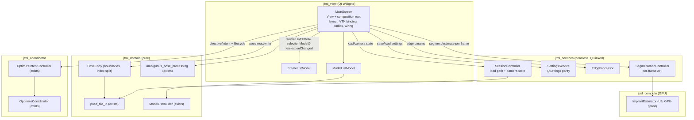

# Decompose MainScreen into View-Models, Services, and Controllers

## Overview

`src/view/mainscreen.cpp` is a 5,693-line god object. Plans 001–003 extracted the pure
seams (SessionState, OptimizeIntentController, ModelListBuilder, pose_file_io,
OptimizeCoordinator + DirectOptimizer), but the view class itself was never divided.
This plan decomposes it into the eight natural components agreed in the brainstorm —
two `QAbstractListModel` view-models, a SettingsService, a domain pose-copy seam, an
EdgeProcessor, a SessionController (load path + camera switching state), optimizer
binding thinning, and the GPU-gated SegmentationController + ImplantEstimator — leaving
`MainScreen` as a decided **View + composition root**.

Every cut is **relocation-first**: logic moves byte-identical, the per-cut gate proves
the move, and `jj diff` against the pre-refactor baseline must show no behavior delta
(R13 — the lesson of the render/xcb bug). The GPU block is ordered last and gated by
the existing `oracle` ctest label (GPU-gated; the repo registers only `headless`,
`oracle`, and `oracle;render` labels — there is no `gpu` label).

---

## Problem Frame

A change to any single behavior — a pose action, an edge parameter, a list interaction,
a segmentation step — currently means reading (or risking) the whole 5.7k-line class.
`MainScreen` half-approximates a view-model without being one: it owns the lists'
content and selection, the load path, pose editing, edge processing, settings
persistence, camera switching, optimizer binding, and the segment/estimate/DRR block.
The decomposition is shape-driven: components fall out of what is actually in the code,
and anything that does not need to be in `MainScreen` moves out. The `.ui` file's flat
widget structure is accepted as-is (no sub-widget modularization this phase).

Origin: `docs/brainstorms/2026-08-10-mainscreen-decomposition-requirements.md`.

---

## Requirements Trace

- R1. Decompose `MainScreen` into the eight agreed natural components (see origin R1).
- R2. `MainScreen`'s role is decided and stated: View + composition root (origin R2).
- R3. Hybrid data shapes stay: `Frame` AoS, `LocationStorage` pose matrix, `SessionState`
  scalars — no restructure unless a seam demands it (origin R3).
- R4. Real `QAbstractListModel` view-models behind both lists; list bookkeeping moves
  into the models or disappears (origin R4).
- R5. `ModelListBuilder` dedup reused; names/selection/primary/current-frame semantics
  match today exactly (origin R5).
- R6. `SessionController` owns the load path; dialogs stay in view (origin R6).
- R7. `EdgeProcessor` owns edge-parameter application over frames (origin R7).
- R8. Pose slots thin over `pose_file_io`; copy-prev/next + boundary logic move to domain
  (origin R8).
- R9. `SettingsService` owns QSettings persistence, keys preserved exactly (origin R9).
- R10. Camera A/B switching state moves to the controller; VTK re-render stays view
  (origin R10).
- R11. Optimizer binding thins to `OptimizeIntentController` + `OptimizeCoordinator`;
  `DisableAll`/`EnableAll` stay view (origin R11).
- R12. `SegmentationController` + `ImplantEstimator` extract the segment/estimate/DRR
  block, GPU-gated (origin R12).
- R13. No behavior change per cut; `jj diff` vs pre-refactor baseline shows relocation
  only (origin R13).
- R14. Per-cut gates: headless for logic/service; compile + scheduled manual-visual for
  presentation; the `oracle` ctest label for GPU (origin R14; the repo has no `gpu` label).
- R15. No Qt-mocking, no god-object characterization; hegel PBT complements deterministic
  tests for extracted pure logic (origin R15).
- R16. Visual verification respects xcb-only rendering and the VTK-standalone limitation
  (origin R16).

**Origin actors:** A1 (developer/researcher — runs GUI for manual-visual gates), A2
(coding agent — performs extractions and tests).
**Origin flows:** F1 (decomposition-with-gate), F2 (view-model binding), F3 (GPU block
extraction).
**Origin acceptance examples:** AE1 (components exist with gates green; mainscreen.cpp is
view-only), AE2 (list models headless + QListView swap compiles with manual-visual
check), AE3 (GPU block passes the `oracle` label within tolerance), AE4 (each cut's
`jj diff` shows relocation only).

---

## Scope Boundaries

- No data-shape restructure (R3): `Frame`, `LocationStorage`, `SessionState` stay as-is;
  services are extracted *around* them.
- No modularization of `mainscreen.ui` into sub-widgets; the flat `.ui` structure is
  accepted for this phase.
- No renaming or re-parenting of `MainScreen`; it remains the `QMainWindow` View +
  composition root.
- No extraction of display-mode radios, VTK interaction/reset/normal-up binding, key
  handling, or layout/resize (R2 view-only).
- No behavior change, no new features, no dialog overhaul; the validated numerical core
  is preserved, not re-derived.
- No Qt-mocking wrappers; no "instantiate the real MainScreen" characterization tests.
- No golden-oracle fixture extension; Kneel_1 remains the regression scope.
- `interactor.h` is not refactored (its inline classes + file-scope globals are a
  one-way door this phase; see Key Technical Decisions).

### Deferred to Follow-Up Work

- Fix the `LaunchOptimizer` `Initialize`-failure thread/manager leak (behavior is
  preserved + noted in code this phase; the fix is a separately-gated change).
- Fix the camera-B slot's raw (non-converted) save-last-pose latent bug (preserved
  byte-identical this phase; the fix must be its own gated cut).
- Unify the four save-last-pose copies (extracted byte-identical, never unified this
  phase).
- `onOptimizedFrame` bounds-else UI-stuck state (unreachable in practice; preserved).
- Rename/restructure `MainScreen` itself (role is stated in code, name kept).
- Fresh `docs/solutions/` capture after the phase lands (see U9).

---

## Context & Research

### Relevant Code and Patterns

- Slot clusters with verified line ranges: pose slots `src/view/mainscreen.cpp:1045-1396` (+`SaveLastPose` 4449), segment/estimate/DRR ~1552-2465 (approximate band — exact slot list in U8; excludes `update_image_list_widget` at 1584, the Controls/Optimizer-Settings menu entries at 2430/2437, and the commented-out NFD block ~2408-2429, which stays in mainscreen.cpp for U9 to delete), load path 2465-2974, camera A/B 2974-3298, list selection 3298-3674, edge controls 4024-4375, optimizer binding 4375-4956 + 5613-5651, settings persistence 4956-5613.
- Existing seams to mirror: `include/domain/session_state.h` (plain state holder),
  `include/domain/optimize_intent_controller.h` (typed `Evaluate(Input) -> Intent`),
  `include/domain/model_list_builder.h` (static pure, dedup quirk preserved),
  `include/domain/pose_file_io.h` (namespace functions), `include/domain/ambiguous_pose_processing.h` (already exists — reuse), `include/coordinator/optimize_coordinator.h`.
- Data stores: `LocationStorage` (`include/services/location_storage.h`,
  `src/services/location_storage.cpp` — `vector<vector<Point6D>>` + no-image vector with
  the `GetPose(-1, ...)` boundary fallback), `Frame` (`include/compute/frame.h` — edge
  fields already present), `Model` (`include/services/model.h`).
- QSettings contract: org `JointTrackAutoGPU`, app `Version340`, groups
  `CostFunctionSettings` / `OptimizerSettings` / `EdgeDetectionSettings` / `FirstTime`;
  keys `APERTURE`/`LOW_THRESH`/`HIGH_THRESH`, `STAGE@ACTIVE_CF`,
  `STAGE@CFname@ParamName@TYPE` (key names/values live inline in
  `src/view/mainscreen.cpp` — the four edge-slot writes at ~4105/4198/4291/4358 and
  `LoadSettingsBetweenSessions` at 4956+; `include/domain/settings_constants.h` holds
  only the default constants).
- Test registration patterns: `test/CMakeLists.txt` — Catch2 targets compile the layer's
  `.cpp` directly (CUDA-free); QtTest for QObject seams (`test/lifecycle/coordinator_test.cpp`,
  Q_OBJECT header in the `add_executable` source list — AUTOMOC gotcha); hegel PBT
  targets need `hegel dl` + `-Wl,-rpath,${CMAKE_BINARY_DIR}/_deps/hegel-build/libhegel`;
  `oracle`/`render` labels per `test/HEGEL-PBT-GUIDE.md` and
  `docs/solutions/tooling-decisions/qt6-hegel-oracle-tooling-recipes-2026-08-08.md`.
- Per-layer CMake convention: `file(GLOB HEADER_FILES CONFIGURE_DEPENDS ...)` +
  **explicit `.cpp`/`.cu` list**; new `.cpp` files must be added explicitly
  (`src/{domain,services,coordinator,view}/CMakeLists.txt`).

### Institutional Learnings

- `docs/solutions/conventions/jtml-testability-and-cmake-conventions-2026-08-07.md` —
  the extraction playbook: pull widget-free decision/state into a pure service, leave
  render/widget binding in MainScreen; reproduce quirks exactly and pin with tests
  *before* normalizing; AUTOMOC header-in-source-list gotcha.
- `docs/solutions/conventions/jtml-layered-lib-split-2026-08-08.md` — layer placement,
  include-prefix grep gates, GLOB+explicit-list CMake rule; `jtml_view`'s PUBLIC AUTOUIC
  dir bakes in the target name (do not rename).
- `docs/solutions/tooling-decisions/jtml-rendering-runtime-xcb-qvtk-2026-08-10.md` —
  xcb-only rendering; standalone `vtkRenderWindow` broken; `ctest -L render` +
  `widget->grab()` PNG smoke is the regression path; diff display path vs baseline
  *first* when a render regression is suspected.
- `docs/solutions/tooling-decisions/qt6-hegel-oracle-tooling-recipes-2026-08-08.md` —
  hegel link recipe; oracle tests need `WORKING_DIRECTORY ${PROJECT_SOURCE_DIR}` and
  label `oracle`, never `headless`.
- `docs/solutions/logic-errors/cost-function-parameter-double-truncation-2026-08-08.md` —
  silent-narrowing bug class; round-trip PBT with fractional/negative/±0.0 draws is the
  exact invariant shape for the SettingsService; if a PBT invariant fails against
  relocated code, treat the code as the bug — but land the fix as a *separate* cut
  (R13 conflict, see Risks).

### External References

None — the repo's own conventions (3 prior plans, 5 solution docs, established test
recipes) fully cover this work; Qt view-model patterns are standard.

---

## Key Technical Decisions

- **View-model placement: `jtml_view`.** `FrameListModel`/`ModelListModel` are Q_OBJECT
  (excluded from `jtml_domain` by the purity grep-gate). `jtml_view` is the
  layer-consistent home; headless tests compile the model `.cpp` directly against
  `Qt6::Core`/`Qt6::Test` (the established direct-compile pattern), so they never link
  the heavy VTK/Torch stack. Q_OBJECT headers go in the layer's explicit source list
  and the test target's source list (AUTOMOC).
- **One `SessionController` (services) covers R6 + R10.** Resolves the origin deferred
  question: the load path (parse files → populate frames/models/pose matrix) and camera
  A/B active-state share one controller. The camera slots' VTK re-render, actor
  placement, and the `interactor.h` global writes stay in the view. The radio buttons
  remain the runtime source of truth (read via `isChecked()` in ~15 places); the
  controller mirrors state for headless tests. **Rename note:** origin R6 named this
  `DatasetController`; this plan renames it `SessionController` (it mirrors
  `SessionState` and owns session scalars + active-camera state). The R6 trace row
  reflects the rename — the origin's deferred question explicitly sanctioned the merge.
- **QListView swap wiring is explicit, not auto-magic (critical).** The
  `on_*_itemSelectionChanged` slots are auto-connected by name today and would
  **silently stop being connected** on `QListView` (no such signal). U2 explicitly
  connects to `selectionModel()->selectionChanged` — and *only* that signal (connecting
  `currentChanged` too would change MultiSelection arrow-key behavior). The seven
  programmatic current-write sites — image-load default-select (2749, 2857), model-load
  (2949), single-model radio `setCurrentIndex(selected[0])` (3820), LaunchOptimizer
  (4653), onOptimizedFrame prev/next (4784, 4813) — become explicit
  `selectionModel()->setCurrentIndex(index, SelectCurrent|Rows)`. `SelectCurrent|Rows`
  is the R13-preserving command: it matches today's `QListWidget::setCurrentRow`
  behavior in every selection mode (additive `SelectCurrent` in ExtendedSelection,
  collapsing in Single/MultiSelection), whereas a blanket `ClearAndSelect|Rows` would
  silently collapse multi-selected frames in the ExtendedSelection image list. (A plain
  one-arg `setCurrentIndex` does NOT default to `NoUpdate` in Qt 6 — that was Qt 5
  behavior; it routes through `selectionCommand()` → `ClearAndSelect` in
  SingleSelection. The explicit rewrite is still required to keep every selection write
  on the model API.) `VTKMakePrincipalSignal`'s per-item Deselect/Select loops stay
  unbatched and direct-connected (intermediate re-entrant renders are R13-visible). The
  `.ui`'s 8 `QListWidget::item:selected` selector blocks (6 active; 2 commented out at
  lines 363, 3794) gain `QListView::item:selected` alongside (image-list highlight
  parity).
- **Model owns selection; the view writes through the model API.** Every programmatic
  selection write (load slots, optimizer navigation, empty-selection fallback,
  `VTKMakePrincipalSignal`, single-model radio) goes through the model/selection-model,
  so `SyncSessionState` can read models, never widgets. Item text is display-only
  (never read back) — write-once models; biplane multiline names (`"A: …\nB: …"`)
  preserved.
- **Registry parity is a hard contract (C4).** `SettingsService` keeps org/app/group/key
  names and first-run detection (`childGroups().size() == 0`) exactly. The four inline
  `EdgeDetectionSettings` writes are sourced **per site, verbatim from the code**
  (`src/view/mainscreen.cpp` ~4105/4198/4291/4358): the three slider/spin slots store
  their own widget key plus the other two keys computed from the current frame; the
  apply-all write stores all three keys directly from the widgets. The U3 parity table
  is derived by reading each write site verbatim — a naive "read all three widgets"
  (or "all frame-sourced") changes registry contents across restarts. Test isolation
  via a QSettings path/format override.
- **Preserve-don't-fix (R13), each with a pinning test:** copy-prev/next boundary
  fallback to the no-image default pose (frame 0 / last frame silently overwrite —
  preserved); copy slots do no A↔B conversion in camera-B view (preserved); the four
  save-last-pose copies with three different behaviors stay byte-identical and never
  unified; the primary-vs-current index split in copy/kinematics/sym-trap writes is
  preserved in domain signatures (both indices passed explicitly); the
  `Initialize`-failure thread leak and the `onOptimizedFrame` bounds-else are preserved
  with a code comment; `update_image_list_widget`'s original-image-branch camera-arg
  quirk is preserved.
- **U8 uses a per-frame controller API (not a controller-owned loop).** The estimate
  slots interleave ~44 `ui.pose_progress`/`pose_label`/`processEvents`/render calls with
  torch work. The view owns the loop and progress; the controller exposes
  `SegmentFrame(frame, params) -> result` / `EstimatePose(frame, ...) -> pose`, keeping
  the interleave byte-identical. The two file dialogs (segment `.pt`, pose `.pt`) stay
  in the view. GPU gate = compile + the `oracle` label (no `gpu` label exists).
- **`interactor.h` globals stay; a view adapter writes them.** `Calibration
  interactor_calibration;` and `bool interactor_camera_B;` are file-scope definitions in
  the header, consumed at VTK event time by the inline interactor classes. Only
  mainscreen.cpp may include `interactor.h` (a second TU would be duplicate definitions).
  The camera/calibration slots keep writing the globals; the controller never touches
  them.
- **Two UB crash paths get guards** (invisible to behavior; explicitly exempted from the
  R13/AE4 relocation-only criterion — each guard lands as its own sub-commit, excluded
  from the relocation-only `jj diff`): the wireframe-radio slot, which dereferences
  `loaded_models[selected[0].row()]` (model list, first statement) and then
  `loaded_frames[image selection's selectedRows()[0].row()]` with no selection guards —
  early-return when either selection is empty, before the first deref; and the
  load-model UF/Denver branch reading `loaded_frames[0]` with no frames — early-return
  when the frame list is empty. (Post-U2 the selection reads use
  `selectionModel()->selectedRows()`, which survives the QListView swap — it is
  QItemSelectionModel API.) A crash path is not behavior worth preserving.
- **Partial-load semantics preserved:** the load slots' `goto stop`/`goto stop_biplane`
  paths (frames appended so far persist) and the `SyncSessionState()` tail are
  reproduced exactly by `SessionController`; `LocationStorage` sizing stays consistent
  with frame/model counts (the invariant behind `PoseMatrixDimensionMismatch`).

---

## Open Questions

### Resolved During Planning

- [Origin deferred] View-model placement: `jtml_view`, direct-compile tests.
- [Origin deferred] Camera A/B shares `SessionController` (R6+R10 merged).
- [Origin deferred] `SettingsService` preserves registry keys/defaults exactly (parity
  table in U3).
- [Origin deferred] Unit ordering: U2 → U3 → U4 → U5 → U6 → U7 → U8 → U9, with U3 before
  U5 (edge/settings overlap) and U2 before U4/U6/U8 (list API).
- [Flow Q1/Q2] Copy-prev/next boundary fallback + no A↔B conversion: preserve
  byte-identical, pin with tests.
- [Flow Q3] `Initialize`-failure leak: preserve + code comment; fix deferred.
- [Flow Q4] U8 per-frame controller API (view owns the loop).
- [Flow Q5] Add `QListView::item:selected` selectors alongside the `QListWidget` ones.
- [Flow Q6] Keep `interactor.h` globals; view adapter writes them.
- [Flow Q7] Guard the two UB crash paths.
- [Flow Q8] SettingsService test isolation via QSettings path/format override.

### Deferred to Implementation

- Exact class member/method names and the `SessionController` state shape (mirror
  `SessionState` + `OptimizeIntentController` conventions).
- Whether `ImplantEstimator` lands in `services` or `compute` — decided by where the
  cost-function calls land during extraction (the estimate math uses
  `CostFunctionManager`; `machine_learning_tools.h` is compute-side). Directional now:
  `SegmentationController` in services; the estimator follows the code.
- The directive-coverage gap check for `OptimizeIntentController` (U7) — if a directive
  path is not covered, extend with a small typed input, not a rewrite.
- `QItemSelection` batching for the load-model `setCurrentRow(0)` sites if the per-item
  sequence must match exactly (default: per-item, same as today).

---

## High-Level Technical Design

> *This illustrates the intended approach and is directional guidance for review, not implementation specification. The implementing agent should treat it as context, not code to reproduce.*

Selection flow after U2: `selectionModel()->selectionChanged` → view handler →
`SyncSessionState` (reads **models**, not widgets) → `previous_frame_index_` /
`SaveLastPose` → VTK re-render. Re-entrancy (empty-selection fallback, per-item
principal loops) stays synchronous-direct.

---

## Implementation Units

- [ ] U1. **Baseline and per-cut verification harness**

**Goal:** Establish the pre-refactor baseline and the per-cut verification procedure
before any code moves.

**Requirements:** R13, R14, R16

**Dependencies:** None

**Files:**
- Modify: `docs/plans/2026-08-10-004-refactor-mainscreen-decomposition-plan.md` (baseline commit recorded)
- Verify: `pixi run test` (headless suite), `ctest -L render` under xcb

**Approach:**
- Record the baseline commit (`jj log`) — the pre-cut state — as the R13 diff target.
- Confirm the headless suite is green (24/24) and the render smoke passes.
- Draft the manual-visual checklist template used by presentation-only cuts: select
  frames, Ctrl+click deselect, multi-select models, arrow-key navigation, VTK `p`
  key principal swap, camera A/B switching mid-optimization, display-mode radios,
  pose save/load round-trip, segmentation/estimate run, single↔multi model radio
  toggle with an active multi-selection (selection collapses to first), deselect-all →
  auto re-select of current (empty-selection fallback), optimizer run stepping frames
  via the rewritten current-write sites.
- State the per-cut procedure: extract → gate → `jj diff` (relocation only) → next cut.

**Test expectation:** none — verification scaffolding; the suite itself is the gate.

**Verification:**
- Baseline commit recorded; headless suite + render smoke green at baseline; checklist
  template exists for later units.

---

- [ ] U2. **FrameListModel + ModelListModel view-models (QListView swap)**

**Goal:** Replace both `QListWidget`s with passive `QListView`s over headless-testable
`QAbstractListModel` classes; delete MainScreen's list bookkeeping.

**Requirements:** R4, R5, R13, R14, R15, R16

**Dependencies:** U1

**Files:**
- Create: `include/view/frame_list_model.h`, `include/view/model_list_model.h`,
  `src/view/frame_list_model.cpp`, `src/view/model_list_model.cpp`
- Modify: `include/view/mainscreen.ui` (2 widget declarations: `image_list_widget`,
  `model_list_widget` → `QListView`; add `QListView::item:selected` selectors alongside
  the 8 `QListWidget::item:selected` blocks), `include/view/mainscreen.h` (slot
  declarations — dead `print_selected_item`/`remove_background_highlights_...`
  declarations are removed in U9 together with their `.cpp` definitions, keeping each
  unit's file compilable),
  `src/view/mainscreen.cpp` (constructor: explicit `selectionModel()->selectionChanged`
  connects; rewrite the 7 programmatic current-write sites (enumerated in Key
  Technical Decisions); `update_image_list_widget`
  shrinks to the render-trigger tail; selection handlers read models), `src/view/CMakeLists.txt`
  (explicit `.cpp` list)
- Test: `test/lifecycle/list_models_test.cpp` (QtTest, compiles the two `.cpp` files
  directly against `Qt6::Core`/`Qt6::Test`; Q_OBJECT headers in the source list)

**Approach:**
- Models own item names (write-once, display-only) and expose selection via the
  `QItemSelectionModel`; `ModelListBuilder::UniquifyModelNames` is called by
  `ModelListModel`.
- **Critical wiring (from flow analysis):** explicit connects to
  `selectionModel()->selectionChanged` replace the name-based auto-connect; all
  `setCurrentRow(n)` sites become `selectionModel()->setCurrentIndex(model->index(n,0),
  ClearAndSelect|Rows)`; `VTKMakePrincipalSignal`'s per-item Deselect/Select loops stay
  unbatched; the empty-selection fallback (re-select current) stays synchronous-direct;
  the single-model radio's `setCurrentIndex(selected[0])` becomes
  `ClearAndSelect|Rows`.
- `SyncSessionState` and `curr_frame()` read the models; `previous_frame_index_` write
  points stay identical (handler-only, ctor −1).
- **QListWidget-only API sweep (file-wide, part of the wiring step):** `count()` →
  `model()->rowCount()` (~13 sites, incl. code later owned by U4/U7/U8: Save_Kinematics,
  Copy_Previous, onOptimizedFrame, Ambiguous slot), `addItem()` → model row insertion
  (load slots), `item(i)->setSelected()` → `selectionModel()->select(index, Select|Rows /
  Deselect|Rows)` (VTKMakePrincipalSignal loops, empty-selection fallback). U4/U7/U8
  note in their units that these sites are already converted by U2.
- **Selection-mode source of truth preserved:** the three runtime `setSelectionMode`
  calls (ctor 276 → SingleSelection, single-model radio 3815 → SingleSelection,
  multi-model radio 3824 → MultiSelection) stay as-is on the QListView — they are the
  only source of the model list's MultiSelection state. The headless tests drive the
  selection model directly, so the manual-visual gate covers the toggle.
- **Constructor ordering:** construct both models and call `setModel()` on both
  `QListView`s before connecting `selectionModel()->selectionChanged` (a connect issued
  before `setModel` attaches to a selection model that `setModel` replaces — silent
  pipeline death).
- Preserve: biplane multiline names, the `update_image_list_widget` original-image
  camera-arg quirk, optimizer navigation order (`setCurrentRow` → handler →
  `SavePose(old)`).
- The manual-visual gate (xcb) runs the full checklist from U1.

**Execution note:** Land the models + their headless tests first; the `.ui`/wiring swap
is the final step of the unit, gated by compile + scheduled manual-visual check.

**Test scenarios:**
- Happy path: model `data()`/`rowCount()` for names; selection → `selectionChanged`
  fires; `SyncSessionState`-equivalent reads reflect model selection.
- Edge case: empty list; deselect-all on a non-empty model list re-selects current
  (invariant pin); first/last row `ClearAndSelect`; arrow-key navigation fires the
  handler as today (Qt arrow keys change current AND select — `selectionChanged`
  fires); `currentChanged` is never connected, so current-only changes do not
  re-render.
- Edge case: primary-model rule (first selected row) matches today's semantics; biplane
  multiline names preserved.
- Integration: model + selection-model round-trip drives a stub "re-render" observer in
  the same call order as today's handler chain; per-item unbatched principal loops emit
  the same intermediate states.
- Integration: `ModelListBuilder` dedup reuse — duplicate model names yield
  `A, A(2), A(3)` mutated-name-rescan output (existing quirk, existing PBT).

**Verification:**
- Headless QtTest green (models only, no widgets); app compiles; manual-visual checklist
  passes under xcb; `jj diff` shows the swap + wiring delta with no logic change;
  selection pipeline demonstrably alive (select a frame → pose bar/render updates).

---

- [ ] U3. **SettingsService (QSettings parity)**

**Goal:** Extract `LoadSettingsBetweenSessions` (470 lines) + `onSaveSettings` + the
four inline edge-slot QSettings writes into a widget-free `SettingsService`.

**Requirements:** R9, R13, R14, R15

**Dependencies:** U1 (U3 must precede U5 — the edge slots' registry writes move here
first)

**Files:**
- Create: `include/services/settings_service.h`, `src/services/settings_service.cpp`
- Modify: `include/view/mainscreen.h`, `src/view/mainscreen.cpp` (`LoadSettingsBetweenSessions`
  thins to: service round-trip + CUDA probe/dialog + widget value application, in the
  same ctor position and order; `onSaveSettings` thins to service write +
  `UpdateDilationFrames()` view call; the 4 edge-slot writes route through the service
  but keep their frame-sourced values), `src/services/CMakeLists.txt`
- Test: `test/unit/settings_service_test.cpp` (Catch2, compiles the service `.cpp`
  directly) + `test/unit/settings_service_properties.cpp` (hegel PBT round-trip)

**Approach:**
- Registry parity contract (exact): org `JointTrackAutoGPU`, app `Version340`, groups
  `CostFunctionSettings`/`OptimizerSettings`/`EdgeDetectionSettings`/`FirstTime`, keys
  incl. `STAGE@CFname@ParamName@TYPE`, `APERTURE`/`LOW_THRESH`/`HIGH_THRESH`, first-run
  detection via `childGroups().size() == 0`.
- The first-time branch's `cudaGetDeviceCount`/`cudaGetDeviceProperties` probe and
  `QMessageBox` stay in the view: the service returns a status/values; the view owns
  the probe + dialogs.
- Edge-slot writes receive frame-sourced values (the slot computes them until U5).
  `UpdateDilationFrames` stays view-side (U3↔U5 boundary, incl. the Mahfouz
  `DIRECT_MAHFOUZ → dilation_val = 3` case).
- Constructor order preserved: service load → view applies slider values → threshold-label
  sync (no registry re-write loop: `loaded_frames.size() > 0` gate).
- Test isolation: service constructor takes a QSettings path/format override; tests use
  a temp file.

**Execution note:** Round-trip PBT first (fractional/negative/±0.0 draws — the
silent-narrowing invariant shape); deterministic parity test second.

**Test scenarios:**
- Happy path: save → load round-trip preserves every key/group exactly.
- Edge case: first-run detection (empty registry) returns defaults and creates
  `FirstTime`; fractional and negative values round-trip bit-exact (no narrowing).
- Edge case: `UpdateDilationFrames`-adjacent dilation value (incl. Mahfouz case) is
  preserved by the boundary split.
- Error path: registry missing/corrupt group → defaults, no crash.
- Integration: after U3, restart-equivalent behavior — settings written by the app
  round-trip through the service with identical keys (parity table check).

**Verification:**
- PBT + deterministic tests green headless; `jj diff` of the slot bodies shows the
  QSettings calls replaced by service calls with identical keys/values; manual check:
  settings survive an app restart unchanged (xcb).

---

- [ ] U4. **Pose save/load/copy thinning + domain pose-copy seam**

**Goal:** Thin the seven pose slots over the existing `pose_file_io`; move
copy-prev/next boundary + index-split logic to a pure domain seam.

**Requirements:** R8, R13, R14, R15

**Dependencies:** U2 (slots read `currentRow()` → post-swap `currentIndex().row()`)

**Files:**
- Create: `include/domain/pose_copy.h`, `src/domain/pose_copy.cpp`
- Modify: `include/view/mainscreen.h`, `src/view/mainscreen.cpp` (slots
  `on_actionSave_Pose_triggered`, `on_actionSave_Kinematics_triggered`,
  `on_actionLoad_Pose_triggered`, `on_actionLoad_Kinematics_triggered`,
  `on_actionCopy_Previous_Pose_triggered`, `on_actionCopy_Next_Pose_triggered`,
  `copy_current_pose`, `on_actionAmbiguous_Pose_Processing_triggered` thin to
  view-calls; `SaveLastPose` stays fully view-side — both the VTK actor reads AND the
  B→A conversion call (`calibration_file_.convert_Pose_B_to_Pose_A`, a
  services-layer method) stay in the view, keeping `jtml_domain` free of services
  includes), `src/domain/CMakeLists.txt`
- Test: `test/unit/pose_copy_test.cpp` (Catch2) +
  `test/unit/pose_copy_properties.cpp` (hegel PBT)

**Approach:**
- The domain seam takes **both** indices explicitly (read index = primary/first-selected,
  write index = current row) and preserves the split byte-identical (also in
  `Load_Kinematics` re-render and `updateOrientationSymTrap_MS`).
- Boundary fallback preserved: `GetPose(-1, ...)` / `GetPose(count(), ...)` return the
  no-image default pose and overwrite frame 0 / last frame — pinned by tests, not fixed.
- Copy in camera-B view does no A↔B conversion (model jumps in the B viewport) —
  preserved, pinned.
- `ambiguous_pose_processing` (existing domain seam) is reused as-is; the slot's
  reliance on the last selection event having synced state is noted and kept.
- The four save-last-pose copies (SaveLastPose, camera-A inline, camera-B inline,
  sym-trap) stay in their slots, byte-identical, never unified; only the copy
  index/boundary structure moves to the domain seam (the B→A conversion stays
  view-side — see Files).
- Guards (error boxes for no-selection / multi-mode) preserved as-is, including the
  radio-check (not selection-mode-check) quirk.

**Execution note:** Deterministic boundary tests first; PBT for the index/boundary
invariants (row 0, last row, single/multi selection).

**Test scenarios:**
- Happy path: copy-previous/copy-next at interior frames moves the pose as today.
- Edge case: row 0 and last row fall back to the no-image default pose (pin the
  overwrite behavior); no selection → error path; multi-mode guard via radio.
- Edge case: primary-vs-current split — multi-selection with current outside selection
  preserves the read/write asymmetry.
- Edge case: camera-B copy applies A-coordinates un-converted (pinned).
- Integration: save/load slots call `pose_file_io` with identical paths/format;
  SaveLastPose's B→A conversion stays view-side and is covered by the manual-visual
  gate (no domain test needed — the seam excludes calibration).

**Verification:**
- Headless tests green; `jj diff` shows slot bodies reduced to dialogs + `pose_file_io`/
  domain calls with no arithmetic changes; manual pose save/load/copy round-trip under
  xcb behaves identically.

---

- [ ] U5. **EdgeProcessor**

**Goal:** Extract aperture/low-threshold/high-threshold application, apply-all, and
reset-edge over `Frame` data into a headless `EdgeProcessor`.

**Requirements:** R7, R13, R14, R15

**Dependencies:** U3 (the four inline QSettings writes in these exact slot bodies move
to the service first)

**Files:**
- Create: `include/services/edge_processor.h`, `src/services/edge_processor.cpp`
- Modify: `include/view/mainscreen.h`, `src/view/mainscreen.cpp`
  (`on_aperture_spin_box_valueChanged`, `on_low_threshold_slider_valueChanged`,
  `on_high_threshold_slider_valueChanged`, `on_apply_all_edge_button_clicked`,
  `on_reset_edge_button_clicked` thin to processor calls + widget/registry wiring),
  `src/services/CMakeLists.txt`
- Test: `test/unit/edge_processor_test.cpp` (Catch2) +
  `test/unit/edge_processor_properties.cpp` (hegel PBT)

**Approach:**
- Processor API: `(params, Frame&) -> edge/dilated/distance images` — the `Frame`
  methods already exist; the processor owns the parameter-derived decisions
  (incl. Mahfouz `dilation = 3` case) and camera-dependent application targets.
- The slots keep: widget reads, registry writes (now via `SettingsService`), and the
  re-render tail. Frame-sourced value computation stays in the slot until the
  processor owns the full per-frame pipeline.
- Reset-edge persists via the signal cascade (three `setValue` calls → valueChanged
  slots → service writes), not a direct write — preserved.
- `UpdateDilationFrames` remains view-side for now (U3 boundary); it may migrate to the
  processor in the consolidation unit if the boundary stays clean.

**Execution note:** PBT for the invariant "applying params then reset restores the
original edge state" and "the same params applied to N frames yield identical images
per frame".

**Test scenarios:**
- Happy path: params applied to a synthetic `cv::Mat` produce the expected edge/dilated
  images (deterministic fixtures).
- Edge case: reset restores original (pre-edge) frame state; Mahfouz dilation case.
- Edge case: zero/negative/out-of-range params behave as today (pin, don't normalize).
- Integration: apply-all processes every loaded frame; per-frame application matches
  per-frame single application (PBT property).

**Verification:**
- Headless tests + PBT green; `jj diff` shows the edge slots reduced to widget reads +
  processor calls with identical parameter flow; manual edge-parameter interaction
  under xcb unchanged.

---

- [ ] U6. **SessionController (load path + camera A/B state)**

**Goal:** Extract the load path (calibration/images/models) and camera A/B switching
state into a headless `SessionController`.

**Requirements:** R6, R10, R13, R14

**Dependencies:** U2 (load slots insert into models post-swap), U4 (pose-matrix sizing
handoff)

**Files:**
- Create: `include/services/session_controller.h`, `src/services/session_controller.cpp`
- Modify: `include/view/mainscreen.h`, `src/view/mainscreen.cpp`
  (`on_load_calibration_button_clicked`, `on_load_image_button_clicked`,
  `on_load_model_button_clicked`, `on_camera_A_radio_button_clicked`,
  `on_camera_B_radio_button_clicked`), `src/services/CMakeLists.txt`
- Test: `test/unit/session_controller_test.cpp` (Catch2)

**Approach:**
- Controller owns: file parsing (the inline `QTextStream` + `QRegularExpression`
  parsing moves verbatim), dataset population (frames/models → `LocationStorage`
  sizing via `LoadNewFrame()`/`LoadNewModel()`), partial-load semantics
  (`goto stop`/`goto stop_biplane` — frames appended so far persist), the
  `SyncSessionState()` tail, and the active-camera enum (mirror of the radio).
- View keeps: `QFileDialog`s, model/frame insertion into the view-models (post-U2),
  `interactor.h` global writes (`interactor_calibration`, `interactor_camera_B` — also
  the calibration slot's monoplane `interactor_camera_B = false`), all VTK actor
  placement/render, the optimizing-time camera branch, and the inline save-last-pose
  copies (byte-identical, per U4).
- **No new TU includes `interactor.h`** (file-scope definitions would duplicate).
- Guard: the load-model UF/Denver `loaded_frames[0]` UB path gets an early return
  (invisible-to-behavior guard, per Key Technical Decisions).
- Camera slots' enable/disable radio decision (pure function of
  `calibrated_for_*`) moves to the controller.

**Test scenarios:**
- Happy path: parsing a fixture calibration file yields the same `Calibration` values
  as today (fixture in `test/golden/`); image/model path lists parse to the expected
  frame/model set.
- Edge case: partial load failure mid-list persists the frames appended so far
  (pin `goto stop` semantics); empty selection/cancel keeps state unchanged.
- Edge case: pose-matrix dimensions stay consistent with frame/model counts after load
  (the `PoseMatrixDimensionMismatch` invariant).
- Edge case: camera-state enable/disable decision matrix matches the calibrated flags.
- Integration: controller-populated dataset feeds the post-U2 models and `SessionState`
  with identical counts.

**Verification:**
- Headless tests green; `jj diff` shows parsing/state relocated verbatim with widget
  calls confined to the view; manual load flows (calibration, images, models, camera
  A/B switch) under xcb behave identically.

---

- [ ] U7. **Optimizer binding thinning**

**Goal:** Complete the thinning of optimizer entry/result binding onto
`OptimizeIntentController` + `OptimizeCoordinator`; verify directive coverage.

**Requirements:** R11, R13, R14

**Dependencies:** U2 (optimizer `setCurrentRow` navigation uses the model API), U4
(`previous_frame_index_` reads stay in the slot)

**Files:**
- Modify: `include/view/mainscreen.h`, `src/view/mainscreen.cpp` (`LaunchOptimizer`
  thins to: `SaveLastPose()` first (kept), intent evaluation, thread/manager lifecycle,
  signal connects, navigation, `currently_optimizing_`; `DisableAll`/`EnableAll`
  unchanged — already widget-only), possibly
  `include/domain/optimize_intent_controller.h` + `src/domain/optimize_intent_controller.cpp`
  (only if a directive is uncovered by the coverage check)
- Test: extend `test/unit/optimize_intent_controller_test.cpp` if a coverage gap is
  found (directive → intent mapping per directive)

**Approach:**
- `LaunchOptimizer` already calls the intent controller; verify every directive
  (`Optimize Single/From/All/Each`, Sym_Trap) has a tested `Evaluate` path; add typed
  coverage for any gap.
- Preserve: `Initialize`-failure behavior (thread started before the error box —
  preserved + leak comment), the `onOptimizedFrame` bounds-else structure, the
  `display_optimizer_settings_` snapshot, actor-text color, all six callback slots, the
  stop path (keyPressEvent Escape / `VTKEscapeSignal`), and the mid-optimization camera
  switch (radios not disabled by `DisableAll`).
- The `UpdateDilationFrames` / `onUpdateDilationBackground` pair stays view-side
  (U3/U5 boundary).

**Test expectation:** none for the preserved paths — verification-heavy unit; only a
found directive gap produces new tests.

**Verification:**
- Intent coverage check clean (or new tests green); `jj diff` shows `LaunchOptimizer`
  reduced to view lifecycle with the same call order; `pixi run test` green; manual
  optimize run (single + all) under xcb behaves identically.

---

- [ ] U8. **SegmentationController + ImplantEstimator (GPU-gated)**

**Goal:** Extract the segment/estimate/DRR block (~880 lines) into a
`SegmentationController` (services) + `ImplantEstimator` (compute or services,
following the code), gated by compile + the `oracle` label.

**Requirements:** R12, R13, R14, R16

**Dependencies:** U2 (the segment helper reads the image list via the model post-swap),
U7 (no hard dependency; sequenced last among the headless units)

**Files:**
- Create: `include/services/segmentation_controller.h`,
  `src/services/segmentation_controller.cpp`, estimator files per the
  Deferred-to-Implementation note, `test/oracle/segmentation_oracle_test.cpp`
- Modify: `include/view/mainscreen.h`, `src/view/mainscreen.cpp`
  (`on_actionSegment_FemHR_triggered`, `on_actionSegment_TibHR_triggered`,
  `segmentHelperFunction`, `on_actionReset_Remove_All_Segmentation_triggered`,
  `on_actionEstimate_Femoral_Implant_s_triggered`, `on_actionEstimate_Tibial_Implant_s_triggered`,
  `on_actionDRR_Settings_triggered` thin to per-frame controller calls + dialogs +
  progress), `src/services/CMakeLists.txt` (and `src/compute/CMakeLists.txt` if the
  estimator lands there), `test/CMakeLists.txt` (oracle label, `WORKING_DIRECTORY`
  repo root, TIMEOUT per the `jtml.oracle` pattern)

**Approach:**
- Per-frame controller API (Key Technical Decisions): the view owns the loop, progress
  (`ui.pose_progress`/`ui.pose_label`), `processEvents`, and render calls — the ~44
  interleavings stay byte-identical; the controller owns torch model load/segment and
  the estimate math.
- **Link consequence (explicit):** adding the torch-loading `SegmentationController` to
  `jtml_services` requires `${TORCH_LIBRARIES}` (and `jtml_compute` if the estimator
  lands there) on `jtml_services`' link line — the services lib becomes GPU-linked.
  Headless consumers are unaffected (tests compile `.cpp` files directly, per the
  test conventions); note the layer-character change in the compound entry (U9).
- The two file dialogs (segment `.pt`, pose `.pt`) and the nested
  `on_actionSegment_FemHR_triggered()` call from the estimate slot stay in the view.
- GPU/`black_sil_used`/CUDACachingAllocator calls move with the torch code verbatim.
- Oracle gate mirrors `test/oracle/` conventions: `oracle` label, repo-root
  `WORKING_DIRECTORY`, silhouette/IoU-based verification (never raw pose) against the
  golden baseline, tolerance documented in `golden_oracle.org`.
- `DRR_Tool` stays its own widget (view); only the menu-entry slot thins.

**Execution note:** Compile + GPU label gate only — no headless expectation. Run the
oracle label on the GPU machine; the baseline tolerance is the gate.

**Test scenarios:**
- Integration (oracle label): segmentation of the Kneel_1 fixture frames produces the
  expected silhouette (IoU vs `Labels/`) with the documented tolerance.
- Integration (oracle label): femoral + tibial estimation on the fixture yields poses
  within the recorded tolerance of the baseline.
- Edge case: reset-segmentation restores original frames (GPU label).

**Verification:**
- Compiles; `ctest -L oracle` passes on the GPU machine within
  tolerance; `jj diff` shows the relocation with the progress/render interleave intact
  in the view.

---

- [ ] U9. **Final consolidation and evidence**

**Goal:** Remove the dead code the extraction exposed, state MainScreen's role in the
header, and record the phase evidence.

**Requirements:** R1, R2, R13, R15 (plus the grand-origin coupling-signal R10 — see Approach)

**Dependencies:** U2–U8

**Files:**
- Modify: `include/view/mainscreen.h` (role comment: View + composition root; drop the
  dead `print_selected_item` declaration), `src/view/mainscreen.cpp` (remove dead
  `remove_background_highlights_from_model_list_widget` (never called),
  `print_selected_item` (never called), the commented-out
  `on_actionNFD_Pose_Estimate_triggered` block ~2408–2429 (stays in mainscreen.cpp
  through U8; deleted here), the duplicate
  `#include "view/interactor.h"`; guard the wireframe-radio UB path (both derefs —
  `loaded_models[selected[0].row()]` and the frame-selection read — per Key Technical
  Decisions)),
- Modify: `docs/handoff-mainscreen-decomposition.md` (annotate the stale "9 targets already exist" line — the post-phase count is 13 PBT targets + 1 hegel smoke: 10 existing + 3 added in U3–U5)

**Approach:**
- Record evidence: mainscreen.cpp line count + `ui.`-reference count before/after
  (coarse coupling signal, not a hard gate — grand-origin R10 from
  `docs/brainstorms/2026-08-07-testability-mvvm-refactor-requirements.md`; the plan-trace
  R10 is camera switching, covered by U6); expected residual ~1,600–2,000
  lines (layout ~650 + VTK ~300 + ctor/wiring ~200 + view-only slots), consistent with
  AE1's structural reading.
- Verify every origin requirement's gate is green; confirm AE1–AE4 evidence.
- Land the dead-code removal as its own commit-sized sub-step with a `jj diff` (pure
  deletion).

**Test expectation:** none — measurement and cleanup; each removal is diff-verified.

**Verification:**
- AE1–AE4 evidence assembled (components exist, gates green, `jj diff` relocation-only);
  MainScreen header states its role; compound entry written; line/reference counts
  recorded.

---

## System-Wide Impact

- **Interaction graph:** the selection pipeline (models → handlers → `SyncSessionState`
  → `SaveLastPose` → VTK re-render) is the most-wired path — U2's explicit connects are
  the critical risk; the edge slots' registry writes cross U3/U5; `UpdateDilationFrames`
  crosses U3/U5/U7; camera slots write `interactor.h` globals consumed at VTK event
  time.
- **Error propagation:** preserved per cut (error boxes stay in slots; services return
  statuses; the `Initialize`-failure path is preserved with a comment). No new error
  surface is introduced.
- **State lifecycle risks:** model/view selection drift (U2 — all programmatic writes
  through the model API); registry parity (U3); pose-matrix sizing (U6); partial-load
  state (U6); `previous_frame_index_` write-point stability (U2/U4/U7).
- **API surface parity:** `pose_file_io`, `LocationStorage`, `Frame`, `Model`,
  `ModelListBuilder`, `ambiguous_pose_processing`, `OptimizeIntentController`,
  `OptimizeCoordinator` are unchanged; `interactor.h` is untouched and remains
  one-TU-only.
- **Integration coverage:** the manual-visual checklist (U1) is the only gate for
  widget-level paths; the `oracle` label gates the GPU block; `ctest -L render`
  gates render regressions.
- **Unchanged invariants:** all behavioral quirks listed under Preserve-don't-fix
  (copy boundaries, no-conversion copies, index splits, leak, bounds-else, camera-arg
  quirk, first-run detection, partial loads) — explicitly not changed and pinned by
  tests where testable.

---

## Risks & Dependencies

| Risk | Mitigation |
|------|------------|
| U2: auto-connected selection handlers silently die on `QListView` (no `itemSelectionChanged`) — whole selection pipeline dead | Explicit `selectionModel()->selectionChanged` connects (only that signal); manual-visual checklist includes selection interactions; render smoke after the swap |
| U2: `setCurrentIndex` semantics are mode-dependent (additive `SelectCurrent` in ExtendedSelection vs collapsing in SingleSelection) — a blanket `ClearAndSelect|Rows` would collapse multi-selected frames | `SelectCurrent|Rows` at the seven sites (R13-preserving, per Key Technical Decisions); selection tests pin the coupling |
| U3: registry drift (org/app/group/key, frame-sourced edge values) changes restart behavior | Parity table in the unit; round-trip PBT with fractional/negative draws; manual restart check |
| PBT surfaces a latent bug in relocated code (R13 vs learning #5) | Land the relocation cut as-is; file the fix as a separate gated cut with its own `jj diff`; never weaken an invariant to pass |
| U6: `interactor.h` file-scope globals duplicated if a second TU includes it | One-TU rule stated in the unit; grep-guard in verification |
| U8: relocation conflicts with progress/render interleave | Per-frame controller API — the view owns the loop; GPU gate is the automated check |
| U5/U3 overlap in the same slot bodies (QSettings writes inside edge slots) | U3 sequenced before U5; frame-sourced value semantics preserved across the boundary |
| AUTOMOC undefined-vtable errors for new Q_OBJECT headers | Headers in the layer's explicit source list + every test target that includes them |
| VTK-standalone limitation breaks any new visual gate | Only xcb app runs + `ctest -L render` + the oracle label; no new offscreen renderer |
| hegel link boilerplate for 3 new PBT targets (U3 settings_service_properties, U4 pose_copy_properties, U5 edge_processor_properties) | Copy the established recipe (`hegel dl` + rpath line) per the tooling solution doc |
| Residual mainscreen.cpp size surprises AE1's reading | Expectation set: ~1,600–2,000 view-only lines; AE1 is structural (view wiring + listed slots), not a line target |
| `jtml_view` AUTOUIC PUBLIC dir baked into consumers | Do not rename `jtml_view`; no consumer change beyond the two widget declarations |

---

## Documentation / Operational Notes

- `docs/handoff-mainscreen-decomposition.md`: the stale "9 hegel PBT targets" line is
  annotated with the post-phase count (13 PBT + 1 hegel smoke: 10 existing + 3 added in
  U3–U5) in U9. (There is no `docs/AGENTS.md`; the repo-root `AGENTS.md` contains no
  PBT count.)
- New `docs/solutions/` entry after the phase: view-model swap semantics, settings
  interleave split, per-frame controller API pattern (U9).
- `golden_oracle.org`: tolerance note for the U8 oracle gate (already documents the
  two-tier spec; extend only if the estimate oracle needs a new case — not expected).
- No CI changes; the headless suite remains the default gate; `oracle`/`render`
  labels stay explicitly-triggered.

---

## Sources & References

- **Origin document:** [docs/brainstorms/2026-08-10-mainscreen-decomposition-requirements.md](docs/brainstorms/2026-08-10-mainscreen-decomposition-requirements.md)
- Prior plans: `docs/plans/2026-08-07-001-refactor-testability-mvvm-plan.md`, `docs/plans/2026-08-07-002-refactor-mvvm-controller-oracle-expansion-plan.md`, `docs/plans/2026-08-07-003-refactor-layered-directory-restructure-plan.md`
- Handoff: `docs/handoff-mainscreen-decomposition.md`
- Related code: `src/view/mainscreen.cpp`, `include/view/mainscreen.h`, `include/view/mainscreen.ui`, `include/view/interactor.h`, `include/domain/session_state.h`, `include/domain/pose_file_io.h`, `include/services/location_storage.h`, `test/CMakeLists.txt`
- Institutional: `docs/solutions/conventions/jtml-testability-and-cmake-conventions-2026-08-07.md`, `docs/solutions/conventions/jtml-layered-lib-split-2026-08-08.md`, `docs/solutions/tooling-decisions/jtml-rendering-runtime-xcb-qvtk-2026-08-10.md`, `docs/solutions/tooling-decisions/qt6-hegel-oracle-tooling-recipes-2026-08-08.md`, `docs/solutions/logic-errors/cost-function-parameter-double-truncation-2026-08-08.md`, `test/HEGEL-PBT-GUIDE.md`
