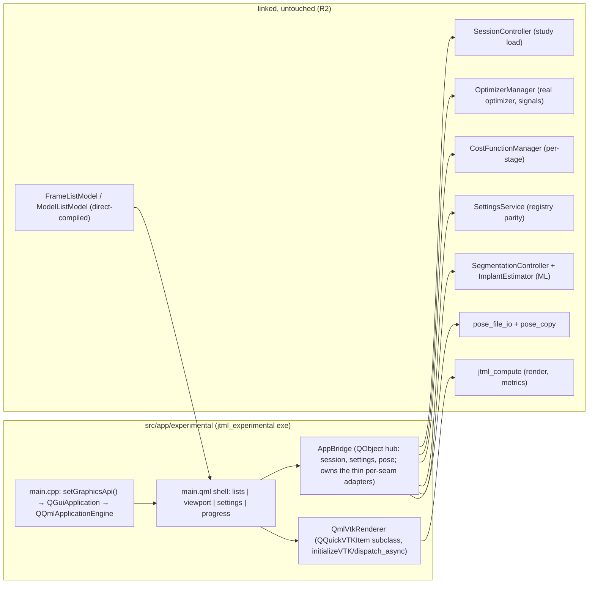

# QML Experimental Front-End (Parallel App)

## Overview

A new, parallel executable (`jtml_experimental`) in `src/app/` — a QML front-end
that links the existing widget-free backend (`jtml_domain/services/coordinator/
compute`) plus Qt Quick and VTK's in-tree `GUISupportQtQuick`, drives the REAL
optimizer (`OptimizerManager`, `CostFunctionManager`) and the study-loading seams
(`SessionController`), and provides a cleaner surface for running optimizer/cost
experiments. The widgets app (`joint-track-machine-learning`) is untouched
(R2 — the phase is additive). A spike-first sequencing makes the
xcb + Qt 6.7.2 + VTK 9.3 `QQuickVTKItem` viability check the go/no-go gate
before any real UI is built.

Evidence base: panoptes angle 04 (`.panoptes/jtml-research-horizons/angles/04-qml-vs-widgets.org`)
— full QML rewrite = NO-GO now, parallel spike = sanctioned first increment,
seams verified QML-ready; plus repo research this session (CMake mechanics,
`OptimizerManager` signal surface, `CostFunctionManager`/`SessionController`
APIs, render-smoke registration, the `vtkWindowToImageFilter` segfault).

---

## Problem Frame

The hand-built QWidgets mainscreen is not worth rebuilding by hand or in Qt
Designer. The backend is fully widget-free and the repo's VTK build already
compiles the QML integration — so a QML exploration costs nothing in backend
terms and everything in front-end terms. The owner wants a **resident
experimental front-end**: a parallel app they actually prefer for experiments,
oracle-arbitrated, with the widgets app as the full-featured fallback.

Origin: `docs/brainstorms/2026-08-11-qml-experimental-frontend-requirements.md`
(R1–R17, F1–F3, AE1–AE5).

---

## Requirements Trace

- R1. New executable `jtml_experimental` in `src/app/` linking
  `jtml_domain/services/coordinator/compute` + `Qt6::Quick/Qml/QuickControls2` +
  `VTK::GUISupportQtQuick`; `jtml_view` NOT linked.
- R2. Widgets app + all backend code byte-identical (R2 — the phase is additive;
  R13 in this plan is the parity gate, not the no-behavior-change rule); the
  named modification set is minimal (see Scope Boundaries).
- R3. Study loading reuses `SessionController`; the app owns its dataset
  containers (frames/models/`LocationStorage`).
- R4. Optimizer settings panel (ranges/budgets/dilation per stage, backed by
  `OptimizerSettings` + `settings_constants.h`).
- R5. Cost-variant selection via `CostFunctionManager`'s public API
  (`getAvailableCostFunctions` / per-stage `setActiveCostFunction`).
- R6. Live optimization progress from `OptimizerManager` signals (stage, calls,
  current min, pose updates).
- R7. Single `QQuickVTKItem` main viewport; silhouette at current pose over the
  fluoro background; pose updates via the render-thread contract.
- R8. ML path: `.pt` selection, `SegmentFrame` / `EstimateImplantPose`, estimate
  seeds the optimizer; graceful degradation without models.
- R9. Pose save/load/edit: `pose_file_io` + `pose_copy`, editable per-frame
  pose values in QML.
- R10. Settings persistence via `SettingsService` (registry parity), including
  the cost-function registry mapping.
- R11. `QmlVtkRenderer` seam: minimal VTK pipeline owned inside
  `QQuickVTKItem::initializeVTK`; all VTK state render-thread-owned, reachable
  only via `initializeVTK`/`destroyingVTK`/`dispatch_async`.
- R12. Oracle integrity: the numeric oracle gate (`jtml.oracle`) and its
  fixtures remain untouched and UI-free; render-smoke binaries already live in
  `test/oracle/` (`render_smoke` links `jtml_view` today — that is the
  precedent the new QML smoke joins, not a violation). Existing gates green at
  every cut.
- R13. Oracle-arbitrated parity: QML app on Kneel_1 with the oracle config lands
  within the oracle's band (IoU ≥ 0.85; pose within informational tolerance).
- R14. Per-cut gates (umbrella requirement applied by every unit's
  Verification section): headless for pure logic; compile + manual-visual for
  UI; QML render smoke for the render path.
- R15. QML render smoke via `QQuickWindow::grabWindow` under forced xcb
  (`vtkWindowToImageFilter` is a documented segfault on this build — resolved,
  not open).
- R16. `.pt` models stay user-provided.
- R17. v1 scope locked (study load, settings, cost selection, progress, ML,
  pose edit, persistence, single viewport); no biplane/coronal, no IoU table.

**Origin actors:** A1 (developer/researcher — the success bar is their
preference), A2 (coding agent).
**Origin flows:** F1 (study-load), F2 (experiment-run), F3 (ML-initialized run).
**Origin acceptance examples:** AE1 (additive diff + green gates), AE2 (parity
run), AE3 (cost-variant knob), AE4 (ML path + degradation), AE5 (save/restart
round-trip).

---

## Scope Boundaries

- NOT a MainScreen rewrite; no QML islands on the widgets app (deferred);
  no biplane/coronal viewport; no IoU results table in v1.
- Zero modifications to existing seams (`OptimizerManager`, `SessionController`,
  `CostFunctionManager`, `SettingsService`, compute kernels, view-models) —
  reuse and direct-compile only.
- No ML model training or committed weights; `.pt` stays user-provided.
- No changes to `packaging/` (the experimental app is a dev tool run from the
  build dir; CPack stays widgets-app-only).
- Not the production-shaped multi-stage oracle (optimizer-backend workstream).

### Deferred to Follow-Up Work

- Extracting the widgets app's private `BuildCostFunctionRegistryEntries`
  (`src/view/mainscreen.cpp:4895`, ~150 lines) into `SettingsService` so both
  apps share one mapping — the QML app replicates it this phase (duplication
  accepted, R13), extraction is a separately-gated cut.
- QML islands on the widgets mainscreen (QQuickWidget) — future decision.
- Full QML front-end (Path A) — revisit per the decision record (U9).

---

## Context & Research

### Relevant Code and Patterns

- App target precedent: `src/app/CMakeLists.txt` (RPATH props :32-34,
  `CUDA_ARCHITECTURES native` :29, lib set), `src/app/main.cpp`
  (surface-format-before-app), `src/app/Study2Grid/` (second-exe subdir
  precedent).
- VTK QML: `_deps/vtk/install/include/vtk-9.3/QQuickVTKItem.h` (render-thread
  contract: `initializeVTK`/`destroyingVTK`/`dispatch_async`/`setGraphicsApi`),
  `VTK::GUISupportQtQuick` registered but NOT in root `find_package` COMPONENTS
  (`CMakeLists.txt:97`) → directory-scoped re-find in the app's CMakeLists.
- Autoinit precedent: `test/CMakeLists.txt:580-613` (`jtml_test_render_smoke`:
  `vtk_module_autoinit`, `CUDA_ARCHITECTURES native`, rpath appends, LABELS
  `oracle;render`, `ENVIRONMENT "QT_QPA_PLATFORM=xcb"`, repo-root
  `WORKING_DIRECTORY`).
- Optimizer wiring: `optimizer_manager.h:84-114` signals (7 binds the widgets
  app makes in `LaunchOptimizer`, `mainscreen.cpp:4235-4303`), `Initialize`
  signature (:61-79, containers by value; `QModelIndexList` buildable from
  `model->index(row,0)` without `QItemSelectionModel`).
- Cost API: `CostFunctionManager.h` — `CostFunctionManager(Stage)` :48,
  `getAvailableCostFunctions()` :84, `setActiveCostFunction(name)` :53;
  widgets precedent `settings_control.cpp:40-44,463-594`.
- Session API: `session_controller.h` — `ParseCalibration` :114, `ParseImages`
  :124, `ParseModels` :140, `PopulateModels` :147 (caller-owned containers).
- Models: `include/view/frame_list_model.h` / `model_list_model.h` are
  QAbstractListModel and widget-free — direct-compile their `.cpp` into the app
  target (the established direct-compile pattern; do NOT link `jtml_view`).

### Institutional Learnings

- `docs/solutions/tooling-decisions/jtml-rendering-runtime-xcb-qvtk-2026-08-10.md`:
  xcb-only rendering; **`vtkWindowToImageFilter` segfaults on this build**
  (VTK_USE_X=OFF/EGL/OSMesa off) → R15 commits to `QQuickWindow::grabWindow`;
  surface-format-before-app rule.
- `docs/solutions/conventions/jtml-testability-and-cmake-conventions-2026-08-07.md`:
  AUTOMOC — Q_OBJECT headers must be in the `add_executable` source list;
  explicit `.cpp` lists; rpath recipe (conda overrides BUILD_RPATH).
- `docs/solutions/conventions/jtml-mainscreen-decomposition-patterns-2026-08-10.md`:
  selection-command traps (the QML delegate selection sidesteps them
  deliberately); torch `ATen/core/ivalue_inl.h` does `#undef slots` — torch
  includes after Qt-object headers; per-frame controller API transfers to the
  ML path.
- `docs/solutions/logic-errors/cost-function-parameter-double-truncation-2026-08-08.md`:
  cost parameters must round-trip losslessly (no int narrowing) — the QML
  settings panel writes doubles.
- Panoptes angle 04: QQuickVTKItem bug tail (DPR/mouse-position, draw-pick
  styles), ecosystem QWidgets-first, spike = the only way to verify this box's
  xcb + Qt 6.7.2 + VTK 9.3 behavior.

### External References

None beyond angle 04's sourced evidence (VTK 9.3 release notes, QQuickVTKItem
docs, VTK/Slicer discourse, Qt docs — all cited in the angle file).

---

## Key Technical Decisions

- **Spike-first:** U1 is a minimal QML window with one `QQuickVTKItem` rendering
  a model silhouette under xcb. Its result (renders + interacts + smoke
  captures) is the go/no-go for U2–U9; a spike failure aborts the phase with
  the angle-04 verdict standing (QML deferred, decision recorded in U9).
- **Directory-scoped `find_package(VTK ... COMPONENTS GUISupportQtQuick)`** in
  the app's CMakeLists instead of editing the root COMPONENTS list — keeps the
  root file untouched and other targets' link lines unchanged (AE1-friendly).
- **QML-delegate selection, no `QItemSelectionModel`:** lists use
  `currentIndex` + model-level multi-select state. Deliberate non-reuse that
  sidesteps the entire selection-command trap class and keeps the widgets app's
  pinned semantics untouched.
- **Real optimizer, real seams:** drives `OptimizerManager` on its own thread
  exactly like `LaunchOptimizer` does (new manager + thread + `moveToThread` +
  `Initialize` + 7 signal connects + start), reusing `OptimizeIntentController`
  for the entry gate. Containers passed by value, `QModelIndexList` built from
  the list models.
- **`QmlVtkRenderer` under the render-thread contract:** all VTK state created
  in `initializeVTK`, stored in the returned `vtkUserData`; pose/background
  updates only via `dispatch_async`. Reuses compute-layer rendering
  (GPUModel/render paths) — the reimplementation is the actor/mapper/window
  plumbing, not the rendering math.
- **Render smoke = `QQuickWindow::grabWindow`** (vtkWindowToImageFilter is a
  segfault on this build), registered like `jtml.render_smoke`
  (LABELS `oracle;render`, xcb, repo-root cwd, TIMEOUT), with an
  expose/afterRendering gate before capture.
- **Settings: session-local by default, explicit save.** The panel edits
  `OptimizerSettings` + per-stage managers in memory; a save action persists
  via `SettingsService` (registry parity, incl. the replicated cost-function
  mapping). Avoids registry write churn during experiments.
- **Direct-compiled models:** `frame_list_model.cpp` / `model_list_model.cpp`
  compiled into the app target (and the smoke) — the established test pattern,
  applied to the app itself.
- **Minimal named modification set** (AE1 honesty): `src/app/CMakeLists.txt`
  (one `add_subdirectory` line), the new `src/app/experimental/` tree, the
  decision-record comment edit at `src/view/CMakeLists.txt:6`, the smoke
  registration in `test/CMakeLists.txt`, and — landed with U1 — the additive
  `Qt6 COMPONENTS ... OpenGL Quick Qml` line in the root `CMakeLists.txt`
  (behavior-neutral for all existing targets; the directory-scoped VTK
  `GUISupportQtQuick` re-find from the plan's decision was superseded by this
  simpler root-components addition — both approaches keep existing link lines
  unchanged). Everything else is added files.

---

## Open Questions

### Resolved During Planning

- [Origin deferred] App naming + location: `jtml_experimental`, new subdir
  `src/app/experimental/` (Study2Grid precedent).
- [Origin deferred] Settings persistence: session-local with explicit save via
  `SettingsService`; cost-function registry mapping replicated in the app
  (extraction deferred to follow-up).
- [Origin deferred] Pose display: editable per-frame pose table in QML backed by
  `LocationStorage` + `pose_file_io`.
- [Origin deferred] Cost selection: confirmed widget-free via
  `getAvailableCostFunctions`/`setActiveCostFunction` (R5's brainstorm wording
  corrected — `listCostFunctions` is private registration).
- [Origin deferred] File dialogs: QML `FileDialog` (native last-used-
  directory memory accepted for v1; widgets-dialog directory-persistence
  parity is a follow-up).
- [Origin deferred] Render smoke: `QQuickWindow::grabWindow` (learnings pass
  killed the `vtkWindowToImageFilter` option).
- [Origin deferred] `QModelIndexList` for `Initialize` built from list models
  without `QItemSelectionModel` — verified feasible.

### Deferred to Implementation

- The exact default GL surface format call for `QQuickVTKItem` on this box
  (spike-time; the rule is set-format-before-`QGuiApplication`).
- `QQuickWindow::grabWindow` timing specifics (expose vs `afterRendering` gate)
  — spike/smoke-time discovery.
- Whether the QML shell uses a `.qrc`-embedded `main.qml` via
  `QQmlApplicationEngine` vs `qmlRegisterType` + plain file load (qrc preferred
  for ctest portability; exact structure at implementation).
- QML list delegate styling details (v1 = functional, not polished).

---

## High-Level Technical Design

> *This illustrates the intended approach and is directional guidance for review, not implementation specification. The implementing agent should treat it as context, not code to reproduce.*

**Bridge decomposition (review-fixed):** `AppBridge` is the QML-exposed hub
(session, settings, pose surfaces) and owns four thin per-seam adapters —
`StudyBridge` (U4), `OptimizerBridge` (U6), `MlBridge` (U7), `PoseBridge`
(U8). Thinness rule: adapters are pass-throughs (no logic — all behavior
lives in the seams they delegate to), so the split cannot drift into a
god-object. Every bridge is registered in `main.cpp` (`qmlRegisterType`) or
attached to the engine root context in U2; U7/U8 list `main.cpp`/`AppBridge`
in their Modify sets.

Optimizer run flow: settings panel → `OptimizerSettings` + per-stage managers →
`OptimizeIntentController::Evaluate` gate → `OptimizerManager` on its own
`QThread` (mirror of `LaunchOptimizer`) → 7 signals → QML progress bindings +
pose updates (`dispatch_async` into `QmlVtkRenderer`) → `OptimizedFrame` →
`LocationStorage::SavePose` → viewport re-render at result pose.

---

## Implementation Units

- [x] U1. **Spike gate — QML + VTK viability**

**VERDICT (2026-08-11): GO** — `QQuickVTKItem` renders + interacts + captures under this box's xcb + Qt 6.7.2 + VTK 9.3. Evidence: `ctest -R qml_render_smoke` passes (render non-blank: gray stddev 43.5 / center 66.3; dispatch_async pose update re-renders: 18.8% pixels differ; QTest drag moves the camera: camera x -52.2; PNG artifacts in `qml-render-smoke-output/`). Manual leg: real XTEST-injected X11 drags rotate the camera (2-3% pixel diff per drag, app stable). No factory errors. Notes: DPR≈2 box; the pinned QQuickVTKItem never calls `QVTKInteractorAdapter::SetDevicePixelRatio` (bug tail active — halves drag sensitivity at DPR 2; the deprecated QQuickVTKRenderWindow path does call it) — interaction still correct. Pre-existing `jtml.probe_vtk` expected-fail (standalone GLX symbol resolution) unrelated. One interactive spike launch exited silently mid-test once (no coredump/stderr); relaunch stable. U2+ proceed.

**Goal:** Prove `QQuickVTKItem` renders and captures under this box's
xcb + Qt 6.7.2 + VTK 9.3 before any real UI work. **This unit's result is the
go/no-go for U2–U9.**

**Requirements:** R1, R7, R11, R15

**Dependencies:** None

**Files:**
- Create: `src/app/experimental/CMakeLists.txt` (scratch target,
  directory-scoped `find_package(VTK COMPONENTS GUISupportQtQuick)`,
  `vtk_module_autoinit`, rpath props, `CUDA_ARCHITECTURES native`),
  `src/app/experimental/spike_main.cpp`, `src/app/experimental/spike.qml`
- Modify: `src/app/CMakeLists.txt` (one `add_subdirectory(experimental)` line),
  `test/CMakeLists.txt` (smoke registration: LABELS `oracle;render`, xcb env,
  repo-root cwd, TIMEOUT — the gate's ctest verification must be real at U1)
- Test: `test/oracle/qml_render_smoke.cpp` (loads `spike.qml` through
  `QQmlApplicationEngine` — the smoke must exercise the QML path (type
  registration, import resolution, `QQuickVTKItem` ownership inside a QML
  scene), NOT a C++-only scene; registered `LABELS "oracle;render"`, xcb env,
  repo-root cwd — prototype of U9's smoke, registered in `test/CMakeLists.txt`
  at U1 so the gate's `ctest` verification is real)

**Approach:**
- Mirror the render-smoke registration pattern (`test/CMakeLists.txt:580-613`).
- `setGraphicsApi()` before `QGuiApplication`; one `QQuickVTKItem` subclass
  whose `initializeVTK` creates a renderer + a simple actor (load a Kneel_1
  STL via the existing services path); capture via `QQuickWindow::grabWindow`
  after an expose/afterRendering gate.
- Verification checklist for the spike: window renders non-blank under xcb;
  mouse interaction produces expected camera behavior; grabWindow capture is
  non-empty; no factory/autoinit errors; **one pose update via `dispatch_async`
  from the app thread re-renders (captures differ); a background-image swap
  re-renders correctly** — the dynamic render-thread path is retired at the
  gate, not at U3.

**Execution note:** This is the go/no-go gate. If the spike fails (blank
render, factory failure, capture empty), stop the phase; the owner records an
adjusted decision record ("spike failed; QML deferred — revisit on Qt 6.8+/
VTK 9.4+ maturity") in `src/view/CMakeLists.txt` (the U9 success-case record
text applies only when the spike passes), and do not proceed to U2+.

**Test scenarios:**
- Happy path: spike window shows the STL silhouette over a solid background;
  grabWindow PNG is non-blank (pixel-variance check like `render_smoke.cpp`).
- Edge case: grabWindow before first frame returns empty — the gate exists and
  the test waits for the rendered frame.
- Error path: `setGraphicsApi`/autoinit misconfiguration produces a clear
  failure rather than a silent base-class factory (the documented
  `vtk_module_autoinit` failure modes).

**Verification:**
- Spike renders + interacts + captures under xcb; `ctest -R qml_render_smoke`
  passes; go/no-go recorded in the plan.

---

- [ ] U2. **App skeleton — jtml_experimental target + QML shell**

**Goal:** The full app target with the QML shell layout and direct-compiled
models; the frame in which every other unit lands.

**Requirements:** R1, R2, R3, R17

**Dependencies:** U1

**Files:**
- Create: `src/app/experimental/CMakeLists.txt` (final target: libs minus
  `jtml_view`, `Qt6::Quick/Qml/QuickControls2`, scoped `VTK::GUISupportQtQuick`,
  `vtk_module_autoinit`, rpath, `CUDA_ARCHITECTURES native`, explicit source
  list incl. Q_OBJECT headers for AUTOMOC, direct-compiled
  `frame_list_model.cpp`/`model_list_model.cpp`; AUTORCC is inherited globally
  from the root `CMakeLists.txt` — list `resources.qrc` in the sources, or use
  `qt6_add_resources` explicitly), `src/app/experimental/main.cpp`
  (setGraphicsApi + default GL format before `QGuiApplication`;
  `QQmlApplicationEngine` loading the `.qrc`-embedded shell; QML type
  registrations), `src/app/experimental/main.qml` (shell: study lists left,
  viewport center, settings right, progress bottom), `src/app/experimental/AppBridge.h/.cpp`
  (the QObject exposing session/settings/optimizer/ML/pose operations to QML —
  thin, delegates to the seams), `src/app/experimental/resources.qrc`
- Modify: `src/app/CMakeLists.txt` (add_subdirectory — already added in U1)

**Approach:**
- AUTOMOC: every Q_OBJECT header (`AppBridge.h`, later `QmlVtkRenderer.h`)
  listed in the `add_executable` sources.
- Models direct-compiled (not linked via `jtml_view`) — the established
  pattern; the models' headless tests keep pinning them.
- Shell is functional, not polished (v1). Layout covers ALL v1 surfaces:
  left column = study lists (frame list over model list) + ML controls strip
  (model pickers, segment button, estimate display); center = viewport;
  right panel = settings stacked over the pose table; bottom = progress.
  U7 modifies the ML strip, U8 the pose-table region — the U2 shell already
  allocates them.

**Test expectation:** none for the shell itself — compile gate + manual-visual
under xcb (the app launches and shows the shell).

**Verification:**
- `pixi run build` green; app launches under xcb showing the shell;
  `jj diff` shows only the named modification set.

---

- [ ] U3. **QmlVtkRenderer — the render seam**

**Goal:** The minimal VTK pipeline under `QQuickVTKItem`'s render-thread
contract: models at pose over the fluoro background, pose updates via
`dispatch_async`.

**Requirements:** R7, R11, R15

**Dependencies:** U2

**Files:**
- Create: `src/app/experimental/QmlVtkRenderer.h/.cpp` (QQuickVTKItem subclass:
  `initializeVTK` builds renderer + camera + actors + background image actor;
  `destroyingVTK` cleans up; public slots call `dispatch_async` for pose/model/
  background updates), `src/app/experimental/ExperimentalScene.h/.cpp` (the
  scene state: which frame image, which models, poses — plain data, owned by
  the app thread; the renderer copies what it needs inside `dispatch_async`)
- Modify: `src/app/experimental/main.qml` (viewport item uses the renderer),
  `src/app/experimental/resources.qrc`

**Approach:**
- Reuses compute-layer rendering (GPUModel + render paths, silhouette + DRR
  building blocks) — only the widget/window plumbing is reimplemented.
- ALL VTK state lives in the `vtkUserData` returned by `initializeVTK`; the
  renderer never touches VTK objects outside `initializeVTK`/`destroyingVTK`/
  `dispatch_async` bodies. **Threading reality (review-verified against the
  pinned VTK 9.3 source):** `dispatch_async` lambdas run on the **Qt Quick
  render thread** (the queue is drained in `QQuickVTKItem::updatePaintNode`),
  NOT on the GUI thread. Therefore: copy scene state (pose, background, model
  list) to locals on the GUI thread when the slot is invoked, and capture by
  value into the lambda — never read app-owned mutable state inside lambdas.
- torch-include ordering rule applies if any TU mixes Qt-object + torch
  headers (`#undef slots`).

**Test scenarios:**
- Happy path: scene with one model at a known pose renders the silhouette over
  a background frame; pose update via the slot re-renders at the new pose
  (grabWindow captures differ).
- Edge case: background swap (original/inverted) re-renders correctly.
- Error path: destroying the item mid-update does not crash (dispatch_async
  after destruction is safe — the scene state is app-owned).

**Verification:**
- Manual-visual under xcb: model visible at pose over frame; pose changes
  reflect immediately; no crashes on window close during updates; the smoke
  (U9) exercises it headlessly.

---

- [ ] U4. **Study loading + lists + selection contract**

**Goal:** Load a study through `SessionController` and show it in QML lists over
the direct-compiled models, with the delegate-based selection contract.

**Requirements:** R3, R17

**Dependencies:** U2, U3

**Files:**
- Create: `src/app/experimental/StudyBridge.h/.cpp` (QObject: file-dialog
  orchestration → `SessionController` parse calls → dataset containers +
  `LocationStorage` + model list population; exposes frame/model counts and
  selection state to QML)
- Modify: `src/app/experimental/AppBridge.h/.cpp`, `src/app/experimental/main.qml`
  (lists bound to `FrameListModel`/`ModelListModel` via the bridge)
- Test: `test/unit/experimental_selection_test.cpp` (Catch2, direct-compiles
  the models + a small selection-state helper if one emerges)

**Approach:**
- Study loading: three load actions (calibration → images → models) mirroring
  the widgets buttons, or a chained single "Load Study" action — decide at
  implementation, defaulting to the three-action mirror; models-before-
  calibration guard (defer + prompt when `PopulateModels` needs a
  calibration); loading a second study replaces the dataset (with a confirm);
  `CalibrationParseResult` error kinds map to QML messaging (FileOpenFailed
  silent, PixelSizeZero/InvalidCode message — the widgets precedent);
  `WritePoseFile`/`WriteKinematicsFile` false returns surface a message and
  keep in-memory state.
- Selection contract: frame list = current frame (`currentIndex`); model list
  = multi-select with primary = first selected (model-level state, mirrored
  into `SessionState`). No `QItemSelectionModel` anywhere.
- Partial-load semantics (`goto stop`/`stop_biplane`) come free via
  `SessionController` — the app appends what was parsed.

**Test scenarios:**
- Happy path: parsing a fixture study (Kneel_1 calibration + images + STLs)
  populates frames/models/locations with counts matching `SessionController`'s
  own tests.
- Edge case: cancel mid-load keeps previously loaded data (partial-load
  semantics pinned).
- Edge case: empty selection states are well-defined (no crash on
  render-without-selection).
- Integration: selecting a frame in QML updates the viewport background via the
  bridge → renderer chain.

**Verification:**
- Headless test green; manual-visual: load Kneel_1, lists populate, selection
  drives the viewport.

---

- [ ] U5. **Settings panel + cost-variant selection**

**Goal:** The experiment knobs: per-stage ranges/budgets/dilation and the cost
function choice, session-local with explicit save.

**Requirements:** R4, R5, R10, R17

**Dependencies:** U2

**Files:**
- Create: `src/app/experimental/SettingsPanel.qml` (form: trunk/branch/leaf
  ranges, budgets, dilation, number of branches; cost-variant combo per stage
  from `getAvailableCostFunctions`; save/reset buttons)
- Modify: `src/app/experimental/AppBridge.h/.cpp` (settings accessors +
  save via `SettingsService`, incl. the replicated
  `BuildCostFunctionRegistryEntries` mapping — `mainscreen.cpp:4895` is the
  reference implementation; the mapping must produce identical
  `STAGE@...@TYPE` keys and lossless double values)
- Test: `test/unit/experimental_settings_test.cpp` (Catch2: the replicated
  registry mapping produces the same entries as the widgets reference for a
  fixed manager configuration — parity pin; lossless double round-trip)

**Approach:**
- Per-stage `CostFunctionManager(Stage)` objects built in the bridge;
  `setActiveCostFunction` per stage; parameters via the `CostFunction` setter
  API (doubles — no narrowing, per the truncation-bug lesson).
- Session-local edits; explicit Save writes `OptimizerSettings` +
  `CostFunctionSettings` + `EdgeDetectionSettings` through `SettingsService`
  (org/app/keys identical); Load restores. Reset button restores
  `settings_constants.h` defaults; a dirty/unsaved indicator shows before
  quit.
- **Parity pin mechanism (review-fixed):** the widgets reference
  (`BuildCostFunctionRegistryEntries`, `mainscreen.cpp:4895`) is a private
  `MainScreen` member in `jtml_view` — a live call is impossible. Capture the
  reference once (run the widgets app's save path for a fixed manager
  configuration, dump the `SettingsService` entries) and embed as a golden
  fixture in `experimental_settings_test.cpp`; regenerate the fixture after
  the extraction follow-up lands.

**Test scenarios:**
- Happy path: setting a cost variant per stage reflects in the managers
  (`getActiveCostFunction`).
- Happy path: save → load round-trip preserves every value (registry parity
  contract).
- Edge case: fractional cost parameters round-trip bit-exact (double, no int
  narrowing — the pinned invariant).
- Integration: the mapping replication produces identical registry entries to
  the widgets reference for the same input (parity pin).

**Verification:**
- Headless tests green; manual-visual: change settings, run, save, restart,
  settings restored (AE5).

---

- [ ] U6. **Optimizer run wiring**

**Goal:** Drive the real `OptimizerManager` from QML: entry gate, thread
lifecycle, the 7 signal binds, progress display, result pose → viewport.

**Requirements:** R6, R7, R13

**Dependencies:** U3, U4, U5

**Files:**
- Create: `src/app/experimental/OptimizerBridge.h/.cpp` (QObject: mirrors
  `LaunchOptimizer`'s drive sequence — `OptimizeIntentController::Evaluate`
  gate, `new OptimizerManager` + `new QThread` + `moveToThread`,
  `Initialize(...)` with containers by value and `QModelIndexList` from the
  list models, 7 connects, thread start; relays the 7 signals to QML as
  signals/bindings)
- Modify: `src/app/experimental/AppBridge.h/.cpp`, `src/app/experimental/main.qml`
  (progress display: stage, calls, current min, pose values; run/stop buttons)
- Test: `test/unit/experimental_intent_gate_test.cpp` (Catch2: the app's gate
  calls exercise `OptimizeIntentController::Evaluate` for the same inputs as
  the existing intent tests — reuse, no new logic)

**Approach:**
- R13: no change to `OptimizerManager` — the bridge replicates the widgets
  drive sequence, including the preserved Initialize-failure quirk comment.
- Run-state machine (review-fixed): idle → running → stopping →
  completed/error, exposed to QML; run/stop buttons reflect the state; a
  re-run guard prevents a second `OptimizerManager` thread mid-run. Control
  locking during a run mirrors the widgets `DisableAll`/`EnableAll` pattern
  (load, lists, settings, pose surfaces disabled; stop always enabled).
  Errors (intent-gate rejection, `Initialize` failure, `OptimizerError`)
  surface via a single QML `Dialog` mechanism.
- v1 run scope: the current frame only (All/Each/From/Backward directives
  deferred).
- The 7 binds: `UpdateDisplay`/`OptimizerError`/`UpdateOptimum`/
  `OptimizedFrame`/`StopOptimizer` (app→manager, DirectConnection)/
  `UpdateDilationBackground`/`onUpdateOrientationSymTrap`; `finished()` is an
  optional completion hook for QML.
- Result path: `OptimizedFrame` → `LocationStorage::SavePose` → viewport
  re-render at result pose via `dispatch_async`.

**Test scenarios:**
- Happy path: a run with the oracle config (R13 parity config) completes and
  the pose lands in `LocationStorage` (headless: intent gate + container
  wiring; the GPU run itself is the U9 parity gate).
- Error path: intent gate rejection (no selection, multi-mode) surfaces as a
  QML message, no thread starts (mirrors the widgets behavior).
- Edge case: stop during a run returns to a re-runnable state (thread
  lifecycle mirrors the widgets flow).

**Verification:**
- Headless tests green; manual-visual: full run with progress + result pose in
  the viewport; U9 arbitrates numerically.

---

- [ ] U7. **ML segmentation/estimate path**

**Goal:** Segment frames and estimate an initial pose via the existing ML seams,
seeding the optimizer; graceful degradation without `.pt` models.

**Requirements:** R8, R16

**Dependencies:** U3, U6

**Files:**
- Create: `src/app/experimental/MlBridge.h/.cpp` (QObject: `.pt` selection via
  QML `FileDialog`, `SegmentationController::SegmentFrame` per frame (view
  owns the loop — the per-frame API pattern), `ImplantEstimator::
  EstimateImplantPose` with an `ImplantEstimateContext` built like the widgets
  app, estimate → initial pose → `OptimizerBridge` seed)
- Modify: `src/app/experimental/main.cpp` (bridge registration), `src/app/experimental/main.qml` (ML controls: model pickers, segment button, progress, estimate display)

**Approach:**
- The per-frame controller API transfers: the bridge owns the loop + progress
  signals; the controllers stay per-frame/stateless.
- Per-implant `.pt` pickers mirroring the widgets actions: segment femur,
  segment tibia, and one estimate model; the loaded `.pt` path/state is shown
  in the UI; v1 loop scope = current frame (all-frames deferral keeps the
  progress/cancel surface simple); degradation: pickers empty → clear message
  + plain-optimize path (AE4).

**Test scenarios:**
- Happy path: with `JTML_SEG_PT`/`JTML_FEM_ESTIMATE_PT`-style paths (env or
  dialog), SegmentFrame returns a segmented image for a Kneel_1 frame (GPU
  needed — oracle label if automated).
- Error path: missing models → clear message, no crash, optimizer still
  runnable (headless-testable bridge state).
- Integration: estimate pose seeds the optimizer and the refinement completes.

**Verification:**
- Headless: degradation path; GPU: manual-visual on the GPU machine (oracle
  label if the segmentation oracle fixtures become available).

---

- [ ] U8. **Pose save/load/edit + settings persistence**

**Goal:** Pose editing and file save/load (`pose_file_io`, `pose_copy`) plus
settings persistence (`SettingsService`) round out the experiment loop.

**Requirements:** R9, R10

**Dependencies:** U4, U5

**Files:**
- Create: `src/app/experimental/PoseBridge.h/.cpp` (QObject: pose table rows
  from `LocationStorage`, editable cells → `SavePose`, copy-prev/next via
  `pose_copy::PreviousPose/NextPose`, save/load pose + kinematics files via
  `pose_file_io`)
- Modify: `src/app/experimental/main.cpp` (bridge registration), `src/app/experimental/main.qml` (pose table + save/load/copy buttons)

**Approach:**
- Reuses the seams byte-for-byte; the copy boundary semantics (no-image
  fallback at frame 0/last, primary-vs-current split) come from `pose_copy`
  unchanged — the QML UI does not reimplement them.
- Pose table semantics (net-new UI, no widgets precedent): immediate
  `SavePose` per cell commit; non-numeric input rejected with an inline
  message; dirty-state indication; table + save/load/copy controls disabled
  during an optimizer run.
- Settings load on startup; save via the U5 panel.

**Test scenarios:**
- Happy path: edit a cell → `SavePose` → read back shows the edited value.
- Happy path: save pose file → reload → identical (fixture round-trip).
- Edge case: copy-prev at frame 0 / copy-next at last frame behaves exactly
  like the pinned `pose_copy` semantics (the existing tests already pin the
  seam — the bridge delegates, so a thin integration test suffices).
- Integration: save + restart + load restores poses and settings (AE5).

**Verification:**
- Headless tests green; manual-visual round-trip (AE5).

---

- [x] U9. **Render smoke, parity, decision record**

**VERDICT (2026-08-11):** parity gate PASS — recovered IoU **0.993627 ≥ 0.85**,
digit-for-digit identical to `test/golden/baseline.json`'s captured 0.993627,
and the pose gap vs `fem.jts` (-0.048, +0.004, -0.905, +0.042, +0.002, -0.135)
exactly matches the baseline's measured gap. The app's `OptimizerBridge`
wiring (gate → Initialize → trunk-3000 run from `fem.jts` start poses →
`SavePose`) produces the same deterministic result as the oracle's own
`DirectOptimizer` run — R13/R2-validated end-to-end. Registered as
`jtml.qml_parity_check` (oracle label, 1.15s). Decision record landed at
`src/view/CMakeLists.txt:6` (QML deferred; experimental app sanctioned).
Compound entry: `docs/solutions/conventions/jtml-qml-experimental-frontend-2026-08-11.md`.

**Goal:** The QML render smoke (R15), the oracle-arbitrated parity run (R13),
and the QML decision record replacing the "QML-swappable later" comment.

**Requirements:** R12, R13, R15

**Dependencies:** U1–U8

**Files:**
- Create: `test/oracle/qml_render_smoke.cpp` (finalized from U1's prototype:
  full scene with a model + background, grabWindow capture, non-blank
  pixel-variance check), `docs/solutions/conventions/jtml-qml-experimental-frontend-2026-08-11.md`
  (compound entry: QML app architecture, render-thread contract lessons,
  grabWindow smoke, registry-mapping duplication + extraction follow-up)
- Modify: `src/view/CMakeLists.txt` (comment-only: replace "QML-swappable
  later" with the dated decision record), `docs/plans/2026-08-11-005-feat-qml-experimental-frontend-plan.md`
  (U9 evidence + parity results) — the smoke registration itself landed in
  U1; U9 only finalizes the smoke source if its properties change

**Approach:**
- Parity run: Kneel_1 **frame 0**, via the app's own run path, with the
  oracle-equivalent configuration: start poses **loaded from
  `example_studies/Kneel_1/fem.jts`** via `pose_file_io` (the oracle's
  `StartPoses()` values — a fresh-load default pose would false-fail the
  gate), `OptimizerSettings` = trunk budget 3000, branch/leaf budgets 0 (or a
  documented single-stage-equivalent configuration — verify `RunDirectStage`
  behavior at budget 0 first), ranges (12,12,15,15,15,15), DIRECT_DILATION,
  dilation 6, directive Single; assert IoU ≥ 0.85 vs `Labels/` with the
  **empirically pinned frame↔label pairing (frame 0 ↔
  AT_K1_V1_0160_label_fem.tif** — verified in the oracle, not name-aligned in
  the filesystem) and pose within informational tolerance.
- **IoU comparator (review-fixed):** no existing binary accepts an external
  pose for IoU arbitration and `oracle_test.cpp` stays untouched (R12). The
  app exports the final pose; a small `test/oracle/qml_parity_check.cpp`
  reuses `oracle_test.cpp`'s render + IoU code against that pose file (or the
  app computes IoU internally via `compute::IOU` + `render_engine` at the
  final pose — decide at implementation, defaulting to the app-internal
  check for minimal surface). Backface-culling config pinned to the oracle's
  (OFF) so both sides see the same silhouette.
- Decision record text: "QML-ready seams (models/services/domain widget-free;
  VTK 9.3 GUISupportQtQuick in-tree); QML front-end deferred (angle 04,
  2026-08-11); experimental app landed as the sanctioned parallel vehicle;
  revisit full QML on a concrete UI need or Qt 6.8+/VTK 9.4+ maturity."
- Evidence: AE1–AE5 assembly, `jj diff` additivity, line/signal wiring notes.

**Test scenarios:**
- Happy path: smoke captures a non-blank scene under xcb (ctest -L render
  includes it).
- Integration: parity run lands within the oracle band (documented in the
  plan's U9 evidence).
- Edge case: all existing gates remain green (32 headless, oracle, render) —
  R12.

**Verification:**
- `ctest -L render` (smoke), `ctest -L oracle` (existing + parity documented),
  `pixi run test` 32/32; AE1–AE5 evidence assembled; decision record landed.

---

## System-Wide Impact

- **Interaction graph:** the app makes the same 7 binds as the widgets app
  (6 `OptimizerManager` signals + the app→manager `StopOptimizer` reverse
  connection) — both UIs connected to one manager instance each (independent
  runs, no shared state). The registry (`SettingsService`) is now
  written by both apps — the replicated cost-function mapping must produce
  identical keys or the two apps would fight over settings (parity pin in U5).
- **Error propagation:** intent-gate rejections surface as QML messages;
  `Initialize` failure preserves the widgets behavior (thread started, error
  box analog, leak comment). Missing `.pt` models degrade gracefully.
- **State lifecycle risks:** the renderer's scene state is app-thread-owned
  and copied inside `dispatch_async` (no VTK state off the render thread);
  optimizer thread lifecycle mirrors the widgets flow (stop → re-runnable);
  partial-load datasets persist like the widgets app.
- **API surface parity:** zero changes to existing seams; the only shared-file
  edits are the one-line `add_subdirectory`, the smoke registration, and the
  comment-only decision record.
- **Integration coverage:** the QML smoke (render path), the parity run
  (end-to-end wiring vs the oracle band), and the existing gates (regression).
- **Unchanged invariants:** the widgets app's selection semantics, registry
  behavior, and oracle discipline are untouched; the oracle tests link no UI
  (R12) and nothing in this phase changes that.

---

## Risks & Dependencies

| Risk | Mitigation |
|------|------------|
| Spike fails on this box (blank render / factory / capture) — the phase's core unknown | U1 is the go/no-go gate; failure stops U2–U9, decision record still lands; angle-04 NO-GO verdict stands |
| Render-thread discipline violations (VTK state off the render thread) | `QmlVtkRenderer` contract enforced structurally: scene state app-owned, VTK state only in initializeVTK/destroyingVTK/dispatch_async; review gate in U3 |
| DPR/mouse-position + draw-pick interactor bugs in the 9.3-era integration | Spike tests mouse interaction at DPR=1; v1 UI avoids draw-pick styles (the DRR tool's pick patterns are widgets-only this phase) |
| `QQuickWindow::grabWindow` timing (empty capture before first frame) | Expose/afterRendering gate in the smoke; pixel-variance check |
| AUTOMOC undefined-vtable for new Q_OBJECT classes | Headers listed in the app's explicit source list (U2) — repo gotcha |
| torch `#undef slots` include ordering | Torch includes after Qt-object headers in any mixed TU |
| Registry drift between the two apps (replicated mapping) | U5 parity pin: identical entries for identical input; extraction to `SettingsService` is the follow-up |
| `vtkWindowToImageFilter` segfault on this build | R15 commits to grabWindow (resolved at planning) |
| jtml_view accidentally linked (pulls QWidgets app into the new exe) | Link list explicitly excludes jtml_view; models direct-compiled; review gate |
| QML import/plugin resolution under ctest | `.qrc`-embedded QML + the proven xcb platform-plugin resolution from render_smoke |
| The parity run inherits DIRECT convergence noise | Parity uses the oracle's own band (IoU ≥ 0.85 is the appearance gate; pose informational) — the R2-validated arbiter |

---

## Documentation / Operational Notes

- `src/view/CMakeLists.txt:6`: "QML-swappable later" → dated decision record
  (U9).
- New compound entry `docs/solutions/conventions/jtml-qml-experimental-frontend-2026-08-11.md`
  (U9): QML app architecture, render-thread contract, grabWindow smoke recipe,
  registry-mapping duplication + extraction follow-up, spike result.
- No CI changes; the new app builds in `pixi run build`; the QML smoke is
  `oracle;render`-labeled (not in default headless).
- Packaging: `packaging/` untouched; the experimental app runs from the build
  dir (`bin/jtml_experimental`).

---

## Sources & References

- **Origin document:** [docs/brainstorms/2026-08-11-qml-experimental-frontend-requirements.md](docs/brainstorms/2026-08-11-qml-experimental-frontend-requirements.md)
- Panoptes: `.panoptes/jtml-research-horizons/angles/04-qml-vs-widgets.org` (primary evidence base), `synthesis.org`
- Related code: `src/app/CMakeLists.txt`, `src/app/main.cpp`, `test/CMakeLists.txt:580-613`, `include/coordinator/optimizer_manager.h`, `include/compute/CostFunctionManager.h`, `include/services/session_controller.h`, `include/view/frame_list_model.h`, `include/view/model_list_model.h`, `_deps/vtk/install/include/vtk-9.3/QQuickVTKItem.h`
- Institutional: `docs/solutions/tooling-decisions/jtml-rendering-runtime-xcb-qvtk-2026-08-10.md`, `docs/solutions/conventions/jtml-testability-and-cmake-conventions-2026-08-07.md`, `docs/solutions/conventions/jtml-layered-lib-split-2026-08-08.md`, `docs/solutions/conventions/jtml-mainscreen-decomposition-patterns-2026-08-10.md`, `docs/solutions/logic-errors/cost-function-parameter-double-truncation-2026-08-08.md`
