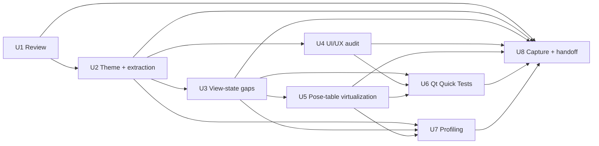

# QML Experimental Front-End Improvement Pass

## Overview

A full improvement pass over the experimental QML front-end
(`src/app/experimental/`, the `jtml_experimental` app built by plan 005 and
extended by plan 006), driven by the Qt QML skill suite: a structured review
(qt-qml-review), best-practice fixes (qt-qml), a UI/UX audit and polish
(qt-ui-design), Qt Quick Test coverage (qt-qml-test / qt-qml-test-run /
qt-cmake-project), and a performance baseline (qt-qml-profiler). The owner
explicitly sanctioned **breaking changes inside `src/app/experimental/`** —
it is a free sandbox. Everything else (widgets app, `src/view`, backend
seams, oracle, golden fixtures, packaging) is historical and untouched.

The plan is grounded in three research passes: repo/learning research (Qt
6.7.2 + QuickTest verified available in the pixi env; qmlformat/qmllint/
qmlprofiler/qmltestrunner all present), a spec-flow analysis of the QML view
layer (5 flows; 2 critical + 6 important + 6 minor gaps found), and direct
reading of all 5 QML files, the bridges, and the plan 005/006 docs.

---

## Problem Frame

Plan 005 shipped the app "functional, not polished" (its own words). The
view layer has never been reviewed against QML best practice, has zero
QML-side tests, no typography/accessibility system, and was never profiled.
The flow analysis additionally found view-layer state gaps with
data-integrity consequences (a stale pose table after optimizer runs, a
pending ML seed that silently overrides a manual arrangement, a pose-cell
commit contract that breaks under list virtualization). This pass fixes the
quality, UX, testability, and performance of the experimental front-end
while keeping the bridge/backend seams and the oracle-arbitrated parity
path intact.

Origin: direct owner request (2026-08-12) — "take a look at the
experimental qml stuff ... and have the myriad of qt qml skills while you
make a plan on improving it". Tracks selected by the owner: full pass
(review → fix → polish → tests → profile), UI/UX polish, QML test coverage,
performance profiling. Owner constraint: breaking changes allowed in
`src/app/experimental/`; historical code untouched.

**Strategic sequencing (owner-confirmed 2026-08-12):** the repo's recorded
roadmap — the 2026-08-11 handoff ("NEXT: synthesis items 1 → 3 → 2 → 5 →
8": cost-path bug fixes, the metric-ablation harness, the multi-stage
oracle, DIRECT variants, compute perf) and the panoptes synthesis verdict
scoring QML "Low now" (decision record at `src/view/CMakeLists.txt:6`) —
is acknowledged and deliberately deferred by this pass. The owner's
2026-08-12 request supersedes it; this pass's data-integrity fixes (U3)
and the view-test suite (U6) additionally pin the shared VM-layer bridge
contracts the algorithm roadmap builds on. U8 names the follow-on phase
explicitly.

---

## Requirements Trace

- R1. Structured review pass over all QML files (qt-qml-review: lint script
  + system qmllint + 6 parallel analysis agents) producing a triaged
  findings report in `docs/reviews/`.
- R2. Code-quality fixes per the qt-qml rules: component extraction
  (main.qml is ~1,020 lines of inline everything), Layout.* sizing
  compliance, binding hygiene, Theme token compliance, import cleanup.
- R3. UI/UX audit + polish per qt-ui-design: typography scale (TypeScale in
  the Theme singleton), keyboard navigation + visible focus, accessibility
  roles, contrast ≥ 4.5:1 for text, hit-target/sizing review.
- R4. View-layer testability: components take injected `required property`
  bridges instead of relying on context-property globals, so tests can
  inject fakes and the app fails loudly at load if a wiring is missed.
- R5. Qt Quick Test coverage (tst_Theme / tst_PoseCell / tst_SettingsPanel
  + view-flow tests) registered headless (offscreen platform, no VTK
  instantiation), following the repo test conventions.
- R6. Fix the view-layer state gaps found by the flow analysis: pose-table
  freshness (I1/I2), ML-seed-vs-manual-drag (I3), run-lock matrix
  completion (I4), Estimate enablement (I5), keyboard→bridge wiring (I6),
  and the pose-cell commit contract under virtualization (C1/C2).
- R7. Performance baseline via qmlprofiler on the 2D chrome (lists,
  dialogs, bindings; the VTK viewport is out of the profiler's scope) with
  the top hotspots fixed and re-documented.
- R8. Institutional capture: new `docs/solutions/` entries (Qt Quick Test
  recipe, qmllint gate, profiler recipe) + handoff update. Historical docs
  are not edited (owner constraint); the stale `MultiFilePicker.qml`
  reference in the 2026-08-11 conventions entry is noted, not rewritten.
- R9. Scope guard: only `src/app/experimental/**`, additive extensions to
  the existing `test/unit/` bridge suites, new test files, additive
  `test/CMakeLists.txt` registrations, `profiler/` artifact outputs, and
  new docs. The widgets app, `src/view`, backend seams, oracle/golden
  fixtures, and `packaging/` are untouched; `jtml.qml_parity_check` stays
  green — re-run after U3's bridge changes and after any U7 bridge
  change (the gate is ~1h; not per unit).

---

## Scope Boundaries

- No changes outside `src/app/experimental/**` (QML + bridges + main.cpp +
  CMakeLists + qrc + qmldir), **additive extensions to the existing
  `test/unit/` bridge suites, new test files, additive
  `test/CMakeLists.txt` registrations, skill-mandated artifact outputs
  under `profiler/` (U7 traces + reports), and new docs**. The owner
  constraint on historical code is absolute: widgets app, `src/view`,
  domain/services/coordinator/compute, oracle, golden fixtures, and
  packaging are not touched.
- No `qt_add_qml_module` conversion of the app target (see Key Technical
  Decisions — the qrc + qmldir approach stays; conversion is a separate
  future decision).
- No worker-thread move of the torch ML calls (GUI-thread freeze, M4): it
  is documented and measured in U7, not fixed.
- No shell-level unsaved-changes indicator in v1 (M6): **folded into U4**
  (owner-confirmed 2026-08-12) — a window/toolbar dirty badge driven by
  `settingsBridge.dirty` + `poseBridge.dirty`, the plumbing for which
  already exists.
- No changes to the backend seams' public APIs (bridges stay pass-throughs;
  all behavior stays in the seams).
- The render-thread contract (`QmlVtkRenderer` + `ExperimentalScene`) is
  unchanged; the pass does not touch VTK pipeline code.

### Deferred to Follow-Up Work

- `qt_add_qml_module` conversion + QML language-server integration for the
  app (needs care with the render-smoke target that loads `qrc:/renderer.qml`
  — separate gated cut).
- Full-window redesign / re-arrangement of the top-level shell (toolbar /
  left column / center / bottom bar) is NOT in scope; **intra-panel
  composition, hierarchy, and placement ARE** (owner-confirmed
  2026-08-12 — U4 carries the visual-composition pass).
- Shell-level dirty indicator (folded into U4), torch worker-thread move,
  RTL/localization support (English-only tool, single locale).

---

## Context & Research

### Relevant Code and Patterns

- `src/app/experimental/main.qml` (~1,020 lines) — the shell: toolbar,
  study lists, ML strip, viewport, run bar, 8 FileDialogs + 2 custom
  dialogs; **6 `Connections` glue blocks** to the bridges (main.qml:419
  studyBridge, 447 studyBridge, 461 viewport, 472 optimizerBridge, 493
  mlBridge, 510 poseBridge — line numbers drift during U2).
- `src/app/experimental/SettingsPanel.qml` — settings form with inline
  `component` definitions (RangeField/IntField/CostVariantCombo); does NOT
  import the theme module (hardcodes `#cfd3da`/`#8b929c` where
  `Theme.fg`/`Theme.fgMuted` exist).
- `src/app/experimental/PoseCell.qml` — editable pose cell; commit at
  `onEditingFinished` reads `studyBridge.primaryModelIndex` at commit time
  (C2) and restores on failed commit with a plain assignment that
  permanently kills the `storedValue` binding (C1).
- `src/app/experimental/Theme.qml` + `qmldir` — singleton palette; dirty-
  badge hexes duplicated in main.qml:221-227 and SettingsPanel (M2);
  `Theme.border` unused; no type scale.
- `src/app/experimental/{AppBridge,StudyBridge,SettingsBridge,OptimizerBridge,MlBridge,PoseBridge,FileDialogBridge}.h/.cpp` —
  thin QObject adapters (thinness rule), registered as root-context
  properties in `main.cpp`. Existing headless bridge tests:
  `jtml.experimental_selection`, `jtml.experimental_settings`,
  `jtml.experimental_optimizer_gate`, `jtml.experimental_ml_bridge`,
  `jtml.experimental_pose_bridge`.
- Test conventions: flat `test/CMakeLists.txt`, `jtml.<name>` test names,
  `LABELS "headless"` + repo-root `WORKING_DIRECTORY`, Q_OBJECT headers in
  the `add_executable` source list (AUTOMOC), block-scoped
  `find_package(Qt6 COMPONENTS ...)` (precedent:
  `jtml_test_qml_render_smoke` block), rpath recipe.
- QML smoke precedent: `test/oracle/qml_render_smoke.cpp` + `renderer.qrc`
  (xcb, `LABELS "oracle;render"`).

### Institutional Learnings

- `docs/solutions/conventions/jtml-qml-experimental-frontend-2026-08-11.md`
  — the app charter: render-thread contract (copy scene state on the GUI
  thread, capture by value), versionless imports, Theme singleton rules
  (`pragma Singleton` + `qmldir`), Material Dark choice, Dialog-based
  secondary surfaces. **Note: this entry references a `MultiFilePicker.qml`
  that no longer exists (superseded by `FileDialogBridge`) — historical
  entry, not edited; the drift is noted in U8's new entry.**
- `docs/solutions/ui-bugs/jtml-qml-model-pose-sync-queued-functor-never-delivered-2026-08-11.md`
  — direct by-value signal emits work; queued `invokeMethod` functors
  silently fail. Any new view→bridge signaling uses signal emits.
- `docs/solutions/tooling-decisions/jtml-rendering-runtime-xcb-qvtk-2026-08-10.md`
  — xcb-only rendering; grabWindow-only capture; QML tests must not
  instantiate VTK/GL.
- `docs/solutions/conventions/jtml-testability-and-cmake-conventions-2026-08-07.md`
  — AUTOMOC header-in-sources rule, explicit source lists, rpath recipe.
- `docs/solutions/conventions/jtml-mainscreen-decomposition-patterns-2026-08-10.md`
  — selection-command traps (the delegate-selection contract sidesteps
  them deliberately), torch `#undef slots` include ordering.
- qmllint / Qt Quick Test / qmlprofiler are **uncaptured territory** in
  `docs/solutions/` — the pass captures the recipes (U8).

### External References

- The Qt QML skill suite (authoritative, version-aware): qt-qml (rules),
  qt-qml-review (lint + agent checklists), qt-ui-design (WCAG 2.2, modular
  scale), qt-qml-test (47 testing rules), qt-qml-test-run, qt-qml-profiler
  (trace parser + anti-pattern catalogue), qt-cmake-project (Qt 6 CMake
  API rules). The skills are the version-specific external guidance; no
  further external research was dispatched.
- Verified toolchain (2026-08-12): the env ships BOTH Qt generations —
  Qt 6.7.2 tools at `$CONDA_PREFIX/lib/qt6/bin/` (qmllint 6.7.2 with
  `--json`, qmlprofiler 6.7.2, qmltestrunner 6.7.2) AND Qt 5.15.8 tools at
  `$CONDA_PREFIX/bin/` (bare `qmllint`/`qmlprofiler`/`qmltestrunner` —
  from `qt-main` 5.15.8, pulled by opencv's qt5 build). **Every unit
  pins the Qt6 paths; bare tool names are a Qt 5.15.8 trap** (a Qt 5
  qmltestrunner would run tst files on the Qt 5 engine and can pass
  while validating nothing). `Qt6QuickTestConfig.cmake` +
  `libQt6QuickTest.so.6.7.2` + the qt6 offscreen platform plugin are
  verified present — the QuickTest ctest target is the sole test-run
  mechanism.

---

## Key Technical Decisions

| # | Decision | Rationale |
|---|----------|-----------|
| D1 | **Property injection for testability:** components declare `required property var <bridge>` (same names as today's context properties), wired explicitly in `main.qml`. | Tests inject fakes; a missed wiring fails loudly at load instead of silently falling back to context properties (which would make tests pass against real bridges). Answers flow question Q9. |
| D2 | **PoseCell commit contract:** capture `(frameRow, axisIndex, primaryModelIndex)` when editing starts; commit against the captured values on `editingFinished`; failed commits restore the display through a re-sync `Binding` (or `Qt.binding`), never a one-shot assignment. | Fixes C1 (wrong-row commit under recycling) and C2 (commit-to-new-primary on mid-edit selection change) and the binding-kill regression. Answers Q1. |
| D3 | **Single pose-table refresh owner:** `PoseBridge` hooks
  `runStateChanged` (completed/error) and `viewerPoseApplied`/
  `scenePoseChanged` and refreshes the table model — relay plumbing
  (signal → model notify, no policy), consistent with the thinness rule. | One owner, no double-refresh; fixes I1/I2 (stale table after runs and viewer drags). Answers Q2. |
| D4 | **ML seed invalidation:** any manual pose write on the seeded
  frame+model drops the pending ML seed — viewer drags, pose-table
  edits, **and copy-prev/next + pose/kinematics file loads**
  (owner-confirmed scope). Invalidation routes through
  `OptimizerBridge::clearSeedPose` (the seed's actual owner). | Prevents the optimizer silently overriding the user's final arrangement (I3). Answers Q3. |
| D5 | **Full run-lock matrix:** extend the existing `!optimizerBridge.running` lock to the Black-silhouette checkbox, the Fem/Tib buttons, and viewport interaction (`enabled: false` on the renderer — blocks mouse events). **The viewport lock has a visible state:** a "Running — interaction locked" overlay/dim on the viewport while a run is active (owner-confirmed) — dead input on a live-looking scene is the same silent-failure class D4 exists to prevent. | Completes the DisableAll mirror (I4); drags during a run are a semantic clobber. Answers Q4. |
| D6 | **Estimate enablement:** add `mlBridge.hasSegmentModel` to the Estimate button binding + a hint label when disabled. | Matches AE4 degradation and the Segment button's pattern (I5). Answers Q5. |
| D7 | **Keyboard contract:** frame list wires `onCurrentIndexChanged → studyBridge.setCurrentFrame` (single source of truth; list highlight + bridge can't diverge); model list toggles on Space/Enter; rows are focusable (`activeFocusOnTab`), ListView handles Up/Down; visible focus indicator bound to `activeFocus`. **The pose table is a single tab stop with cell navigation** (owner-confirmed): Left/Right between the 6 cells, Up/Down between rows, Enter commits, Esc reverts — required because recycled delegates physically cannot be reached by Tab. | Fixes I6 and satisfies qt-ui-design keyboard requirements. Answers Q6. |
| D8 | **Pose-table virtualization:** `Repeater`→`ListView` with `reuseItems: true`, fixed row height, `onPooled`/`onReused` reset of cell state, commit contract from D2. **Mid-edit scroll-away is commit-on-pool** (owner-confirmed): focus-out fires `editingFinished` before pooling, the commit handler reads the live text against the captured tuple, and the `onPooled` reset runs after the commit — the typed value is never lost or misrouted. **Rejected alternatives:** `TableView` — the model is a `QAbstractListModel` with 6 pose roles per row; TableView expects per-column roles/columns, which would force a model-shape change rippling into PoseBridge and its pinned tests, and TableView's delegate recycling is less controllable than ListView's pooling hooks for the commit contract. `reuseItems: false` — keeps O(visible) instantiation but churns delegates (create/destroy) on every scroll of a 500-row table, which is exactly the churn profiling targets. | The dialog currently instantiates 6 TextFields × every frame (O(n) at load); virtualization is the profiling-driven fix. Requires D2 first. Answers Q1. |
| D9 | **Keep qrc + qmldir; no `qt_add_qml_module`** for the app. New components register in `qmldir` + `resources.qrc`. The Qt Quick Test target gets its own test-owned `.qrc` embedding the components under test. | Works with the render-smoke target (loads `qrc:/renderer.qml`); zero risk to the oracle path; smallest CMake delta. `qmllint` runs as a ctest command, not a module integration. |
| D10 | **Models-without-frames image load stays a merge** (replace rule keys on `frameCount > 0`), documented in the flow tests. | Legitimate models-first workflow; changing it is behavior risk with no owner ask (M5). Answers Q7. |
| D11 | **Theme tokens first, extraction second:** extend `Theme.qml` (dirty/badge tokens, TypeScale roles), then re-point every hardcoded color/`font.pixelSize` site, *then* extract components. | Prevents the extraction from forking the palette (M2 — the flow analyzer's explicit warning). |
| D12 | **Torch GUI-thread freeze (M4):** documented + measured in U7, not fixed. Shell-level dirty indicator folded into U4 (owner-confirmed). | Scope control; both flagged as acceptable v1 by the flow analysis. Answers Q8. |

---

## Open Questions

### Resolved During Planning

The flow analysis raised 10 questions (Q1-Q10); all are resolved here with
basis in repo context or the flow analysis itself — each maps to a Key
Technical Decision:

- [Q1] PoseCell commit contract under recycling → D2 (capture tuple at edit
  start, commit against captured values).
- [Q2] Pose-table refresh ownership after runs and viewer drags → D3
  (PoseBridge is the single refresh owner).
- [Q3] Manual pose write vs pending ML seed → D4 (write invalidates the
  seed).
- [Q4] Run-lock completion (Black sil., Fem/Tib, viewport drags) → D5.
- [Q5] Estimate enablement without segment model → D6 (`hasSegmentModel`
  in the binding + hint).
- [Q6] Keyboard selection wiring → D7 (`onCurrentIndexChanged →
  setCurrentFrame`; Space/Enter model toggle).
- [Q7] Models-only-then-images load is replace or merge → D10 (merge,
  documented in flow tests).
- [Q8] Token consolidation + shell dirty indicator in scope? → D11/D12
  (tokens yes; shell indicator folded into U4 — owner-confirmed
  2026-08-12).
- [Q9] Injection mechanism (required property vs QQmlContext fakes) → D1
  (`required property`, wired in main.qml — loud load-time failure).
- [Q10] Can Qt Quick Tests run headless here? → verified in research:
  `Qt6QuickTestConfig.cmake` + `qmltestrunner` + `libqoffscreen.so` in the
  pixi env; the components under test import only QtQuick/Controls/Layouts
  (no VTK, no Material style import) — offscreen is safe.

### Deferred to Implementation

- **Concrete TypeScale values** (base/ratio) — the U4 audit's contrast pass
  decides; the plan fixes the role set, not the numbers.
- **FileDialog ownership split** — one owner per dialog is mandated, but
  which dialogs move into which component (toolbar-owned vs PosesDialog-
  owned) is decided at extraction time in U2.
- **Pose-table refresh granularity** (per-cell vs full reset) — pending the
  U3 empirical check of the stale premise and U7 profiler evidence.
- **`jtml.qml_lint` qmllint config** (defaults vs an ini severity file) —
  the U1 warning inventory decides; the gate ships with defaults first.
- **Profiling build mechanics** (separate build dir vs additive pixi
  task) — U7; both avoid editing `CMakeLists.txt`.
- **Accessibility granularity for list rows** (per-row role/name vs
  per-list) — U4, matching how the screen reader treats the delegate
  selection contract.
- **Whether `viewerPoseApplied` refresh is debounced** — only if U3's
  empirical check shows drag storms; default is direct refresh.

---

## High-Level Technical Design

> *This illustrates the intended approach and is directional guidance for review, not implementation specification. The implementing agent should treat it as context, not code to reproduce.*

### Target file structure

```
src/app/experimental/
  main.qml            → bootstrap only: Window + toolbar + region composition
                        + FileDialogs (one owner per dialog) + message/replace
                        dialogs. Target ≤ ~300 lines.
  Theme.qml           → palette tokens + TypeScale roles (caption 12 /
                        label 14 / body 16 / h2 18 — major second from 16)
  StudyPanel.qml      → frame list + model list + selection label (new)
  MlStrip.qml         → ML pickers/buttons/status labels (extracted from main.qml)
  RunBar.qml          → Run/Stop + progress + stage/calls/min (extracted)
  ViewportPanel.qml   → center region: the QmlVtkRenderer + its glue
                        (exposes `property alias viewport`; new)
  SettingsPanel.qml   → existing; gains the theme import + injected settingsBridge
  PosesTable.qml      → the pose table (ScrollView + rows) extracted from the
                        PosesDialog body (new; U5 virtualizes it)
  PosesDialog.qml     → the Poses dialog shell (header, actions, table, message)
  PoseCell.qml        → existing; reworked commit contract (D2)
  renderer.qml        → unchanged (smoke scene)
```

### Component wiring contract (extraction constraints from the flow analysis)

- **Single-owner `Connections` per bridge signal surface:** the 6 glue
  blocks in main.qml (419-525: studyBridge ×2, viewport, optimizerBridge,
  mlBridge, poseBridge) move to the component that owns the surface they
  feed. studyBridge's two blocks split: datasetChanged + message glue →
  StudyPanel; scene relays + selection + the viewport-target block →
  ViewportPanel (the center-region composition). Optimizer/ml/pose
  relays → their surface owners (RunBar / MlStrip / PosesDialog). No
  component creates a second `Connections` to a bridge signal the root
  already observes.
- **The `Qt.callLater` deferral in `onDatasetChanged` (main.qml:421-424)
  must survive extraction** — it exists to outlast the list-model swap
  (`clearDataset` deletes the old model instance).
- **The viewport id is referenced from the toolbar, 5 glue blocks, and
  the pose readout** (the ML strip does NOT reference it) — ViewportPanel
  exposes `property alias viewport`, never `findChild`.
- **The Run button closes both edit dialogs (main.qml:980-981)** — dialogs
  expose `open()`/`close()` or stay root-owned; the run bar does not reach
  into dialog internals.
- Every new component file is registered in `qmldir` (engine-root
  documents cannot use inline components — the documented PoseCell
  limitation) and listed in `resources.qrc`.

### Unit dependency graph



Rationale: U1 is the read-only baseline (feeds the triage). U2 is the
structural foundation (components + tokens) every later unit edits. U3 is
the data-integrity core and must precede U5 (commit contract) and U6
(contract pins). U4 can proceed once U2 lands. U6 is the aggregation point
for the pinned contracts (U3/U4/U5) and is deliberately last among the code
units so tests exercise final behavior. U7 profiles the stabilized shell.
U8 captures whatever landed.

### PoseCell commit contract (D2)

```
edit starts   → capture (frameRow, axisIndex, primaryModelIndex)
user types    → text binding detached by editing (unavoidable QQC2 behavior)
editingFinished → commit captured values via bridge.setPoseValue
commit ok     → binding re-syncs to storedValue (Binding on !activeFocus)
commit fails  → inline validation message; display re-syncs to storedValue
                (binding alive — typing again works; no one-shot assignment)
```

---

## Implementation Units

- [ ] U1. **Structured review + findings report (qt-qml-review)**

**Goal:** Baseline the QML layer against the full review checklist before
any change: deterministic lint + system qmllint + 6 parallel analysis
agents over the 5 QML files, producing a triaged report that feeds U2-U6.

**Requirements:** R1

**Dependencies:** None

**Files:**
- Create: `docs/reviews/2026-08-12-qml-experimental-review.md`
- Review only (no modifications): `src/app/experimental/main.qml`,
  `SettingsPanel.qml`, `PoseCell.qml`, `Theme.qml`, `renderer.qml`

**Approach:**
- Run the qt-qml-review skill exactly: Phase 1 lint script
  (`references/lint-scripts/qt_qml_lint.py`), Phase 1b system `qmllint`
  (pinned to `$CONDA_PREFIX/lib/qt6/bin/qmllint` — the Qt 6.7.2 binary
  with `--json`; the bare `qmllint` on PATH is Qt 5.15.8), Phase 2 six
  parallel agents (bindings, layout, loaders/lifecycle, delegates,
  states, performance) with the lint output passed as context, Phase 3
  consolidation into the skill's report format.
- The report lands in `docs/reviews/` (the repo's review-docs directory)
  and is triaged: each finding tagged fix-now (U2-U6 work) vs
  accepted/won't-fix (with reason) vs investigate.
- Known expected findings to seed the triage (from this plan's research):
  main.qml size/structure (extract-on-responsibility), Layout.* sizing
  violations in the dialog column headers and delegate rows, PoseCell
  binding-kill (C1), transparent-Rectangle spacer, `QtQuick.Window` import,
  hardcoded colors bypassing Theme (M2), no `Accessible` roles, no type
  scale, Repeater-in-ScrollView table.

**Test expectation:** none — review only; the report itself is the
deliverable.

**Verification:**
- Report written to `docs/reviews/2026-08-12-qml-experimental-review.md`
  in the skill's output format (lint findings + deep findings +
  investigation targets + summary table).
- Every finding is triaged (fix-now / accepted / investigate) and the
  fix-now set maps 1:1 onto U2-U6 work items.
- `jj diff` shows zero source changes (review is read-only).

---

- [ ] U2. **Theme tokens + component extraction (qt-qml)**

**Goal:** main.qml shrinks from ~1,020 lines to a bootstrap; every
component is a file with a single responsibility; all colors and type
sizes come from `Theme.qml`; Layout.* sizing and import rules are clean.

**Requirements:** R2, D11 (tokens before extraction), R9

**Dependencies:** U1 (triage feeds the extraction list)

**Files:**
- Modify: `src/app/experimental/Theme.qml` (dirty/badge tokens pulled from
  the duplicated hexes; TypeScale roles added — see U4), `src/app/experimental/main.qml` (shrink to bootstrap), `src/app/experimental/SettingsPanel.qml` (theme import + token re-point), `src/app/experimental/qmldir`, `src/app/experimental/resources.qrc`, `src/app/experimental/CMakeLists.txt` (only if new .cpp files appear — expected none)
- Create: `src/app/experimental/StudyPanel.qml`, `MlStrip.qml`,
  `RunBar.qml`, `ViewportPanel.qml`, `PosesTable.qml`, `PosesDialog.qml`
- Test: `test/CMakeLists.txt` (additive: a `jtml.qml_lint` ctest running
  `$CONDA_PREFIX/lib/qt6/bin/qmllint --json` over the app's QML files,
  `LABELS "headless"` — never the bare `qmllint` name, which is Qt
  5.15.8)

**Approach:**
- Extraction order (token-first, D11): extend Theme → re-point SettingsPanel
  and main.qml color/`font.pixelSize` sites → extract components in
  dependency order (PosesTable before PosesDialog; StudyPanel before
  main.qml cleanup).
- Enforce the wiring contract from High-Level Technical Design: single-owner
  Connections, `Qt.callLater` survival, `property alias viewport` exposure,
  dialog open/close ownership, qmldir + qrc registration for every new
  file.
- Layout fixes per qt-qml: items directly inside `RowLayout`/`GridLayout`
  size via `Layout.*` only (the dialog column-header labels, the pose-table
  row labels, PoseCell width); transparent spacer `Rectangle` → `Item`;
  drop the redundant `QtQuick.Window` import if `Window` resolves from
  `QtQuick` on Qt 6.7; keep the deliberate `Material` style import (the app
  pins Material Dark by design — comment it as such).
- Review-fix additions (U1 report D-01/D-03/I-03/I-04): fix the invisible
  dirty-badge pills (both dialogs — the background Rectangle collapses to
  0 width in its RowLayout; give it a label-derived `Layout.preferredWidth`);
  bind SettingsPanel's content width to the ScrollView's `availableWidth`
  instead of `root.width - 18`; convert list-delegate root-id references
  (`frameList.width` etc.) to `ListView.view` + required properties;
  ViewportPanel gets a `Component.onCompleted` guard that surfaces a
  missing renderer (silent dead-viewport failure mode).
- Add the `jtml.qml_lint` ctest (headless, repo-root cwd) so lint is a
  repeatable gate, not a one-off.

**Test scenarios:**
- Edge case: every extracted component is reachable — app launches, all
  toolbar openers work, pose table renders, ML strip buttons respond
  (manual-visual under xcb; the existing bridge tests pin the logic).
- Edge case: no QML scope regressions — the `Qt.callLater` datasetChanged
  deferral still fires after a dataset replace (observe the frame list
  currentIndex sync; manual-visual).
- Edge case: qmllint gate passes with zero errors on the app's QML files
  (ctest `jtml.qml_lint`); pre-existing warnings documented in the review
  report are either fixed or explicitly accepted.
- Integration: `jtml.qml_parity_check` + all headless gates stay green
  (the extraction is behavior-neutral; R9).

**Verification:**
- `main.qml` ≤ ~300 lines; every panel/dialog/table is a file; zero
  hardcoded colors or `font.pixelSize` outside `Theme.qml`.
- `pixi run build` green; app launches under xcb showing all surfaces;
  `ctest -L headless` + `ctest -R qml_parity_check` green.

---

- [ ] U3. **View-state gap fixes (flow findings C1/C2, I1-I6)**

**Goal:** Fix the data-integrity and state gaps the flow analysis found:
pose-cell commit contract, pose-table freshness, ML-seed invalidation,
run-lock completion, Estimate enablement, keyboard→bridge wiring.

**Requirements:** R6 (C1/C2, I1-I6)

**Dependencies:** U2 (components exist to edit)

**Files:**
- Modify: `src/app/experimental/PoseCell.qml` (D2 contract),
  `src/app/experimental/PoseBridge.cpp/.h` (refresh owner D3),
  `src/app/experimental/MlBridge.cpp/.h` (seed-invalidation relay D4,
  plus the `hasSegmentModel`-aware enablement state if not already
  exposed), `src/app/experimental/OptimizerBridge.cpp/.h` (the pending
  seed lives here via setSeedPose/clearSeedPose — the D4 invalidation
  routes through `clearSeedPose`), `src/app/experimental/main.qml`
  (run-lock matrix D5, Estimate binding D6, keyboard wiring D7 — on the
  extracted StudyPanel/MlStrip/RunBar components),
  `src/app/experimental/StudyPanel.qml`, `MlStrip.qml`,
  `RunBar.qml`, `PosesDialog.qml`
- Test: `test/unit/experimental_pose_bridge_test.cpp` (additive cases),
  `test/unit/experimental_ml_bridge_test.cpp` (additive cases) — extend
  the existing headless suites; bridge changes are **additive relays
  only** (new signals/relays + enablement state; no behavior changes to
  existing paths or APIs — the D3 refresh + D4 seed-drop logic is relay
  plumbing consistent with the thinness rule)

**Approach:**
- **PoseCell (C1/C2):** capture the commit tuple at edit start
  (`onActiveFocusChanged` entering focus / `editingStarted`), commit on
  `editingFinished` against captured values; failed-commit display restore
  keeps the `storedValue` binding alive (Binding or `Qt.binding`); the
  dirty/validation surface is unchanged (bridge-owned).
- **Pose-table freshness (I1/I2):** PoseBridge connects
  `optimizerBridge.runStateChanged` (completed/error) and its own
  `viewerPoseApplied`/`scenePoseChanged` relay → single table refresh.
  First verify the stale-on-reopen premise empirically in the test harness
  before the fix (the residual risk the flow analysis flagged: it rests on
  Dialog content persisting across open/close).
- **ML-seed invalidation (I3, D4):** a manual pose write on the seeded
  frame+model drops the pending seed — viewer drags via `applyViewerPose`,
  pose-table edits, **and copy-prev/next + pose/kinematics file loads**
  (owner-confirmed scope). Verify against the plan-006 stale-seed guard
  first; the invalidation routes through `OptimizerBridge::clearSeedPose`
  (the seed's owner — MlBridge already forwards there in clearEstimate).
  Each path is pinned in the extended pose/ml bridge suites.
- **Run-lock matrix (I4, D5):** Black-sil. checkbox, Fem/Tib buttons,
  **the Camera/Model interaction-mode toggles (U1 review D-07 — they
  escaped the original inventory)**, and viewport interaction
  (`enabled: false`) join the existing `!optimizerBridge.running` locks;
  the viewport shows the "Running — interaction locked" overlay/dim while
  a run is active. Introduce a single `runLocked` readonly root property
  and bind every locked control to it — the review found the spread
  `!optimizerBridge.running` bindings are how controls keep escaping the
  lock.
- **Estimate enablement (I5):** add `hasSegmentModel` to the Estimate
  binding + a hint label (the AE4 degradation pattern the Segment button
  already follows).
- **ButtonGroup `checked:` binding-kill (U1 review D-08):** the three
  ButtonGroups pair `checked: bridge.x === N` with `onClicked: bridge.x =
  N`; QQC2 writes `checked` imperatively on click, killing the binding on
  the clicked button (masked by group exclusivity). U3 picks the
  single-source pattern (e.g., checked bound to the bridge value with
  onClicked setters only); U4 applies it to all three groups.
- **Keyboard wiring (I6, D7):** `onCurrentIndexChanged → setCurrentFrame`
  for the frame list (view highlight and bridge state cannot diverge);
  Space/Enter model toggle; focusable rows; Up/Down via ListView.
  **Dataset-swap guard:** the index-sync suppresses `setCurrentFrame`
  while a dataset replace is in flight (the `clearDataset` model swap the
  `Qt.callLater` deferral outlasts) — a transient -1/0 index write
  mid-swap must never reach the bridge (it would cascade into
  selectionChanged → seed clear + pose-table re-point).
- All bridge changes are additive relays (new signals/relays + enablement
  state); existing bridge tests + parity pin the behavior. Parity
  re-runs after this unit (the ~1h gate), not per unit.

**Test scenarios:**
- Happy path: edit a pose cell → commit lands on the captured
  (row, axis, primary) even if the selection changes mid-edit (C2 pin);
  failed commit reverts the display and the field remains editable
  (C1 binding-alive pin).
- Happy path: run completes → reopen the Poses dialog → cells show the
  optimized values (I1 pin); viewer drag ends → the edited cell shows the
  dragged value (I2 pin).
- Edge case: estimate lands a seed → user drags the model on the same
  frame → Run does NOT override the user's arrangement (I3 pin); the
  estimate label/state reflects the dropped seed.
- Edge case: during a run, Black-sil. + Fem/Tib + viewport drags are all
  inert AND the viewport shows the lock overlay (I4 pins, incl. the D5
  visual); after completion they re-enable and the overlay clears.
- Edge case: no segment .pt loaded → Estimate disabled with hint; with
  segment .pt loaded → enabled (I5 pin).
- Integration: keyboard frame selection updates the viewport background via
  the existing bridge→renderer chain (I6).
- Integration: existing `jtml.experimental_pose_bridge` /
  `jtml.experimental_ml_bridge` / `jtml.experimental_optimizer_gate`
  suites stay green with the additive bridge changes.

**Verification:**
- Extended headless suites green; `jtml.qml_parity_check` green;
  manual-visual: the I1-I6 behaviors verified under xcb per the scenarios
  above.

---

- [ ] U4. **UI/UX audit + polish incl. visual composition (qt-ui-design)**

**Goal:** Apply the qt-ui-design audit checklist to the polished shell:
typography scale, keyboard + focus, accessibility, contrast, hit targets
— **plus a visual-composition pass** (owner-confirmed 2026-08-12: "it
looks a bit rough and i'd love it to look fresh") that makes button
placement and panel composition genuinely more intelligent, not just
rule-compliant.

**Requirements:** R3

**Dependencies:** U2 (components + Theme tokens exist)

**Files:**
- Modify: `src/app/experimental/Theme.qml` (TypeScale roles — concrete
  values from the audit), the components touched in U2/U3 (type-size and
  contrast re-points), `src/app/experimental/main.qml` (toolbar labels,
  window-level details)
- Test: `test/CMakeLists.txt` only if the audit produces a reusable check
  (contrast assertions live in U6's `tst_Theme.qml` instead)

**Approach:**
- Context (already known — no intake questions needed): desktop, ~60 cm
  viewing distance, mouse+keyboard, DPR≈2 box, dark theme, English single
  locale, no RTL. Qt Quick Controls Material style with the Theme overlay.
- **Typography:** define a modular scale in `Theme.qml` — **pinned now**
  (not deferred): major second 1.125 from base 16 → caption 12, label
  14, body 16, h2 18 (max 3-4 roles per screen). U2's token-first re-point
  already applies these values; U4 verifies contrast + proportion rather
  than re-specifying. Remap the ~20 inline `font.pixelSize` 10/11 sites;
  the 240px left column may need a bump (~260px) — verify at DPR 2 and at
  Large OS font size.
- **Keyboard:** full Tab order (toolbar → lists → run bar), visible focus
  indicator on list rows and toolbar buttons, Escape closes dialogs
  (already `CloseOnEscape`), no keyboard traps. **Dialog focus
  management:** initial focus lands on the first field when the settings
  dialog opens and the first pose cell when the Poses dialog opens;
  closing (Esc / button) returns focus to the opener control.
  **Pose-table keyboard (D7):** the table is a single tab stop; arrows
  move cells/rows, Enter commits, Esc reverts (U6 tests the visible page
  of cells, not "every interactive control" — recycled rows are
  unreachable by Tab by design).
- **Accessibility:** `Accessible.role`/`Accessible.name` on the custom
  list rows and the mode toggle buttons; decorative items
  `Accessible.ignored`.
- **Contrast:** verify every text/background pair ≥ 4.5:1 (audit suspects
  `Theme.fgDim` ≈ 4.0:1 on `Theme.bg` — bump if confirmed); color is never
  the sole state carrier (the dirty badge already pairs ● + text — keep).
- **Hit targets:** list rows 22px → 24px; buttons already ≥ default.
- **Visual composition pass (owner-confirmed "make it look fresh"):**
  apply the qt-ui-design principles to placement, not just tokens:
  - **CTA hierarchy (Hick's law):** the toolbar's three load buttons +
    two mode toggles + two dialog openers currently sit at equal visual
    weight. Group by function (Load cluster vs View cluster vs Edit
    cluster) with spacing/separation; one visually primary action per
    cluster; the status label and interaction toggle get distinct
    placement rather than mixed with actions.
  - **Proximity/similarity:** the ML strip's 8-row scatters of tiny
    buttons/labels get regrouped (picker pairs aligned on a shared
    baseline, Segment/Estimate as one emphasized action pair, the
    Black-sil./implant/view rows as one settings sub-group with a
    divider); consistent label alignment across rows.
  - **Spacing rhythm:** adopt a fixed 4/8px grid for panel margins and
    inter-control gaps (today: mixed 4/6/8); consistent list-row
    padding; the 22→24px row bump aligns with it.
  - **Dialog ergonomics:** SettingsPanel Save/Reset placement + the
    Poses dialog action row get primary/secondary distinction; standard
    button ordering (affirmative rightmost); dialog padding consistent
    with the grid.
  - **Empty states:** the viewport placeholder and the two dialog empty
    labels get the same visual language (icon-less centered caption + a
    muted outline treatment), so "no data" reads as designed, not
    broken.
  - **Freshness bar:** no more than 3 active type sizes per screen; one
    accent color discipline (Theme.accent used only for interactive
    elements — never decoration); panels/selection contrast verified
    against the palette; the result must read as a designed dark tool,
    not a default-skin app.
  - The composition pass lands on the U2-extracted components (StudyPanel
    / MlStrip / RunBar / ViewportPanel / dialogs), so it is a placement
    edit pass, not another restructure.
- **Motion:** nothing animated today beyond defaults — add no decorative
  motion; note reduced-motion is trivially satisfied.
- **Shell-level dirty badge (M6, owner-confirmed fold-in):** a
  window/toolbar badge aggregating `settingsBridge.dirty` +
  `poseBridge.dirty` ("● unsaved" / "saved", reusing the dialog badge
  tokens from U2's Theme work) — the dirty-state plumbing already exists
  in the bridges. **Dirty-close guard (U1 review I-13):** the two
  `modal: false` + `CloseOnPressOutside` dialogs silently discard dirty
  edits on press-outside/Esc — add a "Discard unsaved changes?" confirm
  when a dialog with dirty state closes that way (the Run-button close
  stays unconditional).
- **Debug pose readout (U1 review D-09g):** the permanent
  `viewport.poseReadout` overlay is plan-005 residue now that the Poses
  dialog exists — remove it or gate it behind a toggle.

**Test scenarios:**
- Edge case: every text/background pair in the Theme tokens meets 4.5:1
  (computed in `tst_Theme.qml`, U6).
- Edge case: Tab reaches every interactive control in order; focus is
  visible on the focused row/button (manual-visual + U6 keyboard test).
- Edge case: at Large OS font size, no label truncates/overflows the 240px
  column (manual-visual; the column bump absorbs the scale).
- Happy path: type-scale roles are used consistently — no raw
  `font.pixelSize` outside `Theme.qml` (qmllint/grep verification).
- Happy path (composition): the toolbar shows at most one visually
  primary action per cluster; the ML strip rows align on a shared
  baseline; the 4/8px grid is consistent across panels (manual-visual
  pass against the composition checklist).

**Verification:**
- Zero raw `font.pixelSize`/hex colors outside `Theme.qml` (grep);
  full keyboard walk-through under xcb; contrast table in the review
  report all ≥ 4.5:1.
- The composition checklist (CTA hierarchy, grouping, spacing grid,
  dialog ergonomics, empty-state language) is reviewed against the live
  app under xcb and signed off by the owner — the "looks fresh" bar is
  the acceptance, not the token rules alone.

---

- [ ] U5. **Pose-table virtualization (Repeater → ListView)**

**Goal:** The Poses table stops instantiating 6 TextFields × every frame:
virtualized ListView with a safe commit contract under recycling.

**Requirements:** R7 (the profiling-driven fix), D8, R9

**Dependencies:** U3 (D2 commit contract must exist first — C1/C2 are the
data-integrity prerequisite), U2 (PosesTable component)

**Files:**
- Modify: `src/app/experimental/PosesTable.qml` (ListView +
  `reuseItems: true`, fixed row height, `onPooled`/`onReused` reset),
  `src/app/experimental/PoseCell.qml` (only if the pooled reset needs a
  hook)
- Test: `test/qml/tst_PosesTable.qml` (see U6 for the harness — the table
  test ships with the U6 test target or its own target; decide at
  implementation, defaulting to one `test/qml/` target)

**Approach:**
- Replace the `Repeater`-in-`Column`-in-`ScrollView` with a `ListView`
  (fixed `cellHeight`/row height, `boundsBehavior` default) inside the
  dialog; `reuseItems: true` with `onPooled` / `onReused` (re-bind
  stored value) — reset per the qt-qml delegate rules. Row delegates
  size from `ListView.view.width`/cellWidth (the review confirmed the
  current `Layout.fillWidth` inside a plain Column is a no-op); the
  column-header row aligns to the table width (scrollbar-aware —
  review I-06).
- **Loader-gated dialog content (U1 review D-04/D-05):** the Poses
  dialog content loads in a `Loader` whose `active` follows the dialog's
  open state — the table currently builds 6 TextFields × every frame at
  dataset load even while closed; deferring construction to first open
  also makes open-time recreation a natural re-sync (the review
  confirmed the I1/I2 staleness premise structurally: QQC2 Dialog never
  destroys contentItem on close).
- **onReused text re-sync (U1 review F2):** because the storedValue
  binding is dead after editing, `onReused` must imperatively re-sync
  the cell text; `onPooled` runs after the commit (commit-on-pool
  ordering pin).
- **Refresh granularity re-check (U1 review I-02):** `PoseTableModel::refresh()`
  full-resets on copy/load paths — post-virtualization, verify reset-vs-
  notify call sites so pooled state survives single-row operations.
- **Mid-edit scroll-away is commit-on-pool (D8, owner-confirmed):**
  focus-out fires `editingFinished` before pooling; the commit handler
  reads the live text against the captured tuple; the `onPooled` reset
  runs after the commit. The typed value is never lost or misrouted.
- The commit contract (D2) makes recycling safe: the captured tuple is
  per-edit, so a recycled cell commits to the row it was editing, not the
  row it now displays.
- Perf expectations to verify with a profiler follow-up (U7): O(visible
  rows) delegates instead of O(frames); also address whole-row
  `dataChanged` re-evaluation if the profiler confirms it (notify
  per-role or per-cell instead of all roles for one cell).

**Test scenarios:**
- Happy path: with a large fake model (e.g., 500 frames), only visible
  rows are instantiated (child-count assertion via `objectName` on the
  table).
- Edge case (D-04 pin): with a large fake model, no table rows exist
  until the Poses dialog first opens (Loader gate); closing the dialog
  destroys them.
- Edge case (C1 pin): edit row 3 → scroll far away mid-edit (the
  commit-on-pool path) → scroll back → the typed value committed to row
  3; no cross-row write, no lost text.
- Edge case (C1 binding-alive pin): failed commit on a recycled cell →
  display reverts, typing again works, no stale text from the pooled
  instance.
- Edge case (C2 pin): mid-edit selection change → commit lands on the
  captured primary model.
- Integration: editing + scrolling + save → reload round-trip preserves
  values (bridge-tested seam; view assertion on the reloaded display).

**Verification:**
- Table tests green; manual-visual with a large study (100+ frames):
  smooth scrolling, correct commits, no flicker/stale cells.

---

- [ ] U6. **Qt Quick Test coverage (qt-qml-test / qt-qml-test-run)**

**Goal:** The view layer gets real automated coverage: component tests
(Theme, PoseCell, SettingsPanel, PosesTable) + view-flow tests (load
ordering, ML degradation matrix, run-state lock matrix, keyboard contract)
— all headless (offscreen, no VTK).

**Requirements:** R4, R5

**Dependencies:** U2 (components), U3 (contracts to pin), U4 (keyboard +
contrast to pin), U5 (table to pin)

**Files:**
- Create: `test/qml/tst_Theme.qml`, `test/qml/tst_PoseCell.qml`,
  `test/qml/tst_SettingsPanel.qml`, `test/qml/tst_PosesTable.qml`,
  `test/qml/tst_StudyFlows.qml` (load ordering + replace confirm + ML
  degradation + run-lock matrix + keyboard contract — panel-level tests
  with injected fakes), `test/qml/main.cpp`
  (`quick_test_main`), `test/qml/tests.qrc` (embeds the components under
  test + a test-only `qmldir`), `test/qml/FakeBridges.qml` (fake
  QObjects with the bridge property surfaces the components read)
- Modify: `test/CMakeLists.txt` (additive: block-scoped
  `find_package(Qt6 COMPONENTS QuickTest)`, the test target with
  Q_OBJECT-free sources + `main.cpp`, `LABELS "headless"`, repo-root
  `WORKING_DIRECTORY`, rpath recipe — mirroring the render-smoke block
  minus VTK)

**Approach:**
- Follow qt-qml-test's 47 rules (per-component `tst_*.qml`, `SignalSpy`
  for source-declared signals, `tryCompare` after mouse events, singleton
  access for Theme with state restore, no-op test functions forbidden).
- Fakes: `FakeBridges.qml` declares plain QObjects (or test-only QML
  types) with the exact property/signal surface the components consume —
  PoseCell (setPoseValue, validationMessage, primaryModelIndex),
  SettingsPanel (the full field surface), panels (frameCount, running,
  canRun, hasSegmentModel, ...). Components receive the fakes via their
  injected `required property` (D1).
- The target must NOT instantiate `QmlVtkRenderer`/VTK (headless rule);
  the tested components are verified VTK-free (Theme/PoseCell/
  SettingsPanel import only QtQuick/Controls/Layouts).
- **Source import form:** the app is executable-backed (no
  `qt_add_qml_module`), so tst files import the components via relative
  directory import (the qt-qml-test source-import resolution: Form 2) —
  resolved inside the test-owned `tests.qrc`; no module refactor needed.
- Tests follow the flow analysis's scenario list: (a) load ordering —
  calibration-first messages for Images and Models, one-use calibration
  disable, replace-confirm Yes/No/Esc, partial-load message; (b) ML
  degradation — the full enabled-binding matrix incl. the I5 fix,
  estimate-requires-segment, failure keeps the estimate label cleared;
  (c) pose validation — non-numeric/NaN reverts + inline message, commit
  lands on the primary at commit time, copy-prev/next boundaries (view
  assertion on field reversion), save-failure keeps dirty; (d) run-state —
  all-controls-disabled matrix incl. the I4 additions, Run closes both
  dialogs, gate messages, re-run after Completed; (e) keyboard contract
  (I6/D7 — incl. the pose-table cell navigation and dialog focus
  management); (f) pose-table freshness (I1/I2).
- Run via the QuickTest **ctest target** under `QT_QPA_PLATFORM=offscreen`
  (the pixi test task already sets it) with
  `QT_QUICK_CONTROLS_STYLE=Material` (the app pins Material Dark — the
  tests must exercise the same style). The ctest target is the **sole**
  run mechanism: bare `qmltestrunner` on PATH is Qt 5.15.8 and would run
  the tst files on the Qt 5 engine.

**Test scenarios:**
- Happy path: `tst_Theme` — tokens exist, TypeScale monotonic, contrast
  pairs ≥ 4.5:1, singleton access works, mutated state restored.
- Happy path: `tst_PoseCell` — commit contract (C1/C2 pins from U3),
  validation message display, storedValue re-sync.
- Happy path: `tst_SettingsPanel` — field bindings mirror the fake bridge,
  ×100 SpinBox scale commits 2-decimal doubles, dirty badge states,
  Save/Reset, dilation-field enablement per stage.
- Error path: `tst_StudyFlows` — load-ordering guards incl. the
  models-first-then-images merge case (images after a models-only dataset
  merge rather than replace — pinning D10), calibration-first messages,
  replace-confirm Yes/No/Esc, ML degradation matrix, run-lock matrix,
  keyboard contract, dataset-swap no-`-1`-write pin (D7 guard).
- Integration: `tst_PosesTable` (U5) — virtualization counts + recycled
  commit correctness.
- Edge case: the whole `test/qml/` target runs headless under ctest
  (`-L headless`); zero VTK/GL instantiation (no `QmlVtkRenderer` type in
  any tst file).

**Verification:**
- `ctest -L headless` includes the new target and it passes; the full
  headless suite + parity stay green; qt-qml-test-run report shows the
  expected counts.

---

- [ ] U7. **Performance baseline + hotspot fixes (qt-qml-profiler)**

**Goal:** Profile the 2D chrome, fix the top hotspots, and document the
results — including measuring the known torch GUI-thread freeze.

**Requirements:** R7

**Dependencies:** U2, U3 (stable, fixed shell), U5 (virtualized table)

**Files:**
- Create: `profiler/traces/qmlprofiler-trace-jtml_experimental-*.qtd`,
  `profiler/reports/profile-report-jtml_experimental-*.md` (skill
  defaults), `docs/reviews/2026-08-12-qml-experimental-profile.md`
  (repo-visible summary)
- Modify: the component(s) the hotspot analysis identifies (expected:
  PoseBridge `notifyCellChanged` whole-row `dataChanged` if confirmed —
  per-role/per-cell notify; any hot bindings the trace shows)

**Approach:**
- Follow qt-qml-profiler exactly: locate `qmlprofiler` **pinned to
  `$CONDA_PREFIX/lib/qt6/bin/qmlprofiler`** (the Qt 6.7.2 binary; the
  bare name is Qt 5.15.8), build with QML debugging enabled
  (`-DQT_QML_DEBUG` — one-off configure into a profiling build dir or an
  additive pixi task; do NOT edit `CMakeLists.txt`), run under xcb on the
  owner's display (interactive leg: load a real study, open dialogs,
  scroll the pose table, run an experiment), parse with the skill's
  parser, write the report.
- Expected hotspot candidates to verify: pose-table delegate creation at
  dataset load (the documented O(n) cost that motivated U5 — a static
  code fact; if a before-trace is wanted, capture it during U5's
  implementation with the profiling build BEFORE the ListView swap),
  whole-row `dataChanged` re-evaluation (U7's own before/after pair as
  two standalone reports — the review confirmed `notifyCellChanged`
  emits role-less `dataChanged`, so all 6 cells re-read per single-axis
  edit; Qt 6 supports role-filtered `dataChanged`), the full-reset
  refresh paths (copy/load), `baseName()` function calls in text
  bindings (cache as readonly property), missing `Text.PlainText` on
  labels, per-frame `updatePose` render load, the M4 torch freeze
  (measure + document the GUI-thread stall duration; the fix stays out
  of scope per D12).
- The profiler's 2D scope excludes the VTK renderer internals — note this
  in the report per the skill's guardrail.
- Fix only the top project hotspots that are QML-view-layer issues;
  re-profile and write a second standalone report (the skill forbids
  delta framing — two standalone reports side by side).

**Test scenarios:**
- Happy path: trace captures a real interaction session; parser JSON is
  non-empty; report written with event-type summary + frame-time summary +
  top-30 hotspots + detailed analysis of the top 5.
- Error path: trace empty/tiny → rebuild with `-DQT_QML_DEBUG` and
  re-run (skill's known-cause table).
- Edge case: no animation events → report omits the run-duration line
  (skill's documented behavior).

**Verification:**
- Report exists in `profiler/reports/` + `docs/reviews/` summary; top
  hotspots are mapped to source lines; fixes landed only for
  view-layer hotspots; second standalone report written after fixes;
  headless suite + parity green (parity re-run once if a U7 fix touched
  a bridge). **U7 outcome threshold:** the top-3 project hotspots show a
  documented improvement (lower ms_per_frame or event count) or an
  explicit "accepted, not fixed" disposition with reason — process
  completion alone does not pass the unit.

---

- [ ] U8. **Institutional capture + handoff**

**Goal:** The pass's conventions (Qt Quick Test recipe, qmllint gate,
profiler recipe, injection pattern) land in `docs/solutions/` and the
handoff reflects the new state — without editing historical docs.

**Requirements:** R8

**Dependencies:** U1-U7 (recipes must exist to capture)

**Files:**
- Create: `docs/solutions/conventions/jtml-qml-view-testing-2026-08-12.md`
  (QuickTest target recipe: test-owned qrc + qmldir, fake-bridge injection,
  offscreen headless registration, AUTOMOC notes; qmllint ctest recipe;
  qmlprofiler recipe incl. the `-DQT_QML_DEBUG` profiling build),
  `docs/handoff-2026-08-12-qml-experimental-improvement.md` (state +
  what's next)

**Approach:**
- Capture exactly what U1-U7 proved; the new conventions entry notes the
  stale `MultiFilePicker.qml` reference in the 2026-08-11 conventions
  entry (superseded by `FileDialogBridge`) without editing it.
- The handoff names the deferred follow-ups (qt_add_qml_module
  conversion, torch worker thread, widgets-app QML islands) and the next
  likely phase — the recorded algorithm roadmap the owner deferred on
  2026-08-12 (synthesis items 1 → 3 → 2 → 5 → 8: cost-path bug fixes,
  metric-ablation harness, multi-stage oracle, DIRECT variants, compute
  perf), plus the QML follow-ups this pass leaves open.

**Test expectation:** none — documentation.

**Verification:**
- Both files written; the handoff reflects the true post-pass state
  (file inventory, test inventory, gate status); `jj describe` per repo
  workflow.

---

## System-Wide Impact

- **Interaction graph:** bridge signal surfaces gain additive signals
  (pose-table refresh relay, seed-invalidation signal) and view-side
  `Connections` move from root-glue into components (single-owner rule).
  The widgets app and its `LaunchOptimizer` wiring are untouched.
- **Error propagation:** unchanged — bridges keep the single-Dialog
  message channel; failed pose commits keep the inline validation
  surface.
- **State lifecycle risks:** the C1/C2 commit contract is the
  data-integrity core (wrong-row/wrong-model pose writes under recycling);
  the ML-seed invalidation (D4) prevents silent user-arrangement
  overrides; the pose-table refresh owner (D3) prevents stale displays
  after runs. All three are test-pinned in U3/U5/U6.
- **API surface parity:** bridge Q_PROPERTY surfaces may gain additive
  members but nothing is removed or renamed; `jtml.qml_parity_check`
  (which drives the optimizer path, not the UI) must stay digit-identical.
- **Integration coverage:** the new `test/qml/` target covers the
  view-layer flows the C++ bridge tests cannot see (enabled-binding
  matrices, dialog behavior, keyboard, recycle semantics); the existing
  bridge suites + parity cover the seams.
- **Unchanged invariants:** the render-thread contract, the delegate
  selection contract (no `QItemSelectionModel`), the thinness rule, the
  Material-Dark style pin, the qrc+qmldir module layout, and every
  historical file. The pass deliberately does not convert the app to
  `qt_add_qml_module`, does not touch VTK, and does not unify bridges
  with the plan-006 shared controllers.

---

## Risks & Dependencies

| Risk | Mitigation |
|------|------------|
| Extraction breaks implicit scope/glue (5 Connections blocks, viewport id used from 3 regions, `Qt.callLater` timing) | The wiring contract in High-Level Technical Design is enforced per component; qmllint + manual-visual + parity gate each unit; `Qt.callLater` survival is an explicit U2 edge-case scenario |
| Pose-table virtualization corrupts pose edits (wrong-row/wrong-model commits) | D2 commit contract lands in U3 BEFORE U5; C1/C2 pins in `tst_PoseCell` + `tst_PosesTable` |
| QuickTest target can't run headless (GL/VTK or dialog platform dependencies) | Tested components verified VTK-free; offscreen plugin verified present; renderer is never instantiated; the smoke target's block-scoped `find_package` is the precedent |
| Bridge additive changes drift behavior (parity) | Existing bridge suites + `jtml.qml_parity_check` gate every unit; bridge changes are additive-only (new signals/relays) |
| Typography scale breaks the dense 240px column / DPR-2 rendering | Column bump + verification at DPR 2 and Large OS font; type roles applied per-screen (max 4 roles) |
| qmlprofiler pass blocked (no display in this session) | Interactive leg runs on the owner's machine; offscreen logic-profile fallback for startup bindings; the skill's manual-fallback handoff path |
| `-DQT_QML_DEBUG` profiling build fights the pixi build | One-off configure into a separate build dir or additive pixi task — never edits `CMakeLists.txt`; documented in U7 |
| Risk | Mitigation |
|------|------------|
| Qt 5.15.8 tool shadowing: bare `qmllint`/`qmlprofiler`/`qmltestrunner` on PATH are Qt 5 (from opencv's qt5); a Qt 5 qmltestrunner would "pass" tests against the wrong engine | Every unit pins `$CONDA_PREFIX/lib/qt6/bin/` paths (U1/U2/U6/U7); the QuickTest ctest target is the sole run mechanism; the External References section records the verified two-generation toolchain |
| `jtml.qml_parity_check` is a ~1h oracle gate — re-running it per unit would stall the pass | Parity re-runs after U3's bridge changes and after any U7 bridge change only; other units gate on the headless suite + lint |
| Extraction breaks implicit scope/glue (6 Connections blocks, viewport id used from 5 blocks + toolbar, `Qt.callLater` timing) | The wiring contract in High-Level Technical Design is enforced per component (one owner per bridge signal surface; ViewportPanel exposes `property alias viewport`); qmllint + manual-visual + parity gate each unit; `Qt.callLater` survival is an explicit U2 edge-case scenario |
| Scope creep into historical files | R9 boundary is absolute and repeated in every unit's Files lists; `jj diff` reviewed per unit |
| Stale-pose-table premise unverified (Dialog persistence across open/close) | U3 verifies empirically in the test harness before implementing the refresh fix (flow-analysis residual risk) |

---

## Documentation / Operational Notes

- Review + profile reports land in `docs/reviews/`; conventions +
  handoff land in `docs/solutions/conventions/` + `docs/`.
- The new `jtml.qml_lint` ctest runs in the default headless suite —
  qmllint failures block `pixi run test`.
- No CI changes beyond test registrations; the app still runs from the
  build dir; packaging untouched.
- The owner runs the manual-visual legs (xcb + GPU) per unit; the
  headless gates run in this session.

---

## Sources & References

- **Origin:** owner request 2026-08-12 (tracks: full pass, UI/UX polish,
  QML test coverage, performance profiling; sandbox constraint on
  `src/app/experimental/`). No requirements doc — planning bootstrap via
  scoping question.
- Prior plans: `docs/plans/2026-08-11-005-feat-qml-experimental-frontend-plan.md`,
  `docs/plans/2026-08-11-006-refactor-shared-vm-layer-extraction-plan.md`
- Handoff: `docs/handoff-2026-08-11-vm-layer-extraction.md`
- Conventions: `docs/solutions/conventions/jtml-qml-experimental-frontend-2026-08-11.md`,
  `docs/solutions/conventions/jtml-testability-and-cmake-conventions-2026-08-07.md`
- Skills: qt-qml, qt-qml-review, qt-ui-design, qt-qml-test,
  qt-qml-test-run, qt-qml-profiler, qt-cmake-project
- Flow analysis: ce-spec-flow-analyzer pass (2026-08-12) — findings
  C1/C2, I1-I6, M1-M6 with file:line references
- Research: ce-repo-research-analyst + ce-learnings-researcher passes
  (2026-08-12)
