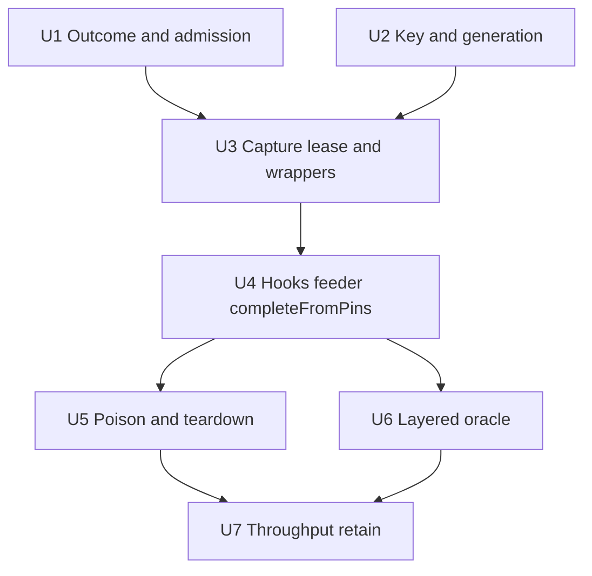

# CUDA-Graph Executor Admission and Lifecycle

## Overview

Plan 011 U1–U5 landed a real monoplane `DIRECT_DILATION` graph recipe, private evaluation contexts, device-driven workers, and a frozen rev-2 measurement contract. The remaining work is **not** “wire U6 and run the existing U7/U8 sketches.” A CUDA-aware review showed that Plan 011 U6 still has unresolved lifecycle and admission design: empty vectors cannot represent R8 after `SetBatchCost` is installed, capture requires a process-wide quiescent boundary, preparation leases collide with `in_flight` and a non-releasing `Recycle(false)`, wrapper lifetime contradicts pool shutdown, and production currently overwrites the real U12 bank batch with serial passthrough.

This plan replaces the still-open Plan 011 U6–U8 work. It does **not** reimplement 011 U1–U5. Production graph admission stays default-deny until a real Layer A/B/C oracle (this plan’s U6) and a machine-qualified retain verdict (this plan’s U7) both exist.

---

## Problem Frame

JTML’s `DirectOptimizer` still needs one synchronous ordered `poses -> costs` call per POH iteration (see origin: docs/brainstorms/2026-08-19-cuda-graph-greedy-evaluation-executor-requirements.org). The 011 recipe can capture and relaunch the production render+metric chain, but the production caller cannot safely *admit* that path:

- `EvaluationExecutor::RunBatch` is still serial-cost simulation; `evaluation_executor.cu` is a dummy TU.
- `OptimizerManager::RunDirectStage` installs U12 `SetBatchCost`, then may overwrite it when `useExecutor` is true — including the null-recipe branch that forces executor serial passthrough.
- `RunBatch` returning `{}` is both “legitimate empty batch” and “failure sentinel.” After graph `SetBatchCost` is installed, that collision becomes `std::invalid_argument` inside `DirectOptimizer` and never reaches `OptimizerError`.
- Recipe capture uses `cudaStreamCaptureModeGlobal` and requires `ctx.in_flight == true`, but there is no app-wide capture coordinator, no preparation-lease protocol, and `Recycle(idx, false)` does not un-check a context.
- `createGraph` returns a `GraphExecWrapper*`; pool `Shutdown()` treats `ctx.graph_exec` as a raw `cudaGraphExec_t`.
- Recipe `complete()` still `cudaStreamSynchronize`s, so overlap claims are not honest.
- Existing U7/U8 oracles are circular or synthetic (see origin anti-pattern: docs/solutions/logic-errors/jtml-cuda-graph-stub-failure-2026-08-19.md). `docs/solutions/architecture-patterns/graph-tiered-correctness-2026-08-19.md` remains aspirational.

The product problem is unchanged: faster POH-batch cost acquisition without changing DIRECT semantics or silently compromising registration correctness. The planning problem is to make admission, capture, ownership, completion, and failure modes implementable without inventing them during coding.

---

## Requirements Trace

Origin requirements remain the source of truth. This plan adds the admission/lifecycle constraints the 011 U6 text left unresolved.

- R1. Domain contract remains synchronous and ordered: DIRECT submits one ordered POH vector and receives the cost vector in the same input order before the next iteration.
- R2. Executor greedily feeds poses to available private contexts; callers must not pre-partition into fixed-size sub-batches.
- R3. Generic cost-function graph-recipe interface represents eligibility, preflight, launch, completion, cleanup. First admitted recipe is monoplane `DIRECT_DILATION`; unsupported recipes retain the serial path.
- R4. In-flight evaluation owns private mutable state: pose inputs, device write set, stream, completion state, result storage. Immutable geometry/comparison data may remain shared only when verified read-only.
- R5. Admitted recipe removes the device-to-host packet barrier from the critical render-to-metric path.
- R6. Graph recipe is reusable for repeated evaluations with stable topology and per-evaluation parameter/buffer updates; compatible with concurrently active private contexts.
- R7. Runtime CUDA/graph error after graph-backed submission aborts the stage through the existing error path; no partial results combined with serial fallback.
- R8. Recipe that fails preflight capture/instantiation before any graph-backed submission is deterministically marked unavailable and uses the serial/U12 path.
- R9. Layered correctness: rendered output and raw integer metric reductions are bit-exact vs serial baseline; only final floating-point composition may use a pre-registered, tightly bounded tolerance with written rationale.
- R10. Every affected existing test is classified before modification; no deletion merely because internals change.
- R11. Graph-backed path preserves replay-ordered DIRECT bookkeeping.
- R12. Performance claims use fixed-work paired experiments after warmup.
- R13. Nsight Systems evidence must confirm real device overlap; stream/context count alone is not evidence.
- R14. Graph-backed recipe retained only when it passes correctness gates and demonstrates a pre-registered performance result.

**Plan-local constraints this document must resolve (the 011 U6 blockers):**

- C1. **Typed stage-admission transaction.** All fallible key/provider/capture work completes *before* graph `SetBatchCost` replaces U12/serial. `{}` / wrong-size vectors cannot represent R8 after graph `SetBatchCost` is installed.
- C2. **Wrapper lifetime.** `createGraph` returns `GraphExecWrapper*`. Executor owns/destroys it with `recipe->destroyGraph`. Never store the wrapper in `ctx.graph_exec`.
- C3. **Global capture coordinator.** Enforce an app-wide quiescent boundary for `cudaStreamCaptureModeGlobal`. Begin/end capture stay on one thread. Competing CUDA/UI submissions are parked or capture is refused (R8).
- C4. **Preparation lease protocol.** Capture requires `ctx.in_flight == true`. Define checkout, prepare/capture, release, and partial-failure cleanup *before* the first batch launch. `Recycle(false)` must not leak checked-out contexts.
- C5. **Headless / CUDA TU split.** Headless tests link `evaluation_executor.cpp`, not the `.cu` TU. Drive one ordered loop from CUDA-free hooks installed by `.cu`. Never direct-call a `.cu` symbol from `.cpp`.
- C6. **No-sync completion.** After `cudaEventQuery == cudaSuccess`, read context-owned pinned results without `cudaStreamSynchronize`. Share score composition with syncing `complete()`. Distinct pinned D2H destinations per context.
- C7. **Capture-input generation identity.** Graphs bake comparison/distance-map pointers, dilation, and white-sum. Invalidation/re-capture is driven by an authoritative input-generation token, not by hoping pointers stay valid.
- C8. **Post-submission vs hang recovery.** Ordinary terminal CUDA errors drain and release. Watchdog/device hang poisons in-flight contexts so shutdown cannot free buffers still used by hung graph work. Recovery is terminal session state or process restart — not in-process `cudaDeviceReset` as a supported path.
- C9. **OptimizerError conversion.** Post-launch failures must reach `OptimizerError`. They must not escape the worker as `std::invalid_argument` from `DirectOptimizer`.
- C10. **One `GraphAdmissionPolicy`.** Default deny until U6 (Layer A/B/C) and U7 (machine-qualified retain) pass. Combine runtime opt-in, U6 artifact/version, and U7 retained verdict. Never let a null recipe overwrite U12 with executor serial passthrough.
- C11. **Honest U6/U7 gates.** Layer A image bytes, Layer B actual `DIRECT_DILATION` reductions (`pixel_score`, `distance_score`, `edge_count`), Layer C frozen tolerance. U7 uses the rev-2 fixture only, four arms, timing-enabled events distinct from disable-timing completion events, pre-registered minimum benefit, `nsys` unavailable = blocked, N<2 explicit branch.

**Origin actors:** A1 (DIRECT optimizer), A2 (greedy evaluation executor), A3 (cost-function graph recipe), A4 (registration developer), A5 (test and measurement harness)

**Origin flows:** F1 (graph-backed POH evaluation), F2 (unsupported recipe or graph setup), F3 (runtime CUDA failure)

**Origin acceptance examples:** AE1 (R1, R2, R11 — ordered replay), AE2 (R3, R4, R6 — private contexts), AE3 (R5, R9 — no barrier + bit-exact), AE4 (R7, R8 — preflight fallback vs runtime abort), AE5 (R10, R12, R13, R14 — test matrix + measurement)

**Traceability — Actors / Flows / Acceptance Examples → Units**

| Requirement / Actor / Flow / AE | U1 | U2 | U3 | U4 | U5 | U6 | U7 |
|---|---|---|---|---|---|---|---|
| R1 ordered domain contract | ✓ |  |  | ✓ |  |  |  |
| R2 greedy feeding |  |  |  | ✓ |  |  |  |
| R3 generic recipe / monoplane admission | ✓ | ✓ | ✓ | ✓ |  |  |  |
| R4 private mutable state |  |  | ✓ | ✓ | ✓ |  |  |
| R5 device-driven barrier removal |  |  |  | ✓ |  | ✓ |  |
| R6 reusable topology + concurrent contexts |  | ✓ | ✓ | ✓ |  | ✓ |  |
| R7 runtime abort (no partial) | ✓ |  | ✓ | ✓ | ✓ |  |  |
| R8 preflight fallback | ✓ | ✓ | ✓ |  |  |  |  |
| R9 layered bit-exact |  |  |  |  |  | ✓ | ✓ |
| R10 test-impact matrix | ✓ |  |  |  |  | ✓ | ✓ |
| R11 replay-ordered bookkeeping | ✓ |  |  | ✓ |  |  |  |
| R12 paired throughput (frozen) |  |  |  |  |  |  | ✓ |
| R13 Nsight overlap (quantitative) |  |  |  |  |  |  | ✓ |
| R14 retain only on gates | ✓ |  |  |  |  | ✓ | ✓ |
| C1 admission transaction | ✓ |  | ✓ |  |  |  |  |
| C2 wrapper lifetime |  |  | ✓ |  | ✓ |  |  |
| C3 capture coordinator |  |  | ✓ |  |  |  |  |
| C4 preparation lease |  |  | ✓ |  | ✓ |  |  |
| C5 hook / TU split |  |  |  | ✓ |  |  |  |
| C6 completeFromPins |  |  |  | ✓ |  |  |  |
| C7 generation identity |  | ✓ | ✓ |  |  |  |  |
| C8 hang / poison |  |  |  |  | ✓ |  |  |
| C9 OptimizerError conversion | ✓ |  |  |  | ✓ |  |  |
| C10 GraphAdmissionPolicy | ✓ |  |  |  |  | ✓ | ✓ |
| C11 U6/U7 gates |  |  |  |  |  | ✓ | ✓ |
| F1 graph-backed POH |  |  |  | ✓ |  | ✓ | ✓ |
| F2 unsupported/setup | ✓ | ✓ | ✓ |  |  |  |  |
| F3 runtime CUDA failure | ✓ |  |  | ✓ | ✓ |  |  |
| AE1 ordered replay | ✓ |  |  | ✓ |  |  |  |
| AE2 private contexts |  |  | ✓ | ✓ |  | ✓ |  |
| AE3 no barrier + bit-exact |  |  |  | ✓ |  | ✓ |  |
| AE4 fallback vs abort | ✓ | ✓ | ✓ | ✓ | ✓ |  |  |
| AE5 matrix + measurement | ✓ |  |  |  |  | ✓ | ✓ |
| A1 DIRECT optimizer | ✓ |  |  | ✓ |  |  |  |
| A2 greedy executor | ✓ |  | ✓ | ✓ | ✓ |  |  |
| A3 graph recipe |  | ✓ | ✓ | ✓ |  | ✓ |  |
| A4 registration developer | ✓ |  | ✓ |  | ✓ |  |  |
| A5 test/measurement harness | ✓ |  |  |  |  | ✓ | ✓ |

---

## Scope Boundaries

- Do not reimplement Plan 011 U1–U5 (pool, test-impact matrix, capture probe, persistent workers, monoplane recipe).
- First admitted recipe remains monoplane `DIRECT_DILATION`. Biplane and other cost families stay serial.
- DIRECT selection, partitioning, budgets, callback semantics, and the synchronous iteration boundary do not change.
- Domain stays CUDA-free. Typed compute outcomes may exist in `compute/`; they are translated before or around `DirectOptimizer`, not by putting CUDA types into `jtml_domain`.
- No silent fallback inside an already-submitted graph-backed batch.
- No production graph admission from a serial-passthrough comparison, a fabricated throughput number, or a missing Nsight timeline.
- `jtml.graph_throughput_oracle` asserting rev-1 `triangle_count=300000` is expected red until U7 rewrites it. Do not “fix” it in U1–U5.
- `jtml.qml_lint` is a known pre-existing headless red.
- `jtml.cut0_measurement` must not mutate `test/golden/cut0_measurement.md` unless `JTML_UPDATE_GOLDEN=1`.

### Deferred to Follow-Up Work

- Additional cost-function graph recipes (biplane, mahfouz, pole-constraint).
- Adaptive `N_MAX` tuning beyond `BankAdmission` plus measured graph overhead.
- Switching capture mode to `ThreadLocal`/`Relaxed` after the Global coordinator is proven.
- In-process `cudaDeviceReset` as a supported recovery path (rejected here; process restart only).
- Removing the U12 capacity-service bank pool. Keep it as the graph-unavailable fallback until a later consolidation decision.

---

## Context & Research

### Relevant Code and Patterns

- `include/domain/direct_optimizer.h` / `src/domain/direct_optimizer.cpp` — synchronous `BatchCostFunction`; wrong-sized result throws `std::invalid_argument` after deleting pending boxes. Domain must remain CUDA-free.
- `src/coordinator/optimizer_manager.cpp` — U12 bank `SetBatchCost` at the monoplane `DIRECT_DILATION` + `poolSize()>1` gate; later U6 block may overwrite it. Null-recipe branch currently forces `useExecutor=true`. Executor pool is initialized with hard-coded 8 GiB and zero graph overhead. `RunDirectStage` has no catch around `opt.Run()`.
- `include/compute/evaluation_executor.h` / `src/compute/evaluation_executor.cpp` — serial simulation; `{}` is both empty-batch and failure; `firstSubmission` is set on simulated launch.
- `src/compute/evaluation_executor.cu` — dummy TU (`EvaluationExecutorCudaDummy`).
- `include/compute/evaluation_context.h` / `src/compute/evaluation_context.cpp` — `Checkout()` sets `in_flight`; `Recycle(idx, false)` returns false without un-checking; `Shutdown()` always `cudaStreamSynchronize`s then destroys `ctx.graph_exec` as raw `cudaGraphExec_t`.
- `include/compute/graph_recipe.h` / `src/compute/graph_recipe_direct_dilation.cu` — `createGraph` returns caller-owned `GraphExecWrapper*` via `void**`; `complete()` synchronizes the stream; no `completeFromPins`; capture is `cudaStreamCaptureModeGlobal` and requires `in_flight`.
- `src/compute/CostFunctionManager.cpp` — explicit-context methods are stubs returning NaN / `cudaSuccess`; no `GetGraphRecipeCaptureInputs`.
- `include/compute/gpu_model.cuh` — no `GetPrimaryRenderEngine()` accessor.
- `include/coordinator/optimizer_manager.h` — `OptimizerError(QString)` is the existing stage-failure signal.
- `docs/TEST_IMPACT_MATRIX.md` — frozen Plan-011-U2 dispositions; Plan-011 U7/U8 rows already exist and must be rewritten in place by this plan’s U6/U7, not deleted.
- `test/golden/graph_pre_registration.json` — frozen rev-2 fixture (12412 tris, 1024×1024, Kneel_1 `2806.tif`, dilation 6 Trunk). Has latency/Nsight thresholds; **does not yet contain** a minimum-benefit multiplier or N<2 N=1 retention criterion.
- Test CMake: headless executor tests link `evaluation_executor.cpp` only; `jtml.layered_correctness` also links that `.cpp` and not the recipe `.cu`.

### Institutional Learnings

- `docs/solutions/architecture-patterns/jtml-cuda-evaluation-context-executor-2026-08-17.md` — sync domain / async interior; six pool conditions; `cudaEventQuery` tri-state; stream count is not throughput.
- `docs/solutions/logic-errors/jtml-cuda-graph-stub-failure-2026-08-19.md` — no `[x]` on circular tests; `ctest -L oracle` + `nsys` before claiming GPU work; `complete()==0.0` is not evidence.
- `docs/solutions/architecture-patterns/graph-tiered-correctness-2026-08-19.md` — **aspirational** until this plan’s U6 proves Layer A/B/C on a real graph path. Do not treat it as a landed gate.
- `docs/solutions/logic-errors/jtml-heatmap-guard-allocator-preconditions-2026-08-12.md` — destruction waits for stream/event; null-init destructor-freed members. This plan *narrows* that rule for poisoned/hung contexts: do not wait-or-free a stream that may never complete.
- `docs/solutions/conventions/jtml-layered-lib-split-2026-08-08.md` — explicit `.cpp/.cu` lists; domain stays Qt/GPU-free.
- `docs/solutions/logic-errors/jtml-cost-function-update-parameter-int-noop-2026-08-12.md` — assemble dilation via `getActiveCostFunctionClass()->get*ParameterValue`, never by-value `Parameter<T>` copies.
- `docs/solutions/conventions/jtml-testability-and-cmake-conventions-2026-08-07.md` — false-confidence / circular-test anti-pattern; headless vs `oracle;gpu`.

### External References

- `cuda-runtime-docs/modules/group__cudart__event.md` — `cudaEventQuery`: `cudaSuccess` complete, `cudaErrorNotReady` pending, other errors real. Disable-timing events are for query/wait, not `cudaEventElapsedTime`. An unrecorded event queries as already complete.
- `cuda-runtime-docs/modules/group__cudart__stream.md` — Global capture prohibits unsafe APIs on *any* thread during a concurrent Global capture. `cudaStreamEndCapture` must be the same thread as begin unless Relaxed. Invalid capture returns error + NULL graph.
- `cuda-runtime-docs/modules/group__cudart__graph.md` and `cuda-guide/04-special-topics/cuda-graphs.md` — instantiate/launch/update lifecycle; memcpy node address updates are restricted; first launch / `cudaGraphUpload` cost is real.
- `best-practices-guide/` — streams express concurrency but do not guarantee it; Systems first for overlap; async errors require `cudaGetLastError` discipline.

---

## Key Technical Decisions

- **Typed `BatchOutcome`, not magic vectors.** Compute returns a CUDA-free outcome: `NotSubmitted`, `OrderedScores`, `PostLaunchAbort`, or `WatchdogPoisoned`. `{}` remains only the legitimate empty-input result. After graph `SetBatchCost` is installed, `NotSubmitted` is unreachable; a coordinator that sees it treats that as an implementation bug, not R8. R8 happens *before* `SetBatchCost` is replaced. (C1, R8)

- **One `SetBatchCost` decision site.** `RunDirectStage` either keeps the existing U12/serial adapter or, after a successful admission transaction, replaces it once with the graph executor. The null-recipe / incomplete-key / failed-prepare branch leaves U12/serial untouched. Never install executor serial passthrough as a “graph” path. (C1, C10, R8)

- **Admission transaction is prepare-then-install.** Order: evaluate `GraphAdmissionPolicy` → assemble complete key + generation → park + capture/prepare every needed context → only then `SetBatchCost(graph)`. Any failure *before* that install is R8. After install, `updateParams` / `cudaGraphLaunch` / poll / overflow failures are R7 (`PostLaunchAbort` or `WatchdogPoisoned`) even if `firstSubmission` is still false. `firstSubmission` still flips only after the first successful `cudaGraphLaunch`; it is not the R8/R7 boundary. (C1, C3, C4)

- **`GraphAdmissionPolicy` is the only production switch.** Default deny. Admit only when all three hold: explicit runtime opt-in, U6 Layer A/B/C artifact at the required version, and a machine-qualified U7 verdict of `retained`. Missing `nsys` or `pending_manual_gpu_run` is not retain. Tests may inject a policy; production must not. (C10, R14)

- **Executor-owned wrappers only.** `graphExecs_[contextIndex]` holds `GraphExecWrapper*`. `ctx.graph_exec` stays null on the graph path. Destroy through `recipe->destroyGraph` before pool buffer teardown. Pool `Shutdown` continues to treat `ctx.graph_exec` as raw `cudaGraphExec_t` for any leftover compatibility value; the executor must never put a wrapper there. (C2)

- **App-wide `CaptureCoordinator`, not “capture on the feeder thread.”** Plan 011 U5 captures with `cudaStreamCaptureModeGlobal`. Global mode forbids unsafe CUDA from *any* thread for the capture window and requires begin/end on the same thread. The coordinator is a process-wide exclusive capture lock plus explicit park/unpark of the known CUDA producers (U12 capacity service, serial `RenderEngine`/`GPUMetrics` completes, VTK/UI render). Park is try-lock with a short bounded wait; failure to obtain a quiet window is `NotSubmitted` and U12 stays. The optimizer worker never waits on a producer that itself waits on Optimize. Do not switch to Relaxed to dodge this. (C3)

- **Preparation lease is a distinct protocol from greedy launch leases.** Recipe capture/preflight require `in_flight`. Prepare checks out each needed context, captures, then `Recycle(..., true)` on success so the context is idle-but-graph-ready before the first POH launch. Partial prepare failure destroys any wrappers created in that attempt, `ForceRelease`s non-poisoned leases, and returns `NotSubmitted`. (C4)

- **`ForceRelease` vs `LeavePoisoned`.** Landed `Recycle(idx, false)` does not un-check (`evaluation_context.cpp`). Add two explicit operations: `ForceRelease` un-checks after a known-idle/drained context; `LeavePoisoned` keeps the context checked out and marks `Failed`/`Poisoned` so Checkout will not reuse it and Shutdown will not sync/free it. Ordinary R7 abort drains then `ForceRelease`. Watchdog hang uses `LeavePoisoned`. (C4, C8)

- **CUDA-free hook seam.** One ordered greedy loop lives in `evaluation_executor.cpp`. Hooks (`enqueue`, `poll`, `completeFromPins`, `teardown`, and prepare/capture) are declared in the CUDA-free header and installed from `.cu` via an installer the `.cpp` never names as a CUDA symbol — the `.cu` calls a header-visible `Install*` on the executor object. Null hooks keep exact serial passthrough for headless. (C5)

- **Completion event is recorded after launch, outside capture.** Poll `cudaEventQuery`. `cudaErrorNotReady` is pending; any other non-success is R7. After `cudaSuccess`, `completeFromPins` reads only that context’s pinned scores and overflow flag. Syncing `complete()` remains the serial/oracle helper and shares one composition function: `white_sum + (-pixel_score) + distance/(edge_count+0.1)`. An unrecorded event must never be queried (CUDA treats it as already complete). (C6)

- **Generation identity is input identity, not the computed white-sum.** Authoritative token = complete `GraphRecipeKey` plus `CaptureGeneration` (`frame_index`, `stage_id`, `dilation`, comparison/distance/rendered pointers, and an upload epoch bumped when those buffers are rewritten in place). White-sum is a capture *output* cached on the context; changing the comparison identity invalidates it. Pointer equality alone is insufficient. (C7)

- **Hang recovery is terminal.** Ordinary CUDA errors are abort-and-drain. A watchdog expiry or `cudaErrorLaunchTimeout` marks the executor/session poisoned, emits `OptimizerError`, and refuses further graph or U12 GPU work in that process. Do not `cudaStreamSynchronize` / `cudaFree` / `cudaGraphExecDestroy` poisoned in-flight contexts. Do not call `cudaDeviceReset` as a supported in-process recovery. The operator restarts the process. (C8, C9)

- **Domain does not grow a CUDA error type.** `DirectOptimizer` keeps throwing `std::invalid_argument` only for true contract violations. The graph `SetBatchCost` lambda maps `PostLaunchAbort` / `WatchdogPoisoned` onto one CUDA-free coordinator abort type (may be the same `BatchOutcome` abort kinds) that `RunDirectStage` catches and turns into `OptimizerError`. Empty/wrong-size vectors are never used as that abort. (C9)

- **Lazy graph-pool allocation.** Default-deny means the production executor pool is *not* allocated with a dummy 8 GiB / zero overhead at manager setup. Initialize the graph pool only when policy allows a prepare attempt, using `cudaMemGetInfo` minus already committed U12/other pools plus measured graph overhead. U12 remains the fallback and is not torn down by a denied graph path. (C10)

- **U6/U7 are gates, not documentation.** U6 must compare a real graph launch to serial Layer A bytes and Layer B `pixel_score` / `distance_score` / `edge_count`. U7 uses only the rev-2 fixture, four arms (serial N=1, graph N=1, graph N=2, graph N=max), timing-enabled events separate from disable-timing completion events, and a minimum-benefit threshold written into `graph_pre_registration.json` *before* the first measured run. `nsys` missing ⇒ `blocked`, not retained. If admitted N<2, overlap is recorded unavailable; retain only against a pre-registered N=1 launch-overhead criterion, never by substituting N=1 for the N=2 overlap gate. (C11, R9, R12–R14)

---

## Open Questions

### Resolved During Planning

- **Is Plan 011 U6 directly implementable?** No. Wrapper lifetime, Global capture, preparation leases, typed R8, hang teardown, and admission policy were still design work. This plan replaces 011 U6–U8.
- **Can `{}` mean R8 after `SetBatchCost`?** No. R8 is a pre-install prepare failure. After install, outcomes are ordered scores or a typed abort.
- **Where does white-sum live in the invalidation key?** It is a capture output. Invalidation keys the comparison-frame identity + upload epoch that produced it.
- **Is in-process device reset supported?** No. Hang ⇒ poisoned session + process restart.
- **Should capture use Relaxed/ThreadLocal to avoid a coordinator?** No. Keep Global and enforce quiescence. Mode change is follow-up after the coordinator is proven.
- **Does a failed U7/U6 gate keep U12?** Yes. Serial/U12 remains the supported path. Graph admission stays off.
- **What is the proposed U7 minimum-benefit default for owner review?** Graph N=2 on the frozen 16-pose Trunk workload must be ≥1.20× paired throughput versus serial N=1. Stage wall must not regress >5% (same bound as the frozen `stage_wall_time_percent` field). For admitted N<2, the proposed N=1 launch-overhead criterion is: graph N=1 throughput ≥ 0.90× serial N=1 and stage wall not regressing >5%. Owner may record different numbers in `graph_pre_registration.json` *before* measurement. A later “it fit Amdahl” result is not retain.

### Deferred to Implementation

- Exact hook member names and whether prepare is one hook or several — choose names at the header seam; the protocol above is normative.
- Whether U12 and the graph executor can share any device buffers once both exist — measure footprint at lazy-init time; do not assume aliasing.
- Exact VTK/UI park hook attachment point — find the existing render-thread submission site during U3; if none can be parked, prepare must refuse rather than capture anyway.
- Numeric `N_max` after real graph-overhead probe — use `BankAdmission` plus measured overhead; do not hard-code 4.
- Whether `cudaGraphInstantiateWithParams` (12.8+) should replace legacy instantiate for diagnostics — optional once the 12.9 toolchain is confirmed at U3 time.
- Exact park-site function names for VTK/UI — locate during U3; refuse capture if they cannot be parked.

---

## High-Level Technical Design

> *This illustrates the intended approach and is directional guidance for review, not implementation specification. The implementing agent should treat it as context, not code to reproduce.*

### Admission and install (R8 happens here)

```text
RunDirectStage
  serial = BuildGpuCostAdapter(...)
  maybe install U12 SetBatchCost          // existing bank fallback
  if GraphAdmissionPolicy.deny:
      keep U12/serial; return to DIRECT
  if !assemble complete key + generation:
      keep U12/serial                     // R8
  if !CaptureCoordinator.try_park():
      keep U12/serial                     // R8
  prepare each needed context:            // in_flight lease
      Checkout -> create/update wrapper
      on any failure: destroy new wrappers, ForceRelease, unpark
      keep U12/serial                     // R8
  Recycle(true) prepared contexts         // idle, graph-ready
  unpark
  replace SetBatchCost ONCE with graph lambda
  opt.Run()
    graph lambda:
      outcome = executor.RunBatch(poses)
      OrderedScores -> vector
      abort kinds -> coordinator abort type
  catch abort -> OptimizerError           // never invalid_argument
```

### Prepare vs launch leases

```text
Prepare (quiescent, parked, before first launch)
  Checkout  => in_flight=true (required by createGraph)
  capture / instantiate / cache key+generation
  Recycle(true) => in_flight=false, wrapper retained by executor

Launch (greedy POH feed)
  Checkout  => in_flight=true
  updateParams + cudaGraphLaunch
  cudaEventRecord(completion_event)       // AFTER launch, outside capture
  firstSubmission = true
  poll cudaEventQuery
    Success -> completeFromPins -> result[input] -> Recycle(true)
    NotReady -> keep feeding
    other / overflow -> PostLaunchAbort: drain, ForceRelease, clear scores
    watchdog -> WatchdogPoisoned: LeavePoisoned, no sync/free
```

### Capture coordinator

```text
thread T (optimizer worker):
  coordinator.acquire_exclusive()         // no other Global capture
  for each registered producer: park()    // U12, serial completes, VTK/UI
  beginCapture(stream, Global)            // same thread
  enqueue production set
  endCapture(stream)                      // same thread
  instantiate
  coordinator.release() + unpark()
```

### Outcome vs DIRECT contract

| Moment | Allowed result | DIRECT / coordinator effect |
|---|---|---|
| Empty POH input | empty ordered vector | legal no-op |
| Prepare/key/policy fail | `NotSubmitted` **before** graph `SetBatchCost` | U12/serial unchanged (R8) |
| Successful graph batch | `OrderedScores` size == poses | replay-ordered bookkeeping |
| Post-launch CUDA/overflow | `PostLaunchAbort` | `OptimizerError`, no partial vector, no serial mix (R7) |
| Watchdog / launch timeout | `WatchdogPoisoned` | `OptimizerError`, session poisoned, no teardown of in-flight buffers |

---

## Implementation Units

Unit dependency graph (plan structure, not code):



---

- [x] U1. **Typed outcome, admission policy, and U12 coexistence**

**Goal:** Make R8/R7 distinguishable without installing a graph path, and stop the null-recipe branch from replacing U12 with executor serial passthrough.

**Requirements:** R1, R3, R7, R8, R10, R11, R14, C1, C9, C10, F2, F3, AE4, A1, A4, A5

**Dependencies:** None (uses landed 011 pool/registry types only)

**Files:**
- Create: `include/compute/batch_outcome.h` (CUDA-free outcome + coordinator abort type)
- Create: `include/compute/graph_admission_policy.h`
- Modify: `include/compute/evaluation_executor.h` / `src/compute/evaluation_executor.cpp` (return typed outcome; keep serial headless behavior)
- Modify: `src/coordinator/optimizer_manager.cpp` / `include/coordinator/optimizer_manager.h` (single `SetBatchCost` site; default-deny policy; catch abort around `opt.Run()`)
- Test: `test/unit/test_direct_optimizer_batch.cpp`
- Test: `test/lifecycle/optimizer_run_controller_test.cpp`
- Modify: `docs/TEST_IMPACT_MATRIX.md` (U1 dispositions only; no obsolete rows)

**Approach:**
- Introduce a compute-layer outcome that cannot confuse empty-input, not-submitted, ordered scores, and post-launch abort.
- `GraphAdmissionPolicy` defaults to deny. Production reads runtime opt-in + U6 artifact version + U7 machine-qualified verdict. Tests inject policy.
- Delete the `else useExecutor = true` null-recipe override. If the recipe is missing, the key is incomplete, or policy denies, leave the U12/serial adapter in place.
- `RunDirectStage` wraps `opt.Run()` so coordinator abort and unexpected `std::invalid_argument` both become `OptimizerError` + `error_occurrred_`. Domain still throws only for true size-contract bugs.
- Do not allocate the graph pool with dummy 8 GiB in this unit.

**Execution note:** Implement the outcome/policy tests first. Headless must prove U12 survives deny/null-recipe before any CUDA wiring.

**Patterns to follow:** Existing U12 gate in `optimizer_manager.cpp`; `OptimizerError` signal; landed `TEST_IMPACT_MATRIX` retain-by-default rule.

**Test scenarios:**
- Happy path: policy deny + eligible cost keeps U12 `SetBatchCost` and still returns ordered serial/bank scores.
- Happy path: injected admit-false with a registered recipe still does not install graph `SetBatchCost`.
- Edge case: 0-pose batch returns empty ordered vector and is not treated as abort.
- Error path: Covers AE4. Graph lambda that yields `PostLaunchAbort` after a fake first launch reaches `OptimizerError` and does not throw out of the worker.
- Error path: `DirectOptimizer` size-mismatch `invalid_argument` is also converted to `OptimizerError` (no process abort).
- Integration: null recipe no longer overwrites U12; a spy/characterization on `SetBatchCost` shows a single remaining adapter.

**Verification:** Headless batch + lifecycle tests green except known `jtml.qml_lint`. Production deny path cannot select executor serial passthrough.

---

- [x] U2. **Capture-input provider and generation identity**

**Goal:** One complete `GraphRecipeKey` and one `CaptureGeneration` used by both admission and later capture, assembled from real stage/frame objects.

**Requirements:** R3, R6, R8, C7, F2, AE4, A3

**Dependencies:** None strictly; lands beside U1

**Files:**
- Modify: `include/compute/graph_recipe.h` (generation token; keep key equality pose-independent)
- Modify: `include/compute/CostFunctionManager.h` / `src/compute/CostFunctionManager.cpp` (`GetGraphRecipeCaptureInputs`; bump upload epoch when dilated/distance/comparison data are rewritten)
- Modify: `include/compute/gpu_model.cuh` (primary render-engine accessor)
- Modify: `src/coordinator/optimizer_manager.cpp` (shared assembler for admission and prepare)
- Test: `test/unit/graph_recipe_preflight_test.cpp`
- Test: new headless assembler tests under `test/unit/`

**Approach:**
- Provider fills render engine, metrics, rendered image, dilated comparison frame, distance map, and active dilation. Executor later supplies `inputs.context`.
- Shared assembler fills width/height, triangle count, stride, CUB bytes, curvature capacity, dilation, calibration hash, graph overhead, recipe id, biplane flag. A zero/default key is `NotSubmitted`, never a reason to weaken recipe preflight.
- `CaptureGeneration` includes `frame_index`, `stage_id`, dilation, the three buffer identities, and an upload epoch. White-sum is **not** an input-key field; it is recomputed at successful capture and stored on the context.
- Validate `key.dilation == inputs.dilation` and non-null `rendered_image` before any later `createGraph`.

**Patterns to follow:** Recipe `GraphRecipeCaptureInputs`; dilation via `getActiveCostFunctionClass()->get*ParameterValue`; 011 U5 `keyForContext`.

**Test scenarios:**
- Happy path: assembler over a fake stage manager produces a key with non-zero dims/triangles matching the fixture layout.
- Happy path: rewriting the dilated comparison frame bumps upload epoch so generation inequality is observable without pointer change.
- Edge case: biplane or non-`DIRECT_DILATION` yields ineligible / `NotSubmitted` without touching graphs.
- Error path: incomplete provider (null comparison or distance) is deterministic `NotSubmitted`.
- Error path: dilation mismatch between key and inputs is `NotSubmitted`.

**Verification:** Headless assembler/preflight tests green. Production admission and future capture call the same assembler.

---

- [ ] U3. **Capture coordinator, preparation leases, and wrapper ownership**

**Goal:** Make Global capture legal and wrapper lifetime safe before any greedy launch exists.

**Requirements:** R3, R4, R6, R7, R8, C1–C4, C7, F2, AE2, AE4, A2, A3, A4

**Dependencies:** U1, U2

**Files:**
- Create: `include/compute/capture_coordinator.h` / matching `.cpp` or `.cu` as required by CUDA types (keep a CUDA-free façade if the header must stay host-testable)
- Modify: `include/compute/evaluation_context.h` / `src/compute/evaluation_context.cpp` (`ForceRelease`, `LeavePoisoned`; Shutdown skips poisoned contexts)
- Modify: `include/compute/evaluation_executor.h` / `src/compute/evaluation_executor.cpp` (executor-owned `graphExecs_` / keys / generations; prepare API)
- Modify: `src/compute/evaluation_executor.cu` (install real prepare/capture hooks; still no production launch required if launch is U4)
- Modify: `src/compute/graph_recipe_direct_dilation.cu` only if prepare needs a testable capture entry that still returns wrappers
- Test: `test/unit/evaluation_context_test.cpp`
- Test: new headless coordinator/lease tests
- Test: `test/oracle/graph_recipe_direct_dilation_test.cu` (extend with prepare-lease capture, not serial passthrough)

**Approach:**
- Process-wide exclusive capture lock on the optimizer worker. Explicitly park the known producers (U12, serial completes, VTK/UI) with a bounded try-lock; do not invent a general plugin registry. Failure to park is `NotSubmitted`. The worker must not wait on a producer that waits on Optimize.
- Prepare checks out each context (satisfying `in_flight`), captures/instantiates, stores wrapper on the executor, records key+generation, then `Recycle(true)`.
- Partial failure: `destroyGraph` every wrapper created in that attempt, `ForceRelease` non-poisoned checkouts, leave U12 installed, `firstSubmission` remains false.
- Never write the wrapper pointer into `ctx.graph_exec`. Executor shutdown destroys wrappers first, then asks the pool to release raw buffers — except poisoned entries, which U5 will leave untouched.
- Do not lazily `createGraph` during a live greedy feed.

**Technical design:** *(directional)* Prepare is a quiescent pre-batch transaction. Launch-time invalidation compares stored key+generation to the current assembler output and, if stale, re-enters prepare — again under the coordinator — rather than capturing beside in-flight work.

**Patterns to follow:** 011 U5 `createGraph`/`destroyGraph`; heatmap teardown null-init; stream docs for Global + same-thread end-capture.

**Test scenarios:**
- Happy path: prepare two contexts, both become idle with executor-owned wrappers; `ctx.graph_exec` remains null.
- Happy path: second prepare with unchanged generation does not recapture.
- Edge case: generation change (new frame or upload epoch) destroys stale wrappers and recaptures under the coordinator.
- Error path: Covers AE4. Mid-prepare `createGraph` failure on context 1 destroys context 0’s new wrapper, `ForceRelease`s both, `firstSubmission` false, U12 remains.
- Error path: park failure does not call `cudaStreamBeginCapture`.
- Error path: `ForceRelease` makes the context checkout-able again; `LeavePoisoned` does not.
- Integration: begin/end capture invoked from one thread in the GPU prepare oracle.

**Verification:** Headless lease tests green. GPU prepare oracle captures without storing wrappers on `ctx.graph_exec`. No new `cudaDeviceSynchronize` on the prepare path.

---

- [ ] U4. **Hook-driven greedy feeder and no-sync completion**

**Goal:** One synchronous `BatchCostFunction` call greedily launches real per-context graphs, polls completion events, and stores scores in input order without per-eval stream sync.

**Requirements:** R1, R2, R3, R4, R5, R6, R7, R11, C5, C6, F1, F3, AE1, AE2, AE3, AE4, A1, A2

**Dependencies:** U3

**Files:**
- Modify: `include/compute/evaluation_executor.h` / `src/compute/evaluation_executor.cpp` (single ordered loop over hooks)
- Modify: `src/compute/evaluation_executor.cu` (install enqueue/poll/completeFromPins/teardown; `cudaEventRecord` after launch)
- Modify: `include/compute/graph_recipe.h` / `src/compute/graph_recipe_direct_dilation.cu` (`completeFromPins` + shared composition helper)
- Modify: `src/coordinator/optimizer_manager.cpp` (install hooks only after successful prepare; graph lambda translates outcomes)
- Test: `test/unit/test_direct_optimizer_batch.cpp` (hook injection: ordered store, no re-poll)
- Test: `test/lifecycle/optimizer_run_controller_test.cpp` (callback order on success)
- Test: new `test/oracle/evaluation_executor_graph_test.cu`

**Approach:**
- Headless: null hooks keep serial passthrough and the U1 outcome rules.
- GPU: enqueue updates params, launches the executor-owned wrapper, records `ctx.completion_event` on `ctx.stream` *after* launch. Poll is `cudaEventQuery` tri-state. Success calls `completeFromPins` only.
- `completeFromPins` is `complete()` minus `cudaStreamSynchronize`. Both share one composition helper. Distinct pinned D2H destinations already exist per context (`host_pixel_score`, `host_distance_score`, `host_edge_count`, `host_overflowFlag`) and must stay private.
- Greedy lease loop finishes the oldest blocking lease before re-checkout so a recycled context cannot be polled under an old input index.
- `firstSubmission` becomes true only after a successful `cudaGraphLaunch`.
- This unit implements ordinary post-launch abort (`PostLaunchAbort`) with drain + `ForceRelease`. Hang/poison is U5.

**Execution note:** Characterization-first on the GPU oracle: prove real `cudaGraphLaunch` + event query + non-zero finite scores before claiming the feeder done. Anti-stub: `completeFromPins` must not return a constant.

**Patterns to follow:** 08-17 greedy sketch; `cost_capacity_service.cu` input-indexed store; event docs (unrecorded event is already complete — always record after launch).

**Test scenarios:**
- Covers AE1. Happy path: two contexts complete out of order; returned vector matches input order; DIRECT call count / callbacks unchanged vs serial fake.
- Happy path: `completeFromPins` and syncing `complete()` agree on identical pins.
- Edge case: 1-pose and `batch < N` still ordered; no capture during the feed.
- Error path: injected post-launch poll error returns `PostLaunchAbort`, clears scores, does not mix serial.
- Error path: overflow / `EvaluationStatus::Failed` is abort, not an ordinary DIRECT non-finite cost.
- Integration: GPU oracle on Kneel_1 launches two real graphs, greps production feeder/recipe for no `cudaDeviceSynchronize` / `cudaStreamSynchronize` on the admitted complete-from-pins path.

**Verification:** Headless injection tests green. GPU executor oracle green on the target GPU. Production sources on the admitted path have no per-eval stream sync.

---

- [ ] U5. **Watchdog poison, teardown, and terminal recovery**

**Goal:** Distinguish ordinary terminal CUDA errors from a hung device, and make shutdown safe in both cases.

**Requirements:** R4, R7, C2, C4, C8, C9, F3, AE4, A2, A4

**Dependencies:** U4

**Files:**
- Modify: `include/compute/evaluation_context.h` / `src/compute/evaluation_context.cpp` (Shutdown skips poisoned; never sync/free those streams/buffers)
- Modify: `include/compute/evaluation_executor.h` / `src/compute/evaluation_executor.cpp` / `.cu` (watchdog → `WatchdogPoisoned`; refuse further RunBatch)
- Modify: `src/coordinator/optimizer_manager.cpp` (poisoned session: `OptimizerError`, stop further GPU stages)
- Test: `test/unit/evaluation_context_test.cpp`
- Test: `test/lifecycle/optimizer_run_controller_test.cpp`
- Test: GPU abort/poison coverage in `test/oracle/evaluation_executor_graph_test.cu`

**Approach:**
- Ordinary R7: `cudaEventQuery` real error or overflow → drain known-healthy streams, `ForceRelease`, destroy only wrappers whose streams have completed, emit `PostLaunchAbort`.
- Watchdog is a **host-side** steady-clock timer around the poll loop (default 5s, matching the landed executor field), independent of `cudaEventQuery` returning. If the query call itself blocks, the host timer still expires on a helper/observer path or the session is already considered wedged; do not require a CUDA error to declare poison. First-launch / `cudaGraphUpload` cost is excluded from the watchdog window (counted as prepare, not hang). Launch-timeout class CUDA errors also poison. `LeavePoisoned` every still-in-flight context, keep wrappers/buffers allocated, mark executor poisoned, emit `WatchdogPoisoned`. Subsequent prepare/RunBatch refuse.
- Executor `Shutdown` / destructor: destroy and free only non-poisoned contexts. Poisoned contexts are leaked until process exit. Document this as intentional.
- No `cudaDeviceReset` API in this unit. Recovery is process restart / new session.

**Patterns to follow:** Heatmap teardown for the healthy path; CUDA event destroy-while-pending is asynchronous — do not use that as hang recovery. Best-practices async error discipline (`cudaGetLastError` after observed failure).

**Test scenarios:**
- Happy path: ordinary injected CUDA error after graph `SetBatchCost` is installed is `PostLaunchAbort` / `OptimizerError` with no U12 mix-in, whether or not `firstSubmission` has flipped.
- Error path: Covers AE4. Watchdog fire leaves contexts checked-out/poisoned; Shutdown does not call stream synchronize on them.
- Error path: poisoned executor returns `WatchdogPoisoned` on the next batch without launching.
- Integration: lifecycle test sees `OptimizerError` and does not observe an uncaught exception.
- Edge case: destructor after explicit Shutdown on a healthy executor remains idempotent.

**Verification:** Headless poison tests green. GPU abort test does not hang the suite. No attempt to free in-flight poisoned buffers.

---

- [ ] U6. **Real layered graph-vs-serial oracle**

**Goal:** Make graph admission enforceable with a real graph-vs-serial oracle. Serial-passthrough equality is not evidence.

**Requirements:** R5, R9, R10, R14, C10, C11, F1, AE2, AE3, AE5, A3, A5

**Dependencies:** U4 (real launch/poll/completeFromPins)

**Files:**
- Rewrite: `test/oracle/layered_correctness_test.cpp` (must link the real GPU path / recipe, not only `evaluation_executor.cpp` serial TU)
- Modify: `test/oracle/bit_identity_test.cpp` (existing graph-coverage section drives the real graph executor, not serial passthrough)
- Modify: `test/oracle/multistage_oracle_test.cpp` (only policy-admitted monoplane `DIRECT_DILATION` may enter the staged graph path)
- Create: `test/golden/graph_layer_verdict.json` (machine-readable Layer A/B/C pass artifact + schema version for `GraphAdmissionPolicy`)
- Update only after proof: `docs/solutions/architecture-patterns/graph-tiered-correctness-2026-08-19.md` (aspirational → proven)
- Modify: `docs/TEST_IMPACT_MATRIX.md` (retained-with-coverage rows stay; record rewrite rationale)
- Modify: `test/CMakeLists.txt` if the layered target still omits the recipe `.cu`

**Approach:**
- Layer A: byte-identical rendered image vs serial for the same Kneel_1 frame/pose (`diff == 0`). Validation D2H is test-only.
- Layer B: exact `pixel_score`, `distance_score`, `edge_count` only. Do not claim `intersection` / `union` / `white_count`. White-sum is a capture-time constant, not a per-eval reduction.
- Layer C: shared composition helper vs frozen `abs=1e-12` / `rel=1e-9`. Never widen after seeing a diff.
- Fixture: rev-2 only (12412, 1024×1024, Canny 3/0/150, dilation 6, backface off). Remove every `300000` / 4 MB fabricated constant from this test.
- Repeat ≥3× with at least two real contexts. Assert distinct device reduction pointers and deterministic ordered vectors.
- Failed U6 leaves `GraphAdmissionPolicy` deny. U7 is blocked.

**Execution note:** Anti-stub protocol from `jtml-cuda-graph-stub-failure-2026-08-19.md`. If `nsys` on this test shows no `FillTriangle` / metric kernels, the unit is not done.

**Patterns to follow:** Frozen `graph_pre_registration.json`; two-tier oracle conventions; 011 U7 layer contract (now implemented here).

**Test scenarios:**
- Covers AE3. Happy path: Layer A diff 0; Layer B three ints equal; Layer C inside frozen tolerance.
- Edge case: tiny `fragment_fill < 256` and a high-detail pose both stay Layer A/B exact.
- Concurrency: N=2 adjacent poses, ≥3 repeats, private reduction targets, identical ordered vectors.
- Failure: shared reduction target or stale generation produces a deterministic Layer A/B fail and keeps admission denied.
- Integration: bit-identity and multistage do not treat unsupported families as graph-admitted.

**Verification:** `ctest -L oracle` layered/bit-identity paths pass on a real graph executor. Verdict artifact written. Tier-2 IoU ≥ 0.85 remains required. Solution doc marked proven only after that.

---

- [ ] U7. **Paired throughput, Nsight overlap, and retain/revert**

**Goal:** Make a measured, reversible retain/revert decision. Nothing synthetic. No retain without U6 + timeline evidence.

**Requirements:** R9, R12, R13, R14, C10, C11, F1, AE5, A5

**Dependencies:** U5, U6

**Files:**
- Rewrite: `test/oracle/graph_throughput_oracle_test.cu`
- Rewrite: `test/golden/graph_performance_baseline.json`
- Modify **before the first measured run:** `test/golden/graph_pre_registration.json` (minimum-benefit multiplier; N<2 N=1 launch-overhead criterion)
- Modify after measurement: `docs/handoff-2026-08-19-cuda-graph-greedy-evaluation-executor.md`, `docs/architecture/jtml-cost-evaluation-execution-graph.org`

**Approach:**
- Rev-2 fixture only. Batches 8/16/32. Discard 3 warmups. 10 trials. Do not edit frozen thresholds after seeing results.
- Four arms: serial N=1 via `BuildGpuCostAdapter`; graph N=1 (launch overhead); graph N=2 (overlap); graph N=max admitted.
- Completion events stay `cudaEventDisableTiming`. Harness uses a separate timing-enabled event pair.
- Minimum benefit must already be in the frozen JSON (default proposed 1.20× N=2 vs serial N=1 on 16-pose). Stage wall must not regress >5%. Amdahl `S(N)` is a consistency ceiling, not proof. Graph N=1 is an overhead arm, not a substitute overlap gate. U7 also records prepare/capture wall separately so retain cannot hide per-stage recapture tax; if recapture happens every stage, that tax is part of the no-go discussion, not excluded from the report.
- R13: `nsys profile` the real harness. Retention needs real `cudaGraphLaunch` work, ≥30% concurrent kernel time at N=2, max host-to-device gap <50 µs, and no production-path `cudaStreamSynchronize` / `cudaEventSynchronize` / blocking `cudaMemcpy`. `nsys` unavailable ⇒ `blocked`.
- N<2: record overlap unavailable. Do not substitute N=1 for the N=2 overlap gate. Retain only if the pre-registered N=1 criterion passes.
- p99 pose latency must not regress >10%; stage wall must not regress >5%. Probe-unavailable keeps serial without failing the suite. Post-submission failure records `failed`, never `0 evals/sec`.
- Retain only if U6 passed, benefit+latency+Nsight passed, and policy can flip to `retained` for that machine. Otherwise keep deny and keep the measured no-go artifact.

**Execution note:** Expected current red is the rev-1 `300000` assertion. Rewriting that stub is this unit, not an incidental fix.

**Patterns to follow:** Cut-0 is context only; anti-stub nsys empty-kernel rule; 011 U8 measurement contract.

**Test scenarios:**
- Real 16-pose graph N=2 vs serial N=1 is judged against the pre-registered benefit/latency/Nsight gates.
- Graph N=1 reports overhead; N=max reports saturation; 8/32 report the tradeoff.
- N<2 hardware records overlap unavailable and does not claim an N=2 win.
- Missing `nsys` writes `blocked` and leaves admission denied.
- Injected CUDA/watchdog failure records `failed` with no fabricated throughput.

**Verification:** Land a real baseline JSON with machine/driver/commit, admitted N, raw trials, Nsight reference, and `retained` / `reverted` / `blocked`. U7 is not done because the harness compiles.

---

## System-Wide Impact

- **Interaction graph:** `Optimize()` (optimizer worker `QThread`) → `RunDirectStage` → `DirectOptimizer` → at most one `BatchCostFunction` → either U12 `RunCostBatchGreedy` or `EvaluationExecutor` → `GraphRecipe` → private contexts. `UpdateDisplay` / `UpdateOptimum` / `OptimizerError` stay the GUI contract. VTK/UI CUDA is a capture-park participant, not a second scheduler.
- **Error propagation:** Policy/prepare failure never installs graph `SetBatchCost` (R8). After install, typed abort becomes `OptimizerError`. `std::invalid_argument` is only a size-contract bug and is also caught at `RunDirectStage`. NaN per-score remains legal DIRECT infeasible handling and must not be reused as CUDA abort.
- **State lifecycle risks:** Prepare leases must not leak (`ForceRelease`). Hung work must not be freed (`LeavePoisoned`). Wrapper vs raw `graph_exec` double-free is prevented by executor ownership. Default-deny avoids a second dummy 8 GiB pool.
- **API surface parity:** `BuildGpuCostAdapter` remains the serial source of truth for production, Tier-2, and z-profile. Graph is an opt-in replacement of `SetBatchCost` only.
- **Integration coverage:** Headless proves policy/outcome/leases/hooks. Oracle proves capture, Layer A/B/C, and retain/revert. Headless cannot prove overlap.
- **Unchanged invariants:** cumulative DIRECT caps, domain zero-CUDA, monoplane-only first recipe, reserved stub graph names, Cut-0 golden mutation rule.

---

## Risks & Dependencies

| Risk | Likelihood | Impact | Mitigation |
|------|-----------|--------|------------|
| Global capture still races a missed CUDA producer (Qt/VTK, U12, serial complete) | Med | High | Exclusive coordinator + explicit park registry; refuse capture if park fails; enumerate producers in U3 tests |
| `Recycle(false)` leak ships again under a new name | Med | High | Replace with `ForceRelease` / `LeavePoisoned`; unit-test both; abort paths may not call the old Recycle(false) |
| Wrapper stored in `ctx.graph_exec` double-frees at Shutdown | Med | High | Executor-only map; assert `ctx.graph_exec == nullptr` after prepare; pool Shutdown remains raw-exec only |
| `completeFromPins` reads pins before D2H lands | Med | High | Event recorded after launch *and* after graph’s async D2H nodes; never query an unrecorded event |
| Watchdog Shutdown hangs the GUI/worker | Med | High | Poison path skips sync/free; process restart is the recovery story |
| U6 remains circular because CMake still links only the `.cpp` TU | High | High | CMake change is part of U6; anti-stub nsys/kernel check |
| Re-capture every frame erases the graph win | Med | Med | Generation token must be stable within a stage; U7 measures steady state after warmup |
| U12 + graph double pool blows VRAM | Med | Med | Lazy graph-pool init; measured overhead; deny does not allocate |
| `invalid_argument` still escapes via a second throw site | Low | High | Single `RunDirectStage` catch; lifecycle QSignalSpy test |
| Owner rejects 1.20× threshold after seeing numbers | Low | Med | Threshold is frozen before measurement; no-go keeps serial |
| `nvcc`/driver drift invalidates retain | Med | Med | U7 artifact is machine-qualified; other machines stay deny |

---

## Alternative Approaches Considered

- **Implement Plan 011 U6 as written.** Rejected. Final CUDA review showed unresolved admission, capture, lease, hang, and TU-split design. Coding those mid-unit is how 011 grew stubs.
- **Use `{}` as R8 after installing graph `SetBatchCost`, then catch `invalid_argument`.** Rejected. That overloads DIRECT’s size-contract exception and cannot preserve U12 once the lambda is installed.
- **`cudaStreamCaptureModeRelaxed` / ThreadLocal instead of a coordinator.** Rejected for this plan. It hides cross-thread unsafe APIs instead of making quiescence enforceable. Deferred as a later refinement.
- **In-process `cudaDeviceReset` after watchdog.** Rejected. It tears down the whole primary context (VTK, U12, images) and is not a reliable recovery for launch timeout. Process restart only.
- **Pooled shared `cudaGraphExec_t`.** Already rejected in 011 (R4/R6). Unchanged.
- **Delete U12 immediately.** Rejected. U12 is the supported fallback until U7 retains the graph path.

---

## Success Metrics

- R8 is observable as “U12/serial still installed,” never as a wrong-sized graph vector.
- A real two-context graph batch returns input-ordered scores without per-eval `cudaStreamSynchronize`.
- Layer A/B pass on Kneel_1; Layer C stays inside the frozen tolerance.
- Production remains default-deny until a machine-qualified U7 `retained` artifact exists.
- A measured no-go still leaves registration functional on serial/U12.

---

## Dependencies / Prerequisites

- Plan 011 U1–U5 remain landed and are not rewritten.
- Frozen `test/golden/graph_pre_registration.json` rev 2 stays the workload/tolerance source. U7 may add benefit fields *before* measurement only.
- GPU machine with the production CUDA toolkit and, for retain, working `nsys`.
- `docs/TEST_IMPACT_MATRIX.md` remains the R10 ledger.

---

## Phased Delivery

### Phase 1 — Fail closed without graphs

U1–U2: typed outcomes, default-deny policy, U12 coexistence, real key/generation assembler.

### Phase 2 — Legal capture and ownership

U3–U5: coordinator, preparation leases, wrappers, hook feeder, no-sync completion, poison teardown.

### Phase 3 — Admit only on evidence

U6–U7: real layered oracle, paired measurement, retain or keep deny.

---

## Documentation / Operational Notes

- Mark Plan 011 U6–U8 as superseded by this file in `AGENTS.md` and the 011 handoff after this plan is accepted.
- Do not mark `graph-tiered-correctness-2026-08-19.md` proven until U6 passes.
- Ordinary Cut-0 runs stay non-mutating.
- Each unit is one logical `jj` change (`jj describe` then `jj new`). A failed gate abandons only the functional change.
- Known expected reds until U7: `jtml.graph_throughput_oracle` (rev-1 300000). Known unrelated red: `jtml.qml_lint`.

---

## Sources & References

- **Origin document:** [docs/brainstorms/2026-08-19-cuda-graph-greedy-evaluation-executor-requirements.org](docs/brainstorms/2026-08-19-cuda-graph-greedy-evaluation-executor-requirements.org)
- **Superseded remaining work:** [docs/plans/2026-08-19-011-feat-cuda-graph-greedy-evaluation-executor-plan.md](docs/plans/2026-08-19-011-feat-cuda-graph-greedy-evaluation-executor-plan.md) (U1–U5 landed; U6–U8 replaced here)
- **Handoff:** [docs/handoff-2026-08-19-cuda-graph-greedy-evaluation-executor.md](docs/handoff-2026-08-19-cuda-graph-greedy-evaluation-executor.md)
- **Blueprint:** [docs/solutions/architecture-patterns/jtml-cuda-evaluation-context-executor-2026-08-17.md](docs/solutions/architecture-patterns/jtml-cuda-evaluation-context-executor-2026-08-17.md)
- **Anti-stub:** [docs/solutions/logic-errors/jtml-cuda-graph-stub-failure-2026-08-19.md](docs/solutions/logic-errors/jtml-cuda-graph-stub-failure-2026-08-19.md)
- **Aspirational layered gate:** [docs/solutions/architecture-patterns/graph-tiered-correctness-2026-08-19.md](docs/solutions/architecture-patterns/graph-tiered-correctness-2026-08-19.md)
- Related code: `include/compute/evaluation_executor.h`, `src/compute/evaluation_executor.cpp`, `src/compute/evaluation_context.cpp`, `src/compute/graph_recipe_direct_dilation.cu`, `src/coordinator/optimizer_manager.cpp`, `src/domain/direct_optimizer.cpp`
- CUDA skill refs: `group__cudart__event.md`, `group__cudart__stream.md`, `group__cudart__graph.md`, `cuda-guide/04-special-topics/cuda-graphs.md`, `best-practices-guide/`
